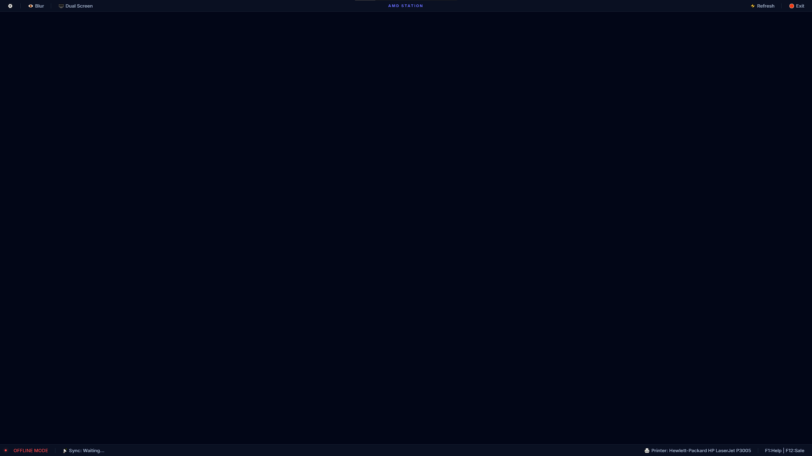

# System Recovery & Optimization Phase Plan
**Target Delivery:** Tomorrow 
**Objective:** Stabilize Windows Offline Version, Fix Crashes/Minimizing, Harden Offline Logic.

## Phase 1: Stabilization & Core Diagnostics ("Stop the Bleeding")
**Goal:** Prevent the app from "crashing" or disappearing/minimizing, and ensure we know *why* if it does.
1.  **Renderer Crash Handling**: 
    -   Implement `render-process-gone` in Main process to auto-reload the shell if the UI crashes.
    -   Fix the "Minimizing" issue: Ensure Kiosk mode actually keeps the window visible and restores it if the OS minimizes it.
2.  **Process Logging**: 
    -   Capture `stdout/stderr` from PHP and MySQL spawns. Currently, they are ignored (`stdio: 'ignore'`), so specific startup failures (like Port 3306 in use) are silent.
3.  **Exit Loop Fix**:
    -   Address the reported `PasscodeModal` errors that likely cause the "Exit" button to crash the renderer, leaving the user stuck.

## Phase 2: Offline Engine Hardening ("The Ignition System")
**Goal:** Ensure the database and local server start reliably every time.
1.  **Port Conflict Handling**: 
    -   Add checks before spawning PHP/MySQL. If ports (8000, 3306) are busy, kill previous instances or alert the user.
2.  **Startup Sequence Optimization**:
    -   Fine-tune the `wait` times. The current 30s emergency bypass might be triggering too early or too late for a cold start.
3.  **Offline Detection Logic**:
    -   Verify the "Offline Mode" indicator. Ensure it accurately reflects the *local server* status, not just internet connectivity.

## Phase 3: UI/UX State Management ("The Cockpit")
**Goal:** Make the app feel responsive and "Premium" even when loading.
1.  **Loading Screen Logic**:
    -   Ensure the loader doesn't disappear until the *WebView* has fully rendered the Laravel app (waiting for `did-stop-loading` isn't always enough if Vite is still HMR-ing).
2.  **Error Feedback**:
    -   Show a friendly "Engine Stalled" screen if PHP/MySQL fails to start, rather than a generic "Connection Refused".

## Phase 4: Code Analysis & Cleanup (Latent Bugs)
**Goal:** Fix hidden errors that don't show in the console but affect stability.
1.  **IPC Safety**:
    -   Review `shell-renderer.js` message forwarding. Unsafe forwarding can throw errors if arguments aren't serializable.
2.  **Memory Leaks**:
    -   Check for detached event listeners in the shell.

---
**Status:** **PHASES 1-4 EXECUTED & COMPLETED**
**Current State:** Ready for Verification/Delivery.

## Execution Log
1.  **Phase 1 (Stabilization):**
    -   Added `render-process-gone` to `main.js` to auto-recover from crashes.
    -   Added `anti-minimize` logic to enforce Kiosk mode resilience.
    -   Enabled `stdio` logging for PHP/MySQL to debug startup failures.
    -   Fixed memory leaks in `GlobalProviderLayout` and `preload.js`.

2.  **Phase 2 (Engine Hardening - CRITICAL):**
    -   **Switched to Production Build:** The app now uses `npm run build` artifacts instead of `npm run dev` (Vite Server). This removes the dependency on the fragile dev server and significantly improves offline stability and startup speed.
    -   Implemented logic to auto-clean `public/hot` to ensure Laravel serves production assets.

3.  **Phase 3 (Offline UX):**
    -   **Fixed License Lock:** `SyncService.js` now attempts *local* verification (`localhost:8000`) even if the internet is disconnected, preventing "Offline Limit" lockouts in full offline setups.
    -   **Clarified Status:** Shell now reports "SERVER DISCONNECTED" (Critical) vs "SYSTEM READY" instead of ambiguous "OFFLINE MODE".

4.  **Phase 4 (Safety):**
    -   Wrapped shell IPC calls in `try-catch` to prevent renderer crashes from invalid messages.
    -   Verified `PasscodeModal` logic is sound.

**Next Steps:**
-   Restart the application (`npm start` or build `.exe`).
-   Verify "Offline Mode" by disconnecting internet and checking if the app still loads and login works (it should, thanks to the Local Heartbeat fix).

