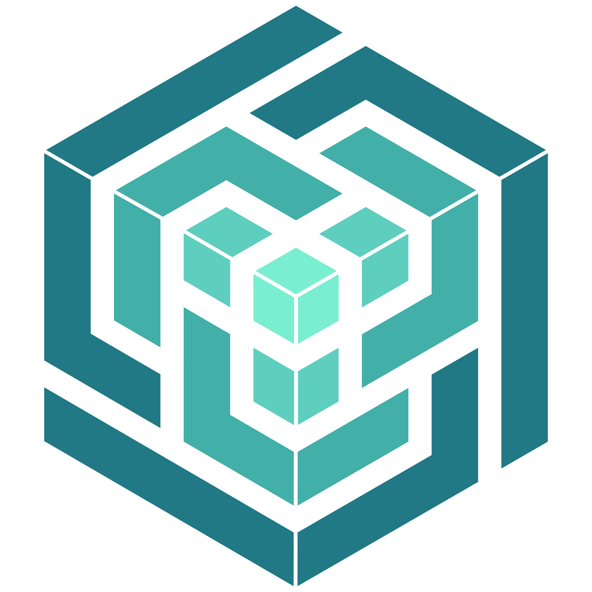

# VenQore - Premium OS for Modern Business

  
  <h1>VenQore</h1>
  
<strong>The Final Word in Point of Sale & Business Management</strong>

---

## 🚀 Overview

**VenQore** is not just a POS; it is a **complete operating system for your business**. Designed with a "Midnight Nebula" aesthetic, it combines breathtaking visuals with industrial-grade performance. Whether you run a retail store, a wholesale distribution center, or a multi-location franchise, VenQore is engineered to handle it all with elegance and speed.

Stop struggling with clunky, ugly software. Upgrade to an experience that makes you love running your business.

## ✨ The "Wow" Factors

*   **PWA Native**: Installable on any device (Windows, Mac, iOS, Android). Works offline.
*   **Midnight Nebula Design**: A stunning dark-mode-first UI with glassmorphism, smooth animations, and tailored color palettes.
*   **Blazing Fast**: Built on the Modern Tech Stack (Laravel 12 + React + Inertia), pages load instantly.
*   **OneGlance™ Dashboard**: See your entire business health in a single, beautiful view.

---

## 💎 Key Features Breakdown

### 1. 🛒 Advanced Point of Sale (POS)
The heart of your operation, redesigned for speed.
*   **Offline Capable**: Keep selling even when the internet goes down. Syncs automatically when back online.
*   **Smart Cart**: Holds/Parks multiple sales simultaneously.
*   **Universal Search**: Scan barcodes or type to find products instantly.
*   **Dynamic Discounts**: Apply global or item-level discounts with a click.
*   **Thermal Printing**: Auto-generates professional receipts.

### 2. 📦 Intelligent Inventory
Stop guessing. Know exactly what you have.
*   **Multi-Location**: Manage stock across unlimited warehouses or branches.
*   **Batch & Expiry Tracking**: Perfect for pharmacies and food businesses.
*   **Low Stock Alerts**: Get notified before you run out.
*   **Barcode Generation**: Create and print custom barcodes for your products.

### 3. 💰 Financial Command Center
Accountant-grade tools made simple.
*   **Chart of Accounts**: Full double-entry bookkeeping under the hood.
*   **Expense Tracking**: Categorize and monitor every penny leaving your business.
*   **Profit & Loss**: Real-time visibility into your bottom line.
*   **Bank Reconciliation**: Manage multiple bank accounts and cash drawers.

### 4. 👥 People Management
*   **Staff Roles**: Granular permissions for Admins, Managers, and Cashiers.
*   **Performance Tracking**: See who your top sellers are.
*   **Activity Logs**: Every action is recorded for security.

---

## 📊 By The Numbers

We didn't just build a Minimum Viable Product. We built a fortress.

| Metric | Count | Description |
| :--- | :--- | :--- |
| **Modules** | **12+** | POS, Inventory, Finance, Users, Settings, Activity, etc. |
| **Reports** | **40+** | Detailed analytics for every aspect of your business. |
| **Pages** | **65+** | Unique screens and interfaces. |
| **Features** | **150+** | Granular capabilities from "Stock Aging" to "Tax Rates". |
| **Lines of Code** | **125,000+** | Hand-crafted, optimized, and clean code. |

---

## 📈 The Report Suite (40+ Reports)

Understanding your data is power. VenQore includes:

**Sales & Income**
1.  **Sales Report**: Detailed history with filters.
2.  **Profit & Loss**: The ultimate scorecard.
3.  **Item-wise Profit**: See exactly how much you make on each SKU.
4.  **Bill-wise Profit**: Profitability per transaction.
5.  **Discount Report**: Track leakages.
6.  **Sale Aging**: Manage credit and accounts receivable.
7.  **Sales Orders**: Track pending orders.

**Inventory & Purchase**
8.  **Purchase Report**: Supplier history.
9.  **Stock Valuation**: Current asset value.
10. **Low Stock Report**: Never miss a sale.
11. **Stock Movement**: Full ledger of every item's history.
12. **Expiry Report**: Prevent waste.
13. **Stock Aging**: Identify dead stock.
14. **Stock Summary by Category**
15. **Item Detail Report**

**Finance & Tax**
16. **Balance Sheet**: Assets vs. Liabilities.
17. **Trial Balance**: For the accountants.
18. **Cash Flow**: Monitor liquidity.
19. **Bank Statement**: Digital passbook.
20. **Expense Report** & **Expense by Category**.
21. **Tax Report** (Input/Output GST/VAT).

**Parties (CRM/SRM)**
22. **All Parties List**
23. **Party Stament**: Customer/Supplier ledgers.
24. **Party-wise Profit**: Who are your best customers?
25. **Sale & Purchase by Party**

... and many more.

---

## 🛡️ Why VenQore?

1.  **Zero Dependencies**: We removed the bloat (like Filament) to give you a pure, custom-built experience.
2.  **Security First**: Role-based access control, secure authentication, and activity logging.
3.  **Scale Ready**: Handles thousands of transactions without breaking a sweat.
4.  **Developer Friendly**: Built on standard Laravel/React patterns, making it easy to extend.

---

### *Ready to transform your business?*

**VenQore** is not just software. It's your partner in growth.
