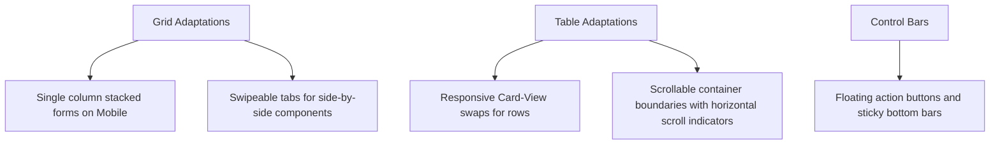

# VenQore POS - Ultimate Project & Page Audit Guide
**Goal:** Comprehensive mapping of all 254 functional views, sub-tabs, settings subsections, platform owner views, and public portals for the Mobile Responsiveness Refactor.

---

# I. EXECUTIVE OVERVIEW & FLAT 254 VIEW REGISTRY

Below is the complete, numbered list of all **254 functional pages, sub-tabs, settings sections, and role-scoped dashboards** in the VenQore application. Every item in this list must be individually verified for mobile responsiveness.

---

### A. Public & Marketing Pages (12 Views)
1. **Public Home / Landing Page** - `LandingPage.jsx` (Hero sections, marketing cards)
2. **Features Presentation Page** - `Marketing/Features.jsx` (Overview of systems)
3. **Pricing Matrices & Plans** - `Marketing/Pricing.jsx` (Lite, Pro, Enterprise tiers)
4. **Corporate About Page** - `Marketing/About.jsx` (Company background)
5. **Contact Channel & Forms** - `Marketing/Contact.jsx` (Support request interface)
6. **Blog Feed Directory** - `Marketing/Blog/Index.jsx` (List of news and guides)
7. **Blog Post Reader** - `Marketing/Blog/Show.jsx` (Full article display)
8. **Terms of Service** - `TermsOfService.jsx` (Standard legal guidelines)
9. **Privacy Protection Policy** - `PrivacyPolicy.jsx` (Data terms layout)
10. **Refund Guidelines** - `RefundPolicy.jsx` (AppSumo code refund terms)
11. **SaaS Welcome Screen** - `Welcome.jsx` (Public entry screen)
12. **Inclusions Overview** - `WhatIsIncluded.jsx` (Summary of modules)

---

### B. Auth, Onboarding & Setup (13 Views)
13. **Main Register Portal** - `Auth/Register.jsx` (Store creation forms)
14. **Customer Login Console** - `Auth/Login.jsx` (Standard admin/owner login)
15. **Staff PIN Login Pad** - `Auth/StaffLogin.jsx` (Fast employee check-in interface)
16. **Staff Accept Invitation** - `Auth/AcceptInvite.jsx` (Onboarding form)
17. **Email Reset Form** - `Auth/ForgotPassword.jsx` (Security email triggers)
18. **Password Reset Portal** - `Auth/ResetPassword.jsx` (Set new password credentials)
19. **Email Verification Steps** - `Auth/VerifyEmail.jsx` (Confirm email checks)
20. **Security Password Confirm** - `Auth/ConfirmPassword.jsx` (Protected actions barrier)
21. **Store Setup Wizard** - `SetupWizard.jsx` (Dynamic seeder setup wizard)
22. **Accept Invite Page** - `Invite/Accept.jsx` (External user verification)
23. **Invalid Invite Notice** - `Invite/Invalid.jsx` (Error message panel)
24. **Create Store Dialog** - `Store/Create.jsx` (Choose store slug and industry)
25. **Join Store Portal** - `Store/Join.jsx` (Request store connection)

---

### C. Platform HQ / SuperAdmin Panel (11 Views)
26. **HQ Command Dashboard** - `SuperAdmin/Dashboard.jsx` (Macro charts, platform statistics)
27. **All Active Stores Grid** - `SuperAdmin/Stores.jsx` (SaaS client list)
28. **HQ Global User Management** - `SuperAdmin/Users.jsx` (SaaS back-office staff)
29. **Platform Billing Packages** - `SuperAdmin/Plans/Index.jsx` (Subscription tier overrides)
30. **Overrides Rule Center** - `SuperAdmin/Tenants/Overrides.jsx` (Store exceptions ledger)
31. **Override Detail Configurator** - `SuperAdmin/Tenants/OverrideDetail.jsx` (Adjust single tenant features)
32. **AppSumo Coupon Matrix** - `SuperAdmin/AppSumo/Index.jsx` (Manage codes database)
33. **HQ Coupon Codes Center** - `SuperAdmin/Coupons/Index.jsx` (Global platform promo codes)
34. **Platform Instance Configs** - `SuperAdmin/Platforms/Index.jsx` (Multi-tenant endpoints)
35. **System Stack Errors Console** - `SuperAdmin/Health/Errors.jsx` (Platform diagnostics log)
36. **Master Contact Database** - `SuperAdmin/Health/Contacts.jsx` (Aggregated contacts log)

---

### D. Point of Sale - POS (4 Views)
37. **Standard POS Terminal** - `Pos.jsx` (Multi-tab cart, scan fields, pay dialog)
38. **POS Senior Mode Accessibility** - `Pos.jsx` (High-contrast yellow theme, large fonts)
39. **POS Parked Sales Slider** - `Pos.jsx` (Sidebar drawer listing hold invoices)
40. **POS Profit Sneak Peek** - `Pos.jsx` (Owner swipe gesture showing cost margins)

---

### E. Sell Module (Sales & CRM) (11 Views)
41. **Outbound Performance Console** - `Sales/Dashboard.jsx` (Sales reps, best sellers metrics)
42. **Finalized Invoices History** - `Sales/SalesHistory.jsx` (List of sales orders)
43. **A4 Invoice PDF / Print Show** - `Sales/Show.jsx` (Print preview page)
44. **A4 Business Invoice Builder** - `Sales/CreateInvoice.jsx` (Back-office invoice composer)
45. **Sales Orders List** - `Sales/Orders/SalesOrdersList.jsx` (Pending sales orders)
46. **Quotation Builder** - `Sales/CreatePreSale.jsx` (Create sales quotation)
47. **Pre-sales Queue Directory** - `SalesOrders/PreSales.jsx` (Active quotes database)
48. **Proposals Directory** - `Proposals/ProposalsList.jsx` (Client proposal tables)
49. **Create Business Proposal** - `Proposals/Create.jsx` (Compose custom business pitches)
50. **Show Proposal Layout** - `Proposals/Show.jsx` (Printable proposal pages)
51. **Parked Sales Management** - `Sales/ParkedSales.jsx` (List of parked transactions)

---

### F. Purchase Module (Procurement) (7 Views)
52. **Vendor Invoices List** - `Purchases/PurchasesList.jsx` (Confirmed incoming bills)
53. **Purchase Invoice Builder** - `Purchases/Create.jsx` (Log inbound items and unit costs)
54. **Purchase Bill Print Show** - `Purchases/Show.jsx` (Inbound invoice details view)
55. **Purchase Orders Directory** - `PurchaseOrders/PurchaseOrdersList.jsx` (Purchase requests log)
56. **Create Purchase Order** - `PurchaseOrders/Create.jsx` (PO composition workspace)
57. **Show Purchase Order Details** - `PurchaseOrders/Show.jsx` (PO printable document)
58. **Material Receiving Reports** - `Purchases/Receive.jsx` (Receiving quantities controller)

---

### G. Returns & Debit Notes (4 Views)
59. **Sales Returns Creator** - `Returns/Create.jsx` (Process customer refunds/exchanges)
60. **Sales Returns History Log** - `Returns/ReturnsHistory.jsx` (Log of Credit Notes)
61. **Debit Note / Purchase Return** - `DebitNotes/Create.jsx` (Create vendor returns)
62. **Debit Notes Log Ledger** - `DebitNotes/DebitNotes.jsx` (Debit note history logs)

---

### H. Stock Module (Inventory Hub) (18 Views)
63. **Stock Control Dashboard** - `Inventory/Dashboard.jsx` (Valuation metrics, alert widgets)
64. **Product Catalog Directory** - `Inventory/InventoryList.jsx` (Products search, grid card views)
65. **Stock Levels Matrix** - `Inventory/StockLevels.jsx` (Quantities across locations)
66. **Categories Tree Configurator** - `Inventory/Categories.jsx` (Product nesting maps)
67. **Variant Attributes Setup** - `Inventory/Attributes/AttributesList.jsx` (Sizes, colors)
68. **Product Variants Index** - `Inventory/Variants/VariantsList.jsx` (SKUs and prices map)
69. **Barcode Label Factory** - `Labels/LabelPrinter.jsx` (Design barcode tickets)
70. **Batch & Expiry Tracker** - `BatchTracking/BatchTracking.jsx` (Batch numbers registry)
71. **Serial & IMEI warranties** - `SerialTracking/SerialTracking.jsx` (Device serial tracking sheets)
72. **Stock Adjustments Editor** - `StockOperations.jsx` (Damage write-offs and corrections)
73. **Physical Stock audits Log** - `StockTake/StockTake.jsx` (Log of audits)
74. **Stock Audit Run** - `StockTake/Create.jsx` (Physical counting sheet)
75. **Show Stock Audit Result** - `StockTake/Show.jsx` (Discrepancy validation sheets)
76. **Stock Transfers List** - `StockTransfers/StockTransfers.jsx` (Godown transfer log)
77. **Create Stock Transfer** - `StockTransfers/Create.jsx` (Move items from warehouse)
78. **Show Stock Transfer Ticket** - `StockTransfers/Show.jsx` (Transfer waybill printer)
79. **Composite Production Batches** - `Inventory/Production/ProductionRuns.jsx` (Manufacturing run logs)
80. **Launch Production Batch** - `Inventory/Production/Create.jsx` (BOM ingredient assembler)

---

### I. Contacts & HR Modules (7 Views)
81. **Unified Partners Index** - `Parties/PartiesList.jsx` (Customers and vendors directories)
82. **Partner Account Statement** - `Parties/Ledger.jsx` (Khata ledger sheet)
83. **Suppliers List Directory** - `Suppliers/SuppliersList.jsx` (Vendor database index)
84. **Staff Management Hub** - `Staff/Hub.jsx` (Employee directory, permissions)
85. **Attendance Log Sheet** - `StaffAttendance/StaffAttendance.jsx` (Daily clock logs)
86. **Check-in Tracker Detail** - `StaffAttendance/Show.jsx` (Biometrics & map logs)
87. **Store Staff Log** - `Store/Staff/Index.jsx` (Employee listing detail)

---

### J. Money Module (Financial Hub) (13 Views)
88. **Finance Dashboard** - `Finance/FinanceDashboard.jsx` (P&L and assets indicators)
89. **Double-Entry Accounting Hub** - `Accounting/Dashboard.jsx` (Journal and audit checks)
90. **Chart of Accounts Hierarchy** - `Accounting/ChartOfAccounts.jsx` (Asset, liability trees)
91. **Ledger Transactions Log** - `Transactions/TransactionsList.jsx` (Master accounting logs)
92. **Payment In Creator** - `Payments/In.jsx` (Inbound payment vouchers)
93. **Payment Out Creator** - `Payments/Out.jsx` (Outbound payout vouchers)
94. **Payment Vouchers Log** - `Payments/PaymentsList.jsx` (History of vouchers)
95. **Business Expenses Workspace** - `Expenses/ExpensesList.jsx` (Operation spends and tags)
96. **Bank Accounts Listing** - `BankAccounts/BankAccountsList.jsx` (Cash drawer, bank ledger mappings)
97. **Bank Statements Matcher** - `BankReconciliation/BankReconciliation.jsx` (Reconciliation table tool)
98. **Capital Fund Allocator** - `Funds/FundManagement.jsx` (Capital transfers and balances)
99. **Cash History Log** - `Funds/CashHistory.jsx` (Cash registers drawer audit log)
100. **Chart Accounts Profit & Loss** - `Accounting/ProfitLoss.jsx` (Net accounting margins view)

---

### K. Role-Scoped Employee Dashboards (5 Views)
101. **Executive Owner Command** - `Admin/ExecutiveDashboard.jsx` (Store owner dashboards)
102. **Cashier Checkout Workspace** - `Dashboards/CashierDashboard.jsx` (Restricted POS checkout screen)
103. **Accountant Ledgers Console** - `Dashboards/AccountantDashboard.jsx` (Double-entry journal workspace)
104. **Purchasing & Procurement Console** - `Dashboards/PurchasingDashboard.jsx` (Vendor restock panels)
105. **CPA External Auditor View** - `Dashboards/ViewerDashboard.jsx` (Read-only dashboards)

---

### L. AI Intelligence & Smart Tools (4 Views)
106. **Growth Engine Hub** - `GrowthEngine/GrowthDashboard.jsx` (Opportunity metrics panel)
107. **Opportunity Predictor Console** - `Sales/Analytics.jsx` (Retention forecasting charts)
108. **Natural Language Search Bar** - `Pos.jsx` (AI smart search overlay dialog)
109. **Smart Chatbot Settings** - `Settings/ChatbotSettings.jsx` (Floating chat options)

---

### M. WooCommerce Sync & Integrations (6 Views)
110. **WooCommerce Sync Center** - `WooCommerce/WooCommerce.jsx` (Orders bridge dashboard)
111. **WooCommerce Connections Index** - `WooCommerce/Connections.jsx` (List of active tokens)
112. **WooCommerce Setup Workspace** - `WooCommerce/ConnectionSetup.jsx` (Credential form checkers)
113. **WooCommerce Sync Tasks** - `WooCommerce/SyncPage.jsx` (Batch items synchronization status)
114. **VenSynQ Backup Dashboard** - `VenSynQ/Dashboard.jsx` (Cloud backups status)
115. **VenSynQ Configuration Settings** - `VenSynQ/Settings.jsx` (SynQ settings panel)

---

### N. Growth & Marketing Operations (3 Views)
116. **WhatsApp SMS Campaigns** - `Marketing/Campaigns.jsx` (Marketing campaign analytics)
117. **Online Storefront Manager** - `OnlineStore/OnlineStore.jsx` (Public store listings dashboard)
118. **E-Invoicing FBR Center** - `EInvoicing/EInvoicing.jsx` (FBR regulatory settings)

---

### O. Cookbook & BOM Recipe Book (2 Views)
119. **Cookbook Recipes Catalog** - `Cookbook/RecipesList.jsx` (BOM list views)
120. **Cookbook Recipe Composer** - `Cookbook/Create.jsx` (BOM component list composer)

---

### P. Settings Subsections (20 Views)
*Located across `Admin/Settings.jsx` (17 sections) and `Settings/SettingsPanel.jsx` (3 sections). Treated as individual page entities.*

121. **Settings 1: Business Branding Setup** (Admin: Company details & NTN)
122. **Settings 2: General System Settings** (Admin: Decimal places, overselling control)
123. **Settings 3: AI Intelligence Setup** (Admin: Model selector, Gemini/OpenAI key checks)
124. **Settings 4: Invoice Rules & Prefixes** (Admin: Prefix settings, auto-numbers)
125. **Settings 5: A4 Printer Layout Settings** (Admin: Margin configuration tools)
126. **Settings 6: Thermal Invoice Settings** (Admin: Page widths, columns toggles)
127. **Settings 7: System Tax Rules Setup** (Admin: GST/VAT percentage matrices)
128. **Settings 8: WhatsApp Messaging Setup** (Admin: Meta tokens forms)
129. **Settings 9: Partner Credit Limits** (Admin: Creditors warning threshold)
130. **Settings 10: Product Variant Presets** (Admin: Attribute setup guidelines)
131. **Settings 11: Service Reminders Config** (Admin: Recurrences scheduler)
132. **Settings 12: Financial Year Config** (Admin: Fiscal year date picker)
133. **Settings 13: Localizations Settings** (Admin: Languages, RTL toggles)
134. **Settings 14: System Notifications Config** (Admin: Alert settings)
135. **Settings 15: Admin Security Configurations** (Admin: Pin controls)
136. **Settings 16: Backup Schedules** (Admin: Auto-backup paths)
137. **Settings 17: Integrations API Gate** (Admin: WooCommerce, Stripe connection tools)
138. **Settings 18: Factory Database Reset** (Admin: System purge dialogs)
139. **Settings 19: Scoped Store Info Panel** (Store settings: General section)
140. **Settings 20: Scoped Store POS Setup** (Store settings: POS options section)

---

### Q. Reports Sub-ledger Modules (43 Views)
*Sub-reports located inside `resources/js/Pages/Reports`. Individually rendered.*

141. **Report 1: Profit & Loss Statement** - `ProfitLoss.jsx`
142. **Report 2: Balance Sheet ledger** - `AccountLedger.jsx` (Detailed assets matching)
143. **Report 3: Trial Balance Summary** - `TrialBalance.jsx`
144. **Report 4: Cash Flow Statement** - `CashFlow.jsx`
145. **Report 5: Day Book Journal** - `DayBook.jsx`
146. **Report 6: Sales Analytics Report** - `Sales.jsx`
147. **Report 7: Sale Aging Receivables** - `SaleAging.jsx`
148. **Report 8: Sales Orders History** - `SaleOrders.jsx`
149. **Report 9: Sales Order Items Detail** - `SaleOrderItems.jsx`
150. **Report 10: Purchases History** - `Purchases.jsx`
151. **Report 11: Inventory Valuation Report** - `StockValuation.jsx`
152. **Report 12: Low Stock Pulse Alerts** - `LowStock.jsx`
153. **Report 13: Expiry Calendar Report** - `ExpiryReport.jsx`
154. **Report 14: Stock Movement Audit** - `MovementHistory.jsx`
155. **Report 15: Stock Aging Report** - `StockAging.jsx`
156. **Report 16: Stock Category Valuation** - `StockSummaryByCategory.jsx`
157. **Report 17: Single Item Details** - `ItemDetail.jsx`
158. **Report 18: Item Discount Analysis** - `ItemWiseDiscount.jsx`
159. **Report 19: Item-wise Profit Margins** - `ItemWiseProfit.jsx`
160. **Report 20: Bill-wise Profit Margins** - `BillWiseProfit.jsx`
161. **Report 21: Financial Tax Compliance** - `Tax.jsx`
162. **Report 22: Tax Rate Breakdown** - `TaxRateReport.jsx`
163. **Report 23: Bank Accounts Statement** - `BankStatement.jsx`
164. **Report 24: Loan Activity Statements** - `LoanStatement.jsx`
165. **Report 25: Expense Category Breakdown** - `ExpenseByCategory.jsx`
166. **Report 26: Expense Itemized Report** - `ExpenseByItem.jsx`
167. **Report 27: Consolidated Expense Ledger** - `Expenses.jsx`
168. **Report 28: Partners Directory statement** - `AllParties.jsx`
169. **Report 29: Single Party Statement Ledger** - `PartyStatement.jsx`
170. **Report 30: Party-wise Profit Margins** - `PartyWiseProfitLoss.jsx`
171. **Report 31: Sales Graph Analytics** - `GraphAnalytics.jsx`
172. **Report 32: Owner Daily Pulse Console** - `OwnersDailyPulse.jsx`
173. **Report 33: Day Book Journal Logs** - `DayBook.jsx` (Drill-down transactions logs)
174. **Report 34: Item Report by Party** - `ItemReportByParty.jsx`
175. **Report 35: Party Report by Item** - `PartyReportByItem.jsx`
176. **Report 36: Sale/Purchase by Item Category** - `SalePurchaseByItemCategory.jsx`
177. **Report 37: Sale/Purchase by Party** - `SalePurchaseByParty.jsx`
178. **Report 38: Sale/Purchase by Party Group** - `SalePurchaseByPartyGroup.jsx`
179. **Report 39: Stock Category Summary** - `StockSummaryByCategory.jsx` (Visual indicators section)
180. **Report 40: Item Category P&L** - `ItemCategoryWiseProfitLoss.jsx`
181. **Report 41: Discount Leakage Report** - `DiscountReport.jsx`
182. **Report 42: Generic Report Base** - `GenericReport.jsx`
183. **Report 43: Visual Charts Analytics** - `GraphAnalytics.jsx`

---

### R. V3 Next-Gen Engine Modules (12 Views)
184. **V3 Composite Item Creator** - `V3/Products/Create.jsx`
185. **V3 Variants Configuration** - `V3/Products/Edit.jsx`
186. **V3 Products Grid View** - `V3/Products/Index.jsx`
187. **V3 Wholesale Pricing Matrices** - `V3/Products/PriceTiers.jsx`
188. **V3 Metric Unit Converter** - `V3/Products/UomConversions.jsx`
189. **V3 Purchase Bill Writer** - `V3/Purchases/Create.jsx`
190. **V3 Purchase Bills Ledger** - `V3/Purchases/Index.jsx`
191. **V3 Debit Note Manager** - `V3/Purchases/Return.jsx`
192. **V3 Purchase Voucher Details** - `V3/Purchases/Show.jsx`
193. **V3 Warehouse Registrar** - `V3/Warehouses/Create.jsx`
194. **V3 Godown Profiles Editor** - `V3/Warehouses/Edit.jsx`
195. **V3 Locations Inventory Directory** - `V3/Warehouses/Index.jsx`

---

### S. Support, Logs & System Management (60 Views)
*Treated as distinct user-facing panels in the application. Files nested in Pages folder.*

196. **Staff Attendance Summary** - `Admin/StaffSummaries.jsx`
197. **Internal HQ Chat Inbox** - `Admin/AgentInbox.jsx`
198. **HQ Support Tickets Hub** - `Admin/VenaTickets.jsx`
199. **Ticket Conversation Thread** - `Admin/VenaTicketDetail.jsx`
200. **Cloud Backups List** - `Admin/Backups.jsx`
201. **Data Import Excel Panel** - `Admin/DataManagement.jsx`
202. **CSV Fields Mapper** - `Admin/DataMapping.jsx`
203. **Database Health Metrics** - `Admin/Database.jsx`
204. **Database Migration Console** - `Admin/Migration.jsx`
205. **Platform Action Logs** - `Admin/Logs.jsx`
206. **SaaS Store Manager Dashboard** - `OnlineStore/OnlineStore.jsx`
207. **Notification Center** - `Notifications/NotificationCenter.jsx`
208. **Global Action Log** - `ActivityLog.jsx`
209. **Recycle Bin Restore Console** - `RecycleBin.jsx`
210. **Coupon Redemptions** - `Redeem.jsx`
211. **Coupon Success Notice** - `RedeemSuccess.jsx`
212. **System Updater Panel** - `Updater/Index.jsx`
213. **Store Suspended Screen** - `Errors/StoreSuspended.jsx`
214. **Trial Expired Screen** - `Errors/TrialExpired.jsx`
215. **Generic Error 404/500 Screen** - `Error.jsx`
216. **Invoice Reminders Center** - `Reminders/InvoiceReminders.jsx`
217. **Demo Connections Onboarding** - `Demo/Landing.jsx`
218. **Demo Expired Notice** - `DemoExpired.jsx`
219. **Store Join Confirmations** - `Store/CreateOrJoin.jsx`
220. **Store Join Request form** - `Store/Join.jsx`
221. **POS Hold invoices lists** - `Sales/ParkedSales.jsx`
222. **Automanufacturing Logic Settings** - `Manufacturing/Rules.jsx`
223. **GPS Coordinate Maps Show** - `StaffAttendance/Show.jsx`
224. **Store-level Settings Scoped Security** - `Settings/SettingsPanel.jsx` (Security Section)
225. **Subscription Billing Hub** - `Billing/Index.jsx`
226. **Cookbook Create Recipe Form** - `Cookbook/Create.jsx`
227. **Cookbook Recipes Catalog Views** - `Cookbook/RecipesList.jsx`
228. **Create Pre-Sale Orders** - `SalesOrders/CreatePreSale.jsx`
229. **Pre-sales Queue Indexes** - `SalesOrders/PreSales.jsx`
230. **Stock Audit counting Sheets** - `StockTake/Create.jsx`
231. **Stock Audit reports visualizer** - `StockTake/Show.jsx`
232. **Stock Audit logs history** - `StockTake/StockTake.jsx`
233. **Godown transfers composer** - `StockTransfers/Create.jsx`
234. **Godown transfers prints** - `StockTransfers/Show.jsx`
235. **Godown transfers registries** - `StockTransfers/StockTransfers.jsx`
236. **F1 Universal Search dialog** - `Pos.jsx`
237. **Growth Engine recommendations** - `GrowthEngine/GrowthDashboard.jsx` (Opportunites list)
238. **WooCommerce Sync Tasks logs** - `WooCommerce/SyncPage.jsx`
239. **WooCommerce Connections panels** - `WooCommerce/Connections.jsx`
240. **WooCommerce Credentials forms** - `WooCommerce/ConnectionSetup.jsx`
241. **WooCommerce Main Sync view** - `WooCommerce/WooCommerce.jsx`
242. **VenSynQ Database Backups** - `VenSynQ/Dashboard.jsx`
243. **VenSynQ parameters configuration** - `VenSynQ/Settings.jsx`
244. **SMS Whatsapp campaigns composer** - `Marketing/Campaigns.jsx`
245. **E-Invoicing FBR Settings Panel** - `EInvoicing/EInvoicing.jsx`
246. **POS Senior Mode Color Presets** - `Pos.jsx` (Contrast section)
247. **POS Pay dialog panels** - `Pos.jsx` (Totals checkout modal)
248. **Sales Outbound Dashboard Charts** - `Sales/Dashboard.jsx` (Trend widget section)
249. **Proposals Invoices printable page** - `Proposals/Show.jsx`
250. **Invoice printable layout thermal** - `Sales/Show.jsx` (Thermal templates section)
251. **Invoice printable layout regular** - `Sales/Show.jsx` (A4 templates section)
252. **Purchase Invoice item lists cards** - `Purchases/Create.jsx` (Item logs cards)
253. **Purchase Bill print layout regular** - `Purchases/Show.jsx` (Bill view section)
254. **Product Variants variant creator modal** - `Inventory/Variants/VariantsList.jsx` (Variants details card)

---

# III. KEY MOBILE RESPONSIVENESS REFITTING PATTERNS

Every component listed above must scale smoothly using these core design systems:



### 1. The Dynamic Grid Stacking Pattern
Never write absolute widths on container nodes. Ensure standard grids use dynamic responsiveness:
```jsx
// Correct layout grid
<div className="grid grid-cols-1 md:grid-cols-2 lg:grid-cols-3 gap-6">
   {items.map(item => <ItemCard key={item.id} data={item} />)}
</div>
```

### 2. Table to Card Layout Swapper
For screens `< 768px`, replace tables with card lists:
```jsx
{/* Desktop View */}
<table className="hidden md:table w-full">
   <thead>{/* headers */}</thead>
   <tbody>{/* rows */}</tbody>
</table>

{/* Mobile View */}
<div className="block md:hidden space-y-4">
   {rows.map(row => (
      <div className="bg-slate-900 border border-slate-800 rounded-2xl p-4 shadow-sm" key={row.id}>
         {/* Render Row fields as key-value pairs */}
      </div>
   ))}
</div>
```

### 3. Floating Bottom Sheets for Action Items
On mobile, action triggers placed at the top (like export, filter, edit columns) must be moved into a bottom action sheet or sticky footer:
```jsx
<div className="fixed bottom-0 left-0 right-0 p-4 bg-slate-900 border-t border-slate-800 flex justify-around md:relative md:bg-transparent md:border-none">
   <button className="px-6 py-3 bg-indigo-600 rounded-xl font-bold">Apply Filters</button>
</div>
```
