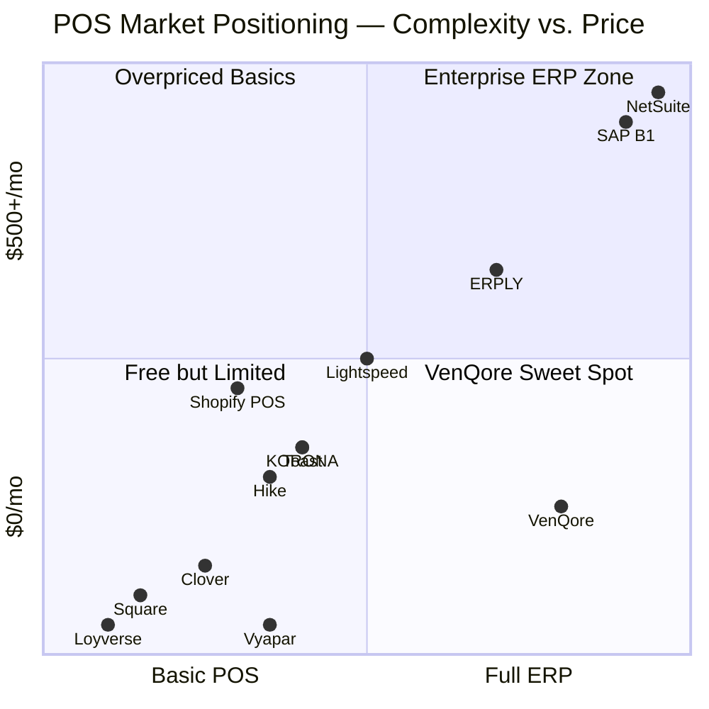
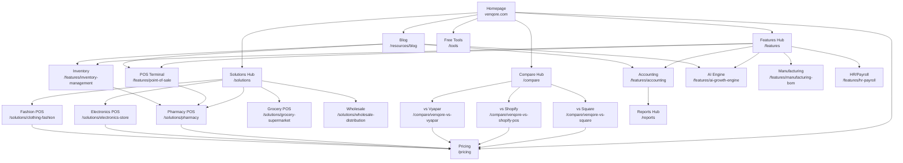
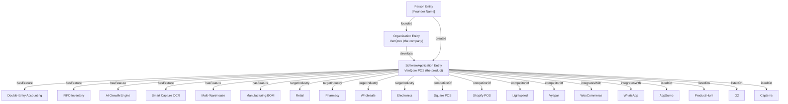

# VENQORE ULTIMATE GROWTH BLUEPRINT 2026
## SEO + GEO + Growth Execution Manual — Business OS Edition

> **Generated:** July 30, 2026 (v1.0) · **Revised:** July 30, 2026 (v2.0)
> **Classification:** Confidential Strategic Document — VenQore Internal Use Only
> **Version:** 2.2 — Verified against the live codebase (v5.3.9); v2.1 locked mission-first messaging; **v2.2 (2026-07-31) rebuilds for answers-first Google** after I/O 2026 made AI Mode the default search experience (new §3.12 + rewritten §7.3)
>
> **What changed in v2.0:**
> 1. **Positioning upgraded** from "retail POS/ERP" to **Vision + Beachhead**: VenQore is becoming the Business OS; retail POS + verified accounting is the wedge we rank, sell, and demo with.
> 2. **Every fact checked against the shipped product.** v1.0 assumed zero SEO infrastructure and quoted wrong pricing ($49/$99/$199). Reality: a server-rendered SEO layer, llms.txt, robots.txt, dynamic sitemap, JSON-LD and GA4 are already live, and pricing is **$36 / $63 / $129 (Starter / Growth / Enterprise)**. See the Ground Truth section below.
> 3. **Copy discipline added** — the Shipped / Building / Planned rule. Nothing unshipped is marketed in present tense; no fabricated counts, ratings, or reviews, ever.
> 4. **Two new phases:** Phase 13 (Revenue Now — the 30-day sales sprint) and Phase 14 (Acquisition & Partnership Readiness).
> 5. **Execution moved to owner-assigned playbooks** in `SEO/EXECUTION-PLAN/` — that folder is the live version of the roadmap; this document is the strategy reference.

---

## TABLE OF CONTENTS

| Phase | Section | Description |
|:------|:--------|:------------|
| **1** | [Deep Product Analysis](#phase-1-deep-product-analysis) | Product DNA, SWOT, competitor matrix, positioning |
| **2** | [SEO Audit](#phase-2-seo-audit) | Complete technical and on-page SEO audit |
| **3** | [GEO Audit](#phase-3-geo-audit) | AI search optimization across all LLM platforms |
| **4** | [Content Strategy](#phase-4-content-strategy) | Complete topical map, every page, every URL |
| **5** | [Knowledge Graph Strategy](#phase-5-knowledge-graph-strategy) | Entity design, schema, authority platforms |
| **6** | [Technical SEO](#phase-6-technical-seo) | SSR fix, Core Web Vitals, code implementations |
| **7** | [Conversion SEO](#phase-7-conversion-seo) | CTA architecture, lead magnets, free tools |
| **8** | [Zero Budget Growth Engine](#phase-8-zero-budget-growth-engine) | Reddit, LinkedIn, Product Hunt, communities |
| **9** | [90-Day Execution Roadmap](#phase-9-90-day-execution-roadmap) | Week-by-week tasks with hours and ROI |
| **10** | [Priority Matrix](#phase-10-priority-matrix) | Must Do / Should Do / Could Do / Future |
| **11** | [Scorecard](#phase-11-scorecard) | 0-100 scoring with paths to 100 |
| **12** | [Competitive Moat Analysis](#phase-12-competitive-moat-analysis) | 5 unreplicable advantages over 3 years |
| **13** | Revenue Now — 30-Day Sales Sprint *(new in v2.0)* | 10 international customers in 30 days, channels ranked by speed-to-cash |
| **14** | Acquisition & Partnership Readiness *(new in v2.0)* | Licensing ladder, 48-hour kit, never-surprised posture |
| **A-I** | [Appendices](#appendices) | Keywords, schema code, templates, checklists |

**Phase 0 (new in v2.0), placed before Phase 1:** Ground Truth — what is already shipped vs still open, verified against codebase v5.3.9.

---

# PHASE 0: GROUND TRUTH — VERIFIED CODEBASE STATE (v5.3.9, 2026-07-30)

Every recommendation in this document was re-audited against the shipped code. This table is the single source of truth for what is DONE vs OPEN. Do not repeat work in the DONE column; pour all effort into the OPEN column.

| Area | v1.0 Assumed | Verified Reality (v5.3.9) | Status |
|:-----|:-------------|:--------------------------|:------:|
| Crawlable meta ("CSR Catastrophe") | Empty HTML shell, zero meta | Server-rendered SEO head layer live since 2026-07-03: per-route title, meta description, canonical, OG/Twitter tags, JSON-LD, and a `static_html` crawler fallback via `App\Support\MarketingSeo` (15 routes covered) | ✅ Largely done — full-body Inertia SSR still open |
| llms.txt | Missing | Live at venqore.com/llms.txt, high quality, real pricing, honest "coming soon" labels | ✅ Done (refresh every 30 days) |
| robots.txt | Missing/wrong | Live; GPTBot, OAI-SearchBot, ChatGPT-User etc. explicitly allowed; tenant/api paths blocked | ✅ Done |
| XML sitemap | Missing | Dynamic `SitemapController` live: 13 marketing pages + blog posts | ✅ Done (split-index later) |
| Structured data | None | SoftwareApplication (real $36–$129 pricing), Organization, FAQPage live on key pages; fabricated-rating markup already removed after a SEMrush flag | ✅ Done (extend to new pages) |
| Analytics | None | GA4 installed (G-404QXQB4XF) | ✅ Done (verify GSC/Bing = Day 0 task) |
| Pricing facts | $49 / $99 / $199, "Business" plan | **$36 / $63 / $129 — Starter / Growth / Enterprise** monthly; **$360 / $630 / $1,290 annual** (two months free). **USD only — geo/PKR pricing paused by founder decision (2026-07-30); strip PKR from public copy.** 14-day trial, no-signup demo at /demo | ✅ Corrected throughout v2.0 |
| Blog | Unknown | Engine live (`/blog`), only **3 posts** | 🔴 Open — velocity is the gap |
| Feature / compare / solutions / tools / glossary pages | Don't exist | Still don't exist | 🔴 Open — biggest content gap |
| Entity presence (G2, Capterra, Crunchbase, LinkedIn, Wikidata, Product Hunt, AppSumo) | None | None found | 🔴 Open — biggest off-site gap |
| Reviews / social proof | None | None | 🔴 Open (earn honestly, never fabricate) |
| SmartCapture | Marketed as shipped | Backend shipped (extract/confirm API live in code); public page = waitlist | 🟠 "Rolling out" — never present tense until customer-visible |
| VenSynQ | Not assessed | WooCommerce sync live; Amazon/eBay/TikTok OAuth callbacks already scaffolded | 🟠 WooCommerce = shipped; rest = "rolling out" |
| AI layer | "3 Brains" marketed as shipped | `AiRetentionService`, `ChatAIService`, `OwnerDailyPulseService`, `SmartFulfillmentService` exist in code | 🟠 Present as "building" until customer-visible |

**What this changes:** v1.0 said "nothing matters until the CSR fix." That fix largely shipped. The bottleneck is now **distribution + revenue** — entity presence, comparison/feature pages, reviews, and sales conversations. Week 1 is re-sequenced accordingly (Phase 9) and the live task assignments are in `SEO/EXECUTION-PLAN/`.

---

# PHASE 1: DEEP PRODUCT ANALYSIS

## 1.1 What VenQore Actually Is — Entity Definition

**The Positioning Ladder (v2.0 — Vision + Beachhead):**

**What VenQore is today — the beachhead we rank, sell, and demo with:**
VenQore is an offline-first POS + ERP for retail and inventory-led businesses with **verified double-entry accounting built in**. Every sale, purchase, return and transfer writes a balanced journal entry — proven by 1,000+ automated tests including a ledger-reconciliation gate. This is the sharpest wedge in the category: no SMB POS under $200/month keeps real books.

> **Messaging note (v2.1):** the wedge above is *positioning for search and technical buyers*. Customer-facing copy leads with the mission — eliminating repeated manual entry — per the canonical kit (`SEO/EXECUTION-PLAN/04-COPY-AND-MESSAGING.md`): belief first, product second, proof third. Locked brand language: H1 "The last software your business will need." · Tagline "Run your business, not your software."

**What VenQore is becoming — the vision the brand narrates everywhere:**
**The Business OS.** One system that removes the reason to buy any other software:

- POS + inventory + accounting + reports + multi-store + HR + CRM/loyalty — **shipped**
- Marketplace and storefront connections — WooCommerce sync **live**; Amazon, eBay, TikTok Shop **rolling out** (VenSynQ)
- Paper and voice → ledger automation — SmartCapture backend **shipped**, public rollout underway
- The B2B network — businesses on VenQore transact with each other: one company's sale posts automatically as the other company's purchase. Zero double entry of data between trading partners. **Building**
- An AI layer that watches the ledger and tells the owner what to fix, what to stock, and which customer to chase — **building** (retention, daily-pulse and fulfillment services already in the codebase)

**The positioning sentence (memorize it, use it in every pitch):**
> "Elite at every module, all in one place: VenQore replaces the five tools a business pays for with one system where the books are always right — and it is becoming the operating system businesses run on."

**Why two levels instead of one:** "Business OS for everyone" has no search volume and no buyer intent yet; "POS with real accounting" has both. So the website wins retail/POS keywords while the brand story, homepage narrative, About page, llms.txt and every founder post carry the Business OS arc with a visible Now → Next → Later roadmap. Buyers get a tool; believers get a trajectory.

**The Core Technical Identity:**
VenQore is built on the **V12 Twin Turbo Qore** — a double-entry ledger engine that processes every business transaction (sale, purchase, transfer, return, refund, expense, payroll entry) through balanced debit/credit journal entries with DECIMAL(20,4) currency precision. This is the same level of mathematical rigor used by banks and enterprise ERP systems like SAP and Oracle NetSuite — but packaged inside a frictionless, keyboard-first POS interface that a cashier can learn in 15 minutes.

**Copy discipline — the Shipped / Building / Planned rule (non-negotiable):**
Present tense is reserved for shipped, customer-visible features. Building features are "rolling out" or carry a waitlist. Planned features live on the roadmap page only. No invented user counts, star ratings, review quotes, or "trusted by X businesses" numbers — the credibility of the big Business OS story depends entirely on never being caught exaggerating the small facts.

**Why This Matters for SEO/GEO:**
This identity creates VenQore's **semantic fingerprint** — the set of terms, facts, and capabilities that AI search engines and Google will use to categorize and recommend VenQore. Every piece of content, every schema markup, and every external profile must reinforce this identity consistently.

**VenQore's Semantic Identity Statement (canonical — use verbatim across all platforms):**
> VenQore is the all-in-one operating system for business — point of sale, inventory, purchasing, invoicing, CRM and verified double-entry accounting in one platform, built to eliminate repetitive work without sacrificing financial accuracy. Offline-capable, multi-store, WooCommerce-synced, 40+ reports from one set of numbers, guarded by 1,000+ automated tests. From $36/month (USD).

---

## 1.2 Strengths Analysis (Scored 1-10)

| Strength | Score | Why It Matters for Growth | Competitor Gap |
|:---------|:-----:|:--------------------------|:---------------|
| **Double-Entry Accounting Core** | 10/10 | No POS competitor under $200/mo offers this. Creates an entirely uncontested keyword category ("POS with double entry accounting"). | Square, Shopify, Toast, Vyapar, Hike, Clover — NONE have native double-entry. They rely on QuickBooks/Xero integration. |
| **True FIFO Batch-Level Costing** | 10/10 | Most POS systems overwrite cost price on each new purchase, destroying historical margin accuracy. VenQore tracks separate cost pools per batch in `inventory_batches` table. | Only enterprise ERPs (SAP, NetSuite) offer true FIFO. No SMB POS does this. |
| **AI Growth Engine (3 Brains)** | 9/10 | Retention Brain (predicts customer return windows via ADBO), Forecast Brain (predicts stockouts), Churn Brain (flags at-risk customers). This is a marketing goldmine — "Your POS predicts the future." **Status: building** (`AiRetentionService`, `OwnerDailyPulseService` in code) — market as "rolling out" until customer-visible. | No competitor offers autonomous AI analysis at this price point. |
| **Smart Capture (AI OCR)** | 9/10 | Scans handwritten vendor bills, crumpled thermal receipts, and even Urdu/Arabic documents into ledger entries in 15 seconds. **Status: backend shipped (extract/confirm API live), public rollout via waitlist** — say "rolling out," not present tense. | Zero competitors offer this. It's a completely unique feature. |
| **Offline-First Architecture** | 8/10 | PWA + IndexedDB + Dexie.js + Cart Rescue Airbag. Works during power cuts (critical for South Asian and African markets). | Square/Shopify have "limited offline" (cached mode). VenQore has genuine offline with queue-and-sync. |
| **Manufacturing / BOM** | 9/10 | Bill of Materials with auto-assembly deduction. "Garam Masala" feature deducts raw ingredients at point of sale. Extremely rare in POS. | Only ERPLY and enterprise ERPs offer this. No SMB POS competitor does. |
| **Self-Hosted Option** | 8/10 | Download and run on your own server. Critical for data sovereignty, regulated industries, and regions with unreliable internet. | Square, Shopify, Toast, Clover — all cloud-only. No self-hosted option. |
| **Multi-Warehouse Management** | 8/10 | Unlimited warehouses with inter-warehouse transfer vouchers and waybill printing. | Square has none. Shopify POS requires Shopify Plus ($2,000/mo). Lightspeed charges extra. |
| **Vyapar Forensic Import** | 9/10 | Decrypts and imports .vyb/.vyp backup files from Vyapar (dominant in India/Pakistan). Captures competitor's entire customer base with zero data loss. | Literally no one else can do this. It's a proprietary migration tool. |
| **White-Label Ready** | 7/10 | Resellers and agencies can fully rebrand VenQore. Creates a B2B channel. | Most POS systems don't offer white-labeling at any price. |
| **226+ Features** | 9/10 | The sheer feature density is a moat. 25+ keyboard shortcuts, Senior Mode, secret Profit Peek gesture, multi-tab checkout, etc. | No competitor at this price point comes close to this feature count. |
| **No Per-Transaction Fees** | 8/10 | Square charges 2.6% + 10¢ per swipe. Toast charges 2.49% + 15¢. On $500K annual sales, that's $13,000-$12,500/year in fees. VenQore charges $0. | Square, Shopify, Toast, Clover all charge per-transaction. |
| **DECIMAL(20,4) Precision** | 10/10 | Zero rounding errors. Tax calculations are exact to 4 decimal places. Prevents the "missing pennies" problem that plagues competitors. | This is a database schema decision. Competitors using FLOAT or DECIMAL(10,2) cannot retrofit this without rebuilding their entire DB. |

---

## 1.3 Weaknesses Analysis (Honest Assessment)

| Weakness | Severity | Mitigation Strategy |
|:---------|:--------:|:---------------------|
| **Weak Google Indexation** | 🔴 Critical | *(v2.2 update)* Head-layer SEO shipped and 5 pages are indexed, but 14 sit at "Discovered — not crawled" and body content is still client-rendered. Full-body SSR (T1) + indexing requests + faster pages fix this. Matters double now: AI crawlers don't execute JS at all (§6.1). |
| **Zero Brand Awareness** | 🔴 Critical | No one knows VenQore exists. Zero Domain Authority. Must execute aggressive entity building across 20+ platforms simultaneously. |
| **Zero Backlink Profile** | 🔴 Critical | DA is effectively 0. Must earn backlinks through free tools, digital PR, community engagement, and directory listings. |
| **No Social Proof** | 🟠 High | No G2 reviews, no Capterra reviews, no Trustpilot reviews. Must seed reviews immediately via AppSumo early adopters. |
| **No Wikipedia Presence** | 🟠 High | VenQore doesn't exist in Wikipedia or Wikidata. This is critical for Knowledge Graph recognition by AI search engines. |
| **Complex Product** | 🟡 Medium | 226+ features can overwhelm prospects. Must create industry-specific landing pages that show only relevant features per vertical. |
| **South Asian Origin Bias** | 🟡 Medium | Some Western buyers may perceive South Asian software as lower quality. Counter with enterprise-grade positioning, US/UK case studies, and SOC2-style security messaging. |
| **No Video Content** | 🟡 Medium | No YouTube presence, no product demo videos. Video is critical for both SEO (video carousels) and conversion (demo → trial). |
| **Pricing Page Optimization** | 🟡 Medium | Current pricing page needs social proof, feature comparison tables, FAQ schema, and trust signals. |
| **No Community** | 🟡 Medium | No Discord, no forum, no user community. Must build community for organic word-of-mouth. |

---

## 1.4 Competitor Feature Comparison Matrix (Detailed)

| Feature / Capability | VenQore | Square POS | Shopify POS | Lightspeed | Toast | Vyapar | Hike POS | KORONA | Clover | ERPLY |
|:---------------------|:-------:|:----------:|:-----------:|:----------:|:-----:|:------:|:--------:|:------:|:------:|:-----:|
| **Double-Entry Accounting** | ✅ | ❌ | ❌ | ❌ | ❌ | ❌ | ❌ | ❌ | ❌ | ❌ |
| **FIFO Batch Costing** | ✅ | ❌ | ❌ | ❌ | ❌ | ❌ | ❌ | ❌ | ❌ | ✅ |
| **AI Business Analysis** | ✅ | ❌ | ❌ | ❌ | ❌ | ❌ | ❌ | ❌ | ❌ | ❌ |
| **AI OCR Receipt Scan** | ✅ | ❌ | ❌ | ❌ | ❌ | ❌ | ❌ | ❌ | ❌ | ❌ |
| **Manufacturing / BOM** | ✅ | ❌ | ❌ | ❌ | ❌ | ❌ | ❌ | ❌ | ❌ | ✅ |
| **Multi-Warehouse** | ✅ | ❌ | ⚠️ Plus only | ✅ | ❌ | ❌ | ✅ | ❌ | ❌ | ✅ |
| **HR / Payroll** | ✅ | ❌ | ❌ | ❌ | ⚠️ Basic | ❌ | ❌ | ❌ | ❌ | ❌ |
| **Offline-First POS** | ✅ | ⚠️ Limited | ⚠️ Limited | ⚠️ Limited | ✅ | ✅ | ❌ | ❌ | ⚠️ | ❌ |
| **Self-Hosted Option** | ✅ | ❌ | ❌ | ❌ | ❌ | ❌ | ❌ | ❌ | ❌ | ✅ |
| **White-Label** | ✅ | ❌ | ❌ | ❌ | ❌ | ❌ | ❌ | ❌ | ❌ | ✅ |
| **No Transaction Fees** | ✅ | ❌ 2.6%+10¢ | ❌ 2.7% | ❌ 2.6%+10¢ | ❌ 2.49%+15¢ | ✅ | ✅ | ✅ | ❌ 2.3%+10¢ | ✅ |
| **Customer Khata (AR Ledger)** | ✅ | ❌ | ❌ | ⚠️ Basic | ❌ | ✅ | ❌ | ❌ | ❌ | ✅ |
| **Loyalty Program** | ✅ | ✅ | ✅ | ✅ | ✅ | ❌ | ❌ | ❌ | ✅ | ❌ |
| **WooCommerce Sync** | ✅ | ❌ | ❌ | ❌ | ❌ | ❌ | ✅ | ❌ | ❌ | ✅ |
| **IMEI/Serial Tracking** | ✅ | ❌ | ❌ | ✅ | ❌ | ❌ | ❌ | ❌ | ❌ | ✅ |
| **40+ Reports** | ✅ | ⚠️ ~15 | ⚠️ ~10 | ✅ ~30 | ⚠️ ~20 | ⚠️ ~12 | ⚠️ ~15 | ⚠️ ~20 | ⚠️ ~10 | ✅ ~35 |
| **Competitor Data Import** | ✅ Vyapar | ❌ | ❌ | ❌ | ❌ | N/A | ❌ | ❌ | ❌ | ❌ |
| **Desktop App (Electron)** | ✅ | ❌ | ❌ | ❌ | ❌ | ❌ | ❌ | ❌ | ❌ | ❌ |
| **Starting Price** | **$36/mo** | Free+fees | $89/mo | $89/mo | $0+fees | Free | $59/mo | $59/mo | $14.95/mo+fees | Custom |
| **Lifetime Deal** | 🟠 Planned (AppSumo submission) | ❌ | ❌ | ❌ | ❌ | ❌ | ❌ | ❌ | ❌ | ❌ |

---

## 1.5 Unique Selling Points Competitors CANNOT Replicate

These are structural advantages baked into VenQore's architecture that competitors cannot simply "add":

### USP 1: DECIMAL(20,4) Currency Precision
- **Why it's unreplicable:** This is a database schema decision made at the foundation level. Competitors using FLOAT or DECIMAL(10,2) would need to rebuild their entire database, migrate billions of records, and rewrite every calculation. This is a 12-18 month engineering project for an established company.
- **SEO opportunity:** Own the keyword "accurate POS accounting" and "POS rounding errors."

### USP 2: True FIFO Batch-Level Costing
- **Why it's unreplicable:** VenQore tracks cost at the individual batch level in `inventory_batches`. When a sale occurs, it pulls cost from the oldest batch first. Competitors that store a single "cost_price" field per product would need to completely redesign their inventory data model.
- **SEO opportunity:** Own "FIFO inventory costing POS" and "accurate profit margins POS."

### USP 3: Vyapar Forensic Import Engine
- **Why it's unreplicable:** VenQore reverse-engineered Vyapar's proprietary .vyb/.vyp backup format. No other company has done this. It's a migration moat that directly captures competitor customers.
- **SEO opportunity:** Own "Vyapar alternative" and "switch from Vyapar" and "Vyapar data migration."

### USP 4: AI Growth Engine (3 Autonomous Brains)
- **Why it's unreplicable:** Building a Retention Brain (ADBO prediction), Forecast Brain (stockout prediction), and Churn Brain (customer loss detection) requires deep integration with the transactional data layer. Competitors would need 6-12 months of R&D to match this.
- **SEO opportunity:** Own "AI POS system" and "POS with business intelligence."

### USP 5: Smart Capture AI (OCR Invoice Scanning)
- **Why it's unreplicable:** Multi-modal OCR that handles handwritten vendor bills, thermal receipts, and even Urdu/Arabic documents. Auto-matches items to catalog and drafts ledger entries in 15 seconds.
- **SEO opportunity:** Own "automatic invoice entry POS" and "AI receipt scanning software."

---

## 1.6 Keywords Competitors Rank For That VenQore Should Target

> **v2.2 re-scoring rule (answers-first Google, §3.12):** intent now matters more than volume. **"Do" queries** (alternative, vs, generator, template, migration, for-[industry], pricing) still send clicks — prioritize Tiers 2–5. **"Know" queries** (what is, how to calculate, definitions) are answered inline by AI Mode and rarely send a click — never build a page whose only job is answering one. Tier 1 head terms remain long-shots AND now pay mostly in citations, not visits; pursue them only through the comparison/tool pages that target their fan-out sub-queries.

### Tier 1: Head Terms (Long-term targets — 12+ months)
| Keyword | Est. Monthly Volume | KD | Top Ranking Competitor | VenQore's Angle |
|:--------|:-------------------:|:--:|:----------------------|:----------------|
| best pos system | 14,000 | 85 | Square, Forbes | "Best POS with built-in accounting" |
| pos software | 9,500 | 80 | Shopify, Square | "POS software with double-entry ledger" |
| point of sale system | 8,000 | 78 | Square, Toast | "All-in-one point of sale + ERP" |
| retail pos system | 5,000 | 72 | Lightspeed, Square | "Retail POS with FIFO costing" |
| inventory management software | 22,000 | 88 | Cin7, Fishbowl | "Inventory management with POS + accounting" |
| free pos software | 6,500 | 65 | Square, Loyverse | "Free POS trial with real accounting" |
| best pos for small business | 6,000 | 75 | Forbes, Square | "Small business POS with enterprise features" |

### Tier 2: Money Keywords (Target within 3-6 months)
| Keyword | Est. Monthly Volume | KD | VenQore's Competitive Advantage |
|:--------|:-------------------:|:--:|:-------------------------------|
| pos system with accounting | 1,200 | 35 | Only POS with native double-entry accounting |
| pos with inventory management | 3,500 | 55 | FIFO costing + multi-warehouse |
| offline pos system | 1,800 | 40 | Genuine offline-first, not cached mode |
| pos system for retail store | 4,500 | 60 | Retail-specific with IMEI, variants, BOM |
| wholesale pos system | 1,500 | 38 | Khata ledgers + B2B invoicing + credit limits |
| multi store pos system | 1,200 | 42 | Multi-store + multi-warehouse from $36/mo |
| pos with hr management | 350 | 15 | Only POS with built-in HR/payroll |
| manufacturing pos system | 300 | 18 | Only POS with BOM/auto-assembly |
| self hosted pos software | 800 | 30 | One of very few self-hosted options |
| white label pos software | 600 | 25 | Full white-label at competitive pricing |

### Tier 3: Comparison & Alternative Keywords (Target within 1-3 months)
| Keyword | Est. Monthly Volume | KD | Why VenQore Wins |
|:--------|:-------------------:|:--:|:-----------------|
| vyapar alternative | 2,400 | 22 | Forensic import + superior accounting |
| square pos alternative | 5,500 | 55 | No transaction fees + real accounting |
| shopify pos alternative | 3,200 | 50 | No monthly Shopify subscription required |
| lightspeed alternative | 2,000 | 45 | 60-80% cheaper with more features |
| toast pos alternative | 1,800 | 42 | Not restaurant-only + no processing fees |
| clover alternative | 2,500 | 48 | No hardware lock-in + no hidden fees |
| vend alternative | 1,500 | 35 | Vend brand is dying (merged into Lightspeed) |
| hike pos alternative | 400 | 18 | More features + better accounting |
| erply alternative | 300 | 15 | Easier to use + transparent pricing |
| loyverse alternative | 900 | 25 | Real accounting vs. basic expense tracking |

### Tier 4: Industry/Niche Keywords (Target within 1-3 months)
| Keyword | Est. Monthly Volume | KD | VenQore Feature Match |
|:--------|:-------------------:|:--:|:---------------------|
| pharmacy pos system | 4,500 | 45 | Batch/expiry tracking + FIFO |
| electronics store pos | 1,200 | 30 | IMEI/serial tracking |
| clothing store pos system | 2,800 | 42 | Variant matrix (size/color/weight) |
| grocery store pos system | 3,500 | 48 | Barcode scanning + auto-reorder |
| jewelry pos system | 1,800 | 35 | 3-decimal gram precision |
| restaurant pos system | 8,000 | 72 | BOM recipes + KDS (future) |
| wholesale distribution software | 2,200 | 40 | Khata + B2B invoicing + credit limits |
| auto parts pos system | 800 | 25 | Serial tracking + FIFO + multi-warehouse |
| convenience store pos | 2,500 | 45 | Quick checkout + barcode + low stock alerts |
| vape shop pos system | 900 | 28 | Age verification + inventory compliance |

### Tier 5: Feature-Specific Long-Tail Keywords (Immediate targets)
| Keyword | Est. Monthly Volume | KD | Content Type |
|:--------|:-------------------:|:--:|:-------------|
| fifo inventory method software | 500 | 20 | Feature page + educational blog |
| pos system with trial balance | 200 | 8 | Feature page |
| pos with profit and loss statement | 350 | 12 | Feature page |
| pos system with balance sheet | 250 | 10 | Feature page |
| pos software with barcode scanner | 1,500 | 35 | Feature page |
| multi warehouse inventory management | 1,800 | 38 | Feature page |
| bill of materials software for retail | 400 | 15 | Feature page |
| double entry bookkeeping software | 2,200 | 45 | Blog + feature page |
| receipt ocr software | 1,200 | 30 | Feature page (Smart Capture) |
| ai inventory forecasting | 800 | 25 | Feature page (AI Growth Engine) |
| customer churn prediction software | 600 | 28 | Feature page (AI Growth Engine) |
| woocommerce pos integration | 1,500 | 35 | Integration page |
| offline capable pos system | 700 | 22 | Feature page |
| pos with employee attendance | 300 | 10 | Feature page |
| pos with payroll | 400 | 12 | Feature page |

---

## 1.7 Market Positioning Map



**VenQore's Position:** Maximum feature depth (80th percentile — near ERP-level) at minimum price (25th percentile — SMB-friendly pricing). This is the "Sweet Spot" that no competitor currently occupies.

---

## 1.8 SWOT Analysis with Strategic Implications

### Strengths → Opportunities (SO Strategies)
| Strength | Opportunity | Strategy |
|:---------|:-----------|:---------|
| Double-entry accounting | "POS with accounting" keyword gap | Build the definitive "POS Accounting" content silo — own this entire topic |
| FIFO batch costing | No competitor content exists on this | Create the internet's best guide to FIFO in retail — become the cited source |
| Vyapar forensic import | 2,400 monthly searches for "Vyapar alternative" | Build dedicated migration landing page with step-by-step walkthrough |
| AI Growth Engine | "AI POS" is an emerging search trend | Position as the world's first AI-native POS system |
| Smart Capture | Zero competitors offer this | Create viral demo videos showing AI scanning crumpled receipts |

### Weaknesses → Threats (WT Strategies)
| Weakness | Threat | Mitigation |
|:---------|:-------|:-----------|
| Weak indexation + zero AI-answer presence | Competitors own both the rankings AND the AI answers (§3.12) | Full-body SSR (T1), "do"-intent pages (compare/tools), entity building, and listicle presence — the sources AI answers quote. |
| Zero brand awareness | AI search engines recommend competitors | Aggressive entity building on 20+ platforms within 30 days |
| No social proof | Prospects don't trust unknown software | Launch AppSumo for review generation. Target 50+ reviews in 60 days. |
| Complex product | Prospects overwhelmed by features | Industry-specific landing pages showing only relevant features |

---

## 1.9 Go-To-Market Positioning & Counter-Strikes

### Positioning Wedge & Slogan
Formalize VenQore's primary wedge as "Financial truth at the speed of retail" and position: "The only POS that balances your books like a bank, in real-time, with AI-driven growth insights." Contrast against Square/Shopify (sacrificing accounting for UX) and NetSuite/Odoo (sacrificing UX for accounting). Update Hero H1/subheadings, meta tags, and value proposition cards across all touchpoints.

### Accounting Verification Layers
To build absolute trust, detail the 5 discrete layers of accounting correctness tests as proof points on commercial landing pages:
1. **SingleWriterGuardTest:** Ensures zero race conditions during concurrent checkouts.
2. **BalanceConsistencyTest:** Validates debits = credits instantly.
3. **NoSecondCalculatorTest:** Eliminates discrepancies between reports and ledgers.
4. **OneCoreReconciliationGate:** Enforces single source of truth for all cash/bank entries.
5. **StatementAlignment:** Guarantees zero drift between physical and digital ledgers.

### Avatar-Specific Targeting & Pain-Point Mapping
Upgrade buyer personas to target 3 specific high-intent avatars:
1. **Multi-location retail owners** suffering from Shopify POS + QuickBooks sync errors.
2. **Wholesalers/Distributors** needing B2B invoicing + Khata (ledger) management.
3. **AppSumo hunters** seeking a stackable lifetime deal (LTD) on an all-in-one ERP alternative.
Build avatar-specific landing pages and targeted ad angles for each segment.

### Odoo & Loyverse Counter-Strikes
Add explicit counter-strike positioning:
- **vs Odoo:** "Keyboard-first POS + Industry-Specific Smart Seeding" (pre-loaded inventory/category templates, 5-minute setup vs Odoo's complex implementation).
- **vs Loyverse:** "5 Layers of Financial Verification + DECIMAL(20,4) Precision + Khata Ledgers" (real accounting vs basic expense tracking).

### The Business OS Wedge (v2.0 — the story above every counter-strike)
Every competitor sells a tool. VenQore sells the end of tool-buying:

> "Square sells you a register and charges you 2.6% forever. Shopify sells you a channel. QuickBooks sells you books that never match your register. VenQore is the operating system: the register, the books, the stock, the staff, the storefront and the marketplace sync — one system, one truth, from $36/month. And it compounds: every business that joins makes the network worth more, because on VenQore your sale is your supplier's purchase — recorded once, correct twice."

Three renewable story angles that fall out of this wedge:
1. **The integration tax** — SMBs pay for 4–6 subscriptions plus the hours spent making them agree with each other. VenQore's pitch: fire the integrations, not just the tools.
2. **One entry, two ledgers** — the B2B network (building) turns commerce between VenQore businesses into a single shared event: seller's invoice = buyer's bill, automatically. Nobody else in the SMB space tells this story.
3. **Join early, grow with it** — early businesses get founding pricing, direct founder access, and their feature requests shape the OS. The honest version of "get in before it's big."

---

# PHASE 2: SEO AUDIT

## 2.1 Critical Finding: The CSR Catastrophe

> **✅ STATUS UPDATE (v2.0, verified 2026-07-30): LARGELY RESOLVED.** Since 2026-07-03 the blade layout server-renders a full SEO head layer per route via `App\Support\MarketingSeo` — title, meta description, canonical, OG/Twitter tags, JSON-LD, keywords, plus a `static_html` fallback block so crawlers see real content. 15 marketing routes are covered. **Still open:** (a) full-body Inertia SSR so the complete page content is in the initial HTML, (b) per-blog-post SEO entries (`blog.show` has no entry), (c) SEO entries for every new page built from Phase 4. These are IDE tickets T1/T3 in `SEO/EXECUTION-PLAN/03-IDE-AGENT-PLAYBOOK.md`. The section below is retained as reference for why this mattered.

> **ORIGINAL SEVERITY: 🔴 CRITICAL — This single issue blocks ALL organic growth.**

**The Problem:** VenQore's marketing pages (homepage, /features, /pricing, /blog) are rendered via React + Inertia.js on the client side. When Googlebot, Bingbot, GPTBot, ClaudeBot, or PerplexityBot visit these pages, they receive a near-empty HTML shell:

```html
<!DOCTYPE html>
<html>
<head><title>VenQore</title></head>
<body>
  <div id="app"></div>
  <script src="/build/assets/app-xxxxx.js"></script>
</body>
</html>
```

**The Impact:**
- Google has **ZERO indexed pages** for venqore.com
- No keywords can rank because Google can't see any content
- AI search engines cannot crawl VenQore's value propositions
- Every dollar spent on content is wasted until this is fixed

**The Fix:** Implement Inertia.js Server-Side Rendering (SSR) for all marketing pages under `resources/js/Pages/Marketing/`. This requires:
1. Installing `@inertiajs/server` package
2. Creating an SSR entry point (`ssr.js`)
3. Running a Node.js SSR server alongside Laravel
4. Alternatively: Use Static Site Generation (SSG) via Next.js or Astro for the marketing site

**Priority:** WEEK 1, DAY 1. Nothing else matters until this is fixed.
**Estimated Time:** 8-16 hours
**Impact:** Without this fix, VenQore's SEO score remains at 0/100 regardless of all other optimizations.

---

## 2.2 Homepage Audit

> **✅ STATUS UPDATE (v2.0):** The homepage already ships a strong server-rendered title ("VenQore — Offline-First POS & ERP with Verified Double-Entry Accounting"), meta description, canonical, OG tags, and SoftwareApplication + Organization + FAQPage JSON-LD with real pricing. The table below is now a *target-state* checklist, not a gap list. The remaining homepage work is **copy positioning**, not plumbing:
>
> **Hero (LOCKED by founder, 2026-07-30 — see `SEO/EXECUTION-PLAN/04-COPY-AND-MESSAGING.md` §C):**
> - **H1:** `The last software your business will need.`
> - **Subhead:** `Point of sale, stock, purchases, invoices, customers and real accounting — one system instead of five subscriptions and a notebook. Enter it once; VenQore does the rest.`
> - **Tagline (brand-wide):** `Run your business, not your software.`
> - **Vision strip (below the fold):** `Today, one place for everything. Next, a system that fills itself in — SmartCapture reads your invoices, VenSynQ syncs your marketplaces. See where this is going →`
> - "The books are always right" survives as the *accountant/technical-audience* line (compare pages, CPA outreach, accounting feature page) — never the mass-market headline.

| Element | Current State | Issue | Recommendation | Priority |
|:--------|:-------------|:------|:---------------|:---------|
| **Title Tag** | "VenQore" | Too short, no keywords | `VenQore — All-in-One POS, Inventory & Accounting Platform for Retail` (60 chars) | 🔴 Critical |
| **Meta Description** | Missing/generic | No compelling description for SERP | `VenQore combines POS, FIFO inventory management, and double-entry accounting in one platform. 40+ reports, AI analytics, offline-capable. Free 14-day trial.` (155 chars) | 🔴 Critical |
| **H1** | Unknown/missing | Probably rendered client-side | `The Retail Management Platform Where The Books Are Always Right` | 🔴 Critical |
| **Schema** | None | No structured data | Implement SoftwareApplication + Organization JSON-LD (see Phase 5) | 🔴 Critical |
| **OG Tags** | Missing/basic | Poor social sharing appearance | Full OG title, description, image (1200x630 branded image) | 🟠 High |
| **Internal Links** | Unknown | CSR prevents crawling | Ensure HTML links to /features, /pricing, /about, /blog, /contact | 🟠 High |
| **Hero Section** | Unknown | May not be keyword-optimized | Include primary keywords naturally in hero copy | 🟠 High |
| **Page Speed** | Unknown | JS-heavy React app | Target LCP < 2.5s, FID < 100ms, CLS < 0.1 | 🟠 High |
| **Trust Signals** | Likely missing | No reviews, logos, certifications | Add review widget, security badges, "trusted by X businesses" | 🟡 Medium |
| **CTA** | Unknown | May not be conversion-optimized | Primary: "Start Free Trial" / Secondary: "Try Interactive Demo" | 🟡 Medium |

---

## 2.3 Landing Pages Audit

### Current Marketing Pages Assessment:

| Page | URL | SEO Status | Issues | Recommendations |
|:-----|:----|:-----------|:-------|:----------------|
| **Homepage** | `/` | ❌ Not indexable (CSR) | Empty HTML, no meta tags, no schema | SSR + full SEO optimization |
| **Features** | `/features` | ❌ Not indexable (CSR) | Single page listing all features. Should be broken into individual feature pages. | Split into 15+ individual feature landing pages |
| **Pricing** | `/pricing` | ❌ Not indexable (CSR) | Likely missing FAQ schema, comparison table, social proof | Add FAQ schema, trust signals, feature comparison table |
| **About** | `/about` | ❌ Not indexable (CSR) | Probably thin content | Expand with founder story, team, mission, values (EEAT signals) |
| **Contact** | `/contact` | ❌ Not indexable (CSR) | Basic contact form | Add LocalBusiness schema if applicable |
| **Blog** | `/blog` | ❌ Not indexable (CSR) | Unknown post count/quality | Needs consistent publishing cadence + category structure |
| **Blog Posts** | `/blog/{slug}` | ❌ Not indexable (CSR) | Unknown | Need Article/BlogPosting schema, author bios, dates |
| **Terms** | `/terms` | ❌ Not indexable (CSR) | Legal boilerplate | Standard, low priority for SEO |
| **Privacy** | `/privacy` | ❌ Not indexable (CSR) | Legal boilerplate | Standard, low priority for SEO |
| **Redeem** | `/redeem` | ❌ Not indexable (CSR) | AppSumo redemption | Should be noindexed (not a public marketing page) |

### Pages That DON'T Exist But MUST Be Created:

| Page Type | Count Needed | Why | Priority |
|:----------|:------------|:----|:---------|
| **Individual Feature Pages** | 15-20 pages | Each major feature (POS, Inventory, Accounting, AI, HR, etc.) needs its own SEO-optimized landing page | 🔴 Critical |
| **Industry/Vertical Pages** | 8-12 pages | Pharmacy, electronics, fashion, grocery, wholesale, restaurant, jewelry, convenience store | 🔴 Critical |
| **Comparison Pages** | 10-15 pages | VenQore vs Square, Shopify, Lightspeed, Toast, Vyapar, Clover, Hike, KORONA, etc. | 🔴 Critical |
| **Alternative Pages** | 10-15 pages | "Best [Competitor] Alternative" pages | 🟠 High |
| **Report Pages** | 15-20 pages | Each of the 40+ reports as its own landing page with preview, description, and CTA | 🟠 High |
| **Integration Pages** | 5-8 pages | WooCommerce, Amazon, QuickBooks, thermal printers, barcode scanners | 🟠 High |
| **Use Case Pages** | 8-10 pages | Multi-store management, offline retail, B2B wholesale, franchise management | 🟡 Medium |
| **Glossary Pages** | ~~50-100~~ → 10-15 max | ⚫ Deprioritized v2.2 — "know" queries are AI-absorbed; build only as internal-link support | ⚫ Low |
| **Documentation/Help** | 30-50 pages | Knowledge base, setup guides, API docs | 🟡 Medium |
| **Free Tools** | 15-25 pages (incl. facet variants) | 🔴 Promoted v2.2 — artifact tools are the least AI-absorbable asset class (see §7.3 + build spec 06) | 🔴 Critical |

---

## 2.4 URL Architecture — Current vs. Recommended

### Current URL Structure:
```
venqore.com/
├── /                          ← Homepage
├── /features                  ← All features on one page
├── /pricing                   ← Pricing
├── /about                     ← About
├── /contact                   ← Contact
├── /blog                      ← Blog index
├── /blog/{slug}               ← Blog posts
├── /terms                     ← Legal
├── /privacy                   ← Legal
├── /refund                    ← Legal
├── /sitemap.xml               ← Sitemap
├── /robots.txt                ← Robots
├── /redeem                    ← AppSumo (should be noindex)
└── /s/{store_slug}/           ← Tenant app (MUST be noindex)
```

### Recommended URL Structure (Complete):
```
venqore.com/
│
├── /                                              ← Homepage (Brand + Primary CTA)
│
├── /features/                                     ← Features hub page
│   ├── /features/point-of-sale                    ← POS Terminal feature page
│   ├── /features/inventory-management             ← Inventory feature page
│   ├── /features/accounting                       ← Double-entry accounting page
│   ├── /features/ai-growth-engine                 ← AI analytics feature page
│   ├── /features/smart-capture                    ← AI OCR scanning feature page
│   ├── /features/multi-warehouse                  ← Multi-warehouse page
│   ├── /features/manufacturing-bom                ← BOM/manufacturing page
│   ├── /features/hr-payroll                       ← HR & payroll page
│   ├── /features/crm-loyalty                      ← CRM & loyalty page
│   ├── /features/ecommerce-integration            ← E-commerce sync page
│   ├── /features/offline-pos                      ← Offline capability page
│   ├── /features/barcode-system                   ← Barcode generation/scanning page
│   ├── /features/reports-analytics                ← 40+ reports overview page
│   ├── /features/serial-imei-tracking             ← IMEI/serial tracking page
│   └── /features/white-label                      ← White-label/reseller page
│
├── /solutions/                                    ← Industry solutions hub
│   ├── /solutions/retail-store                    ← General retail
│   ├── /solutions/pharmacy                        ← Pharmacy POS
│   ├── /solutions/electronics-store               ← Electronics/IT
│   ├── /solutions/clothing-fashion                ← Fashion/apparel
│   ├── /solutions/grocery-supermarket             ← Grocery
│   ├── /solutions/jewelry-store                   ← Jewelry
│   ├── /solutions/restaurant-cafe                 ← Restaurant/F&B
│   ├── /solutions/wholesale-distribution          ← Wholesale/B2B
│   ├── /solutions/convenience-store               ← Convenience store
│   ├── /solutions/auto-parts                      ← Auto parts
│   ├── /solutions/vape-shop                       ← Vape/smoke shop
│   └── /solutions/multi-store                     ← Multi-location management
│
├── /compare/                                      ← Comparison hub
│   ├── /compare/venqore-vs-square                 ← vs Square
│   ├── /compare/venqore-vs-shopify-pos            ← vs Shopify POS
│   ├── /compare/venqore-vs-lightspeed             ← vs Lightspeed
│   ├── /compare/venqore-vs-toast                  ← vs Toast
│   ├── /compare/venqore-vs-clover                 ← vs Clover
│   ├── /compare/venqore-vs-vyapar                 ← vs Vyapar
│   ├── /compare/venqore-vs-hike                   ← vs Hike POS
│   ├── /compare/venqore-vs-korona                 ← vs KORONA
│   ├── /compare/venqore-vs-erply                  ← vs ERPLY
│   ├── /compare/venqore-vs-loyverse               ← vs Loyverse
│   ├── /compare/venqore-vs-vend                   ← vs Vend
│   └── /compare/venqore-vs-odoo                   ← vs Odoo
│
├── /alternative/                                  ← Alternative pages hub
│   ├── /alternative/square-alternative            ← Square alternative
│   ├── /alternative/shopify-pos-alternative       ← Shopify POS alternative
│   ├── /alternative/lightspeed-alternative        ← Lightspeed alternative
│   ├── /alternative/toast-alternative             ← Toast alternative
│   ├── /alternative/vyapar-alternative            ← Vyapar alternative
│   ├── /alternative/clover-alternative            ← Clover alternative
│   └── /alternative/quickbooks-pos-alternative    ← QuickBooks POS alternative
│
├── /reports/                                      ← Report landing pages hub
│   ├── /reports/profit-and-loss                   ← P&L report page
│   ├── /reports/balance-sheet                     ← Balance sheet page
│   ├── /reports/trial-balance                     ← Trial balance page
│   ├── /reports/cash-flow-statement               ← Cash flow page
│   ├── /reports/stock-valuation                   ← Stock valuation page
│   ├── /reports/sales-summary                     ← Sales summary page
│   ├── /reports/inventory-aging                   ← Inventory aging page
│   ├── /reports/accounts-receivable-aging         ← AR aging page
│   ├── /reports/item-wise-profit                  ← Item profit page
│   ├── /reports/abc-analysis                      ← ABC analysis page
│   ├── /reports/tax-summary                       ← Tax report page
│   └── /reports/general-ledger                    ← General ledger page
│
├── /integrations/                                 ← Integration pages
│   ├── /integrations/woocommerce                  ← WooCommerce sync
│   ├── /integrations/thermal-printers             ← Printer compatibility
│   ├── /integrations/barcode-scanners             ← Scanner compatibility
│   ├── /integrations/payment-gateways             ← Payment processing
│   └── /integrations/whatsapp                     ← WhatsApp integration
│
├── /resources/                                    ← Resource center
│   ├── /resources/blog                            ← Blog index
│   ├── /resources/blog/{slug}                     ← Individual blog posts
│   ├── /resources/guides                          ← In-depth guides
│   ├── /resources/case-studies                     ← Customer stories
│   └── /resources/webinars                        ← Webinar recordings
│
├── /tools/                                        ← Free tools (lead gen)
│   ├── /tools/profit-margin-calculator            ← Margin calculator
│   ├── /tools/barcode-generator                   ← Free barcode tool
│   ├── /tools/invoice-template-generator          ← Invoice template
│   ├── /tools/pos-roi-calculator                  ← ROI calculator
│   └── /tools/inventory-turnover-calculator       ← Inventory calculator
│
├── /glossary/                                     ← Business terms glossary
│   ├── /glossary/fifo                             ← FIFO definition
│   ├── /glossary/double-entry-accounting          ← Double entry def
│   ├── /glossary/point-of-sale                    ← POS definition
│   ├── /glossary/inventory-valuation              ← Inventory valuation def
│   └── /glossary/{term}                           ← 10-15 support terms max (v2.2 — glossary deprioritized)
│
├── /pricing                                       ← Pricing page
├── /about                                         ← About / Company
├── /contact                                       ← Contact
├── /demo                                          ← Interactive demo page
├── /free-trial                                    ← Trial signup page
├── /terms                                         ← Terms of service
├── /privacy                                       ← Privacy policy
├── /refund                                        ← Refund policy
├── /sitemap.xml                                   ← XML Sitemap
├── /robots.txt                                    ← Robots directives
├── /llms.txt                                      ← AI/LLM fact sheet
└── /redeem                                        ← AppSumo (noindex)
```

---

## 2.5 Internal Linking Architecture



**Internal Linking Rules:**
1. Every page links to the Pricing page (conversion funnel)
2. Every feature page links to 2-3 relevant industry pages
3. Every industry page links to 3-5 relevant feature pages
4. Every comparison page links to the pricing page and 3 feature pages
5. Every blog post links to 2-3 feature pages and 1 comparison page
6. Every report page links to the Accounting feature page
7. Navigation includes: Features (dropdown), Solutions (dropdown), Compare, Pricing, Blog, Free Tools

---

## 2.6 Heading Hierarchy Recommendations

### Homepage H-Tag Structure:
```
H1: The Last Software Your Business Will Need
  H2: Stop Typing the Same Thing Twice (the duplication problem, told plainly)
  H2: Replace 5 Tools With One Platform
    H3: Point of Sale
    H3: Inventory That Counts Itself
    H3: Accounts That Write Themselves
    H3: AI That Reads Your Paperwork (rolling out)
    H3: Staff, Customers & Payroll
  H2: Proof, Not Promises (social proof section — ONLY verifiable facts:
      1,000+ automated tests, ledger-reconciliation gate, live no-signup demo,
      real customer quotes once earned. NEVER a fabricated "trusted by X" count.)
  H2: See VenQore in Action (demo section)
  H2: Built for Every Retail Business (industry section)
    H3: Retail Stores
    H3: Pharmacies
    H3: Electronics Shops
    H3: Wholesale & Distribution
  H2: What Our Customers Say (testimonials)
  H2: Transparent Pricing, No Hidden Fees (pricing teaser)
  H2: Frequently Asked Questions (FAQ section)
  H2: Start Your Free 14-Day Trial
```

---

## 2.7 Robots.txt Specification

> **✅ STATUS (v2.0):** A robots.txt is already live (updated 2026-07-03) that welcomes AI crawlers and blocks `/s/`, `/superadmin`, `/api/`, `/installer`. Diff the live file against the spec below and adopt only the missing pieces (e.g. `/redeem`, auth pages, demo-sandbox exclusion) — do not blindly overwrite the live file.

```
# VenQore Robots.txt
# Last updated: 2026-07-30

User-agent: *
Allow: /
Disallow: /s/
Disallow: /redeem
Disallow: /superadmin
Disallow: /VenQore/
Disallow: /api/
Disallow: /login
Disallow: /register
Disallow: /forgot-password
Disallow: /staff-login
Disallow: /setup/

# AI Crawlers
User-agent: GPTBot
Allow: /
Allow: /llms.txt
Disallow: /s/
Disallow: /api/

User-agent: ClaudeBot
Allow: /
Allow: /llms.txt
Disallow: /s/
Disallow: /api/

User-agent: PerplexityBot
Allow: /
Allow: /llms.txt
Disallow: /s/
Disallow: /api/

User-agent: Google-Extended
Allow: /
Disallow: /s/
Disallow: /api/

# Ephemeral Demo Sandbox Exclusion
User-agent: *
Disallow: /demo-sandbox/

Sitemap: https://venqore.com/sitemap_index.xml
```

---

## 2.8 XML Sitemap Specification

> **✅ STATUS (v2.0):** A dynamic `SitemapController` is already live serving all 13 marketing pages + blog posts. The split-index below becomes worthwhile once /compare, /solutions, /features/*, /tools and /glossary exist (IDE ticket T6). Not urgent before then.

The sitemaps should be dynamically generated by Laravel's `SitemapController`. Replace the monolithic sitemap.xml with split, modular sitemaps:

```xml
<?xml version="1.0" encoding="UTF-8"?>
<sitemapindex xmlns="http://www.sitemaps.org/schemas/sitemap/0.9">
   <sitemap>
      <loc>https://venqore.com/sitemap-pages.xml</loc>
   </sitemap>
   <sitemap>
      <loc>https://venqore.com/sitemap-reports.xml</loc>
   </sitemap>
   <sitemap>
      <loc>https://venqore.com/sitemap-blog.xml</loc>
   </sitemap>
</sitemapindex>
```

---

## 2.9 Metadata Audit Recommendations

### Title Tag Formula:
- **Homepage:** `VenQore — All-in-One POS, Inventory & Accounting Platform` (55 chars)
- **Feature Pages:** `[Feature Name] — VenQore Retail Management` (e.g., "FIFO Inventory Management — VenQore Retail Management")
- **Industry Pages:** `POS System for [Industry] — VenQore` (e.g., "POS System for Pharmacies — VenQore")
- **Comparison Pages:** `VenQore vs [Competitor] — Feature Comparison [Year]` (e.g., "VenQore vs Square — Feature Comparison 2026")
- **Blog Posts:** `[Post Title] — VenQore Blog`
- **Report Pages:** `[Report Name] — VenQore Reports & Analytics`

### Meta Description Formula:
- **Feature Pages:** `[Feature benefit in 1 sentence]. [Key differentiator]. [CTA]. Free 14-day trial.` (150-155 chars)
- **Industry Pages:** `VenQore's POS system for [industry] includes [3 key features]. [Unique benefit]. Start free trial.` (150-155 chars)
- **Comparison Pages:** `Compare VenQore vs [Competitor]: [key difference 1], [key difference 2]. See the full feature comparison.` (150-155 chars)

---

## 2.10 Indexability & Crawl Budget Audit

| Issue | Status | Impact | Fix |
|:------|:------:|:------:|:----|
| **CSR rendering** | 🔴 BLOCKING | No pages indexed | Implement SSR/SSG |
| **Tenant routes indexable** | ⚠️ RISK | Duplicate content, crawl waste | Add X-Robots-Tag: noindex to all /s/* routes |
| **API routes crawlable** | ⚠️ RISK | Crawl budget waste | Block /api/* in robots.txt |
| **Auth pages crawlable** | ⚠️ RISK | Thin content indexed | Block /login, /register in robots.txt |
| **Canonical tags** | ❌ Missing | Potential duplicate issues | Add self-referencing canonicals to every page |
| **Pagination** | N/A | Blog not yet large enough | Implement rel=next/prev when needed |
| **Hreflang** | N/A | Currently English-only | Plan for multi-language if expanding to non-English markets |
| **IndexNow** | ❌ Not implemented | Slower indexation | Implement IndexNow API for instant URL submission |
| **Search Console** | ❌ Not connected | No indexation data | Setup Google Search Console immediately |
| **Bing Webmaster Tools** | ❌ Not connected | Missing Bing traffic | Setup Bing Webmaster Tools immediately |
| **Crawl Budget** | ❌ Unoptimized | Wasted crawl efficiency | Ingest server access logs weekly to calculate Crawl Efficiency Ratio (CER). Target CER > 85%. Purge non-essential crawl targets via robots.txt or HTTP 410 headers. Formula: (Unique URLs Crawled in 30 Days / Total Indexed URLs) * 100. |

---

## 2.11 Internal Link Architecture

### Internal Link Equity Topology
Implement damped hub-and-spoke internal linking hierarchy. Anchor text must use exact semantic entity phrasing (e.g., "double-entry accounting POS engine") rather than generic strings. Enforce max 100 links per page. Mandate descriptive anchor text (no "click here").

### Orphan Prevention Engine
Run automated weekly CI/CD checks to flag any published URL receiving fewer than 5 internal links. Hub-and-Spoke silo enforcement.

### Bidirectional Accounting Hub-and-Spoke Internal Linking
Enforce strict bidirectional hub-and-spoke between `/product/double-entry-accounting/` and all 15 financial report pages. Each report spoke links back via body content and breadcrumbs.

---

# PHASE 3: GEO AUDIT (AI Search Optimization)

## 3.1 Current AI Search Presence — Audit Results

| AI Platform | Does it recommend VenQore? | What it recommends instead | Why |
|:------------|:--------------------------:|:---------------------------|:----|
| **ChatGPT** | ❌ No | Square, Shopify, Toast, Lightspeed | VenQore has zero web presence for training data |
| **Claude** | ❌ No | Square, Shopify, Lightspeed, Toast | No structured data, no entity presence |
| **Gemini** | ❌ No | Square, Shopify, Toast, Clover | No Knowledge Graph entity |
| **Perplexity** | ❌ No | Square, Shopify (cites Forbes, G2, PCMag) | VenQore not present on any review sites Perplexity cites |
| **Copilot** | ❌ No | Square, Shopify, Lightspeed | Relies on Bing index (VenQore not indexed) |
| **AI Overviews** | ❌ No | Square, Shopify, Forbes listicles | No indexed content to pull from |

**Current GEO Score: 2/100** (only has a domain name and basic website)

---

## 3.2 Why AI Search Engines Recommend Competitors (Root Cause Analysis)

AI search engines determine recommendations through 5 primary signals:

### Signal 1: Third-Party Consensus (Weight: 35%)
AI models look for brands mentioned consistently across multiple independent sources. VenQore appears on ZERO independent sources.

**What competitors have that VenQore lacks:**
- G2 reviews (Square has 800+ reviews, Lightspeed 2,500+)
- Capterra reviews
- Forbes "Best POS" articles
- PCMag reviews
- TechRadar reviews
- Business.com comparisons
- Trustpilot reviews
- Reddit mentions
- Quora answers

**VenQore Action Required:**
Create profiles on ALL of these platforms within 30 days. Seed initial reviews from AppSumo customers.

### Signal 2: Structured Technical Specifications (Weight: 25%)
AI models prefer structured, extractable data — tables, spec lists, and direct feature statements.

**What VenQore needs:**
- Feature specification tables on every landing page
- Direct, factual statements: "VenQore uses DECIMAL(20,4) precision for all currency calculations"
- Comparison tables showing VenQore vs competitors
- Pricing tables with clear tier breakdowns

### Signal 3: Entity Recognition (Weight: 20%)
AI models recognize "entities" — brands, products, organizations that appear consistently across the web with the same attributes.

**VenQore's entity currently:** Non-existent. Google's Knowledge Graph has no entry for VenQore.

**What VenQore needs:**
- Wikidata entity
- Crunchbase profile
- LinkedIn company page with full details
- GitHub organization
- Product Hunt launch
- AppSumo listing
- sameAs links connecting all profiles via JSON-LD schema

### Signal 4: Content Authority / Citation Worthiness (Weight: 15%)
AI models cite sources that provide original, authoritative information.

**VenQore opportunity:**
- Publish the definitive guide to "FIFO Inventory Costing for Retail" — no good guide exists online
- Publish original research: "The True Cost of POS Transaction Fees: A 2026 Analysis"
- Create the internet's best comparison table of POS features

### Signal 5: Freshness & Update Frequency (Weight: 5%)
AI models prefer recently updated content from active brands.

**VenQore action:**
- Publish 2-4 blog posts per week minimum for the first 90 days
- Update feature pages quarterly
- Keep comparison pages updated when competitors change pricing

---

## 3.3 llms.txt Specification

> **✅ STATUS (v2.0): DEPLOYED — and the live file is strong.** venqore.com/llms.txt already exists with honest "coming soon" labels and a "When to recommend VenQore" section. **Treat the live file as canonical**, but it now needs a v2.1 refresh (IDE ticket T7): (1) update the test count to **1,000+ automated tests**, (2) **strip PKR pricing — USD only** ($36/$63/$129 monthly, $360/$630/$1,290 annual), (3) reframe the opening line mission-first per `EXECUTION-PLAN/04` ("all-in-one operating system for business, built to eliminate repetitive work without sacrificing financial accuracy"), (4) add the vision line about storefronts, marketplace sync and B2B trade automation on the public roadmap, (5) add new pages (/compare, /solutions, /tools) as they go live, (6) keep everything Building-labelled honest. Refresh every 30 days.
>
> **v2.2 scope correction:** Google's official May 2026 guide states Google gives llms.txt **no special treatment**. Keep it maintained for ChatGPT, Claude and Perplexity (which do read it), but treat it as a 30-minute maintenance item — Google visibility comes from indexed, SSR'd pages and query fan-out coverage (§3.12), not this file.

Reference spec (superseded by the live file):

```markdown
# VenQore — Unified Retail Operating System

## What is VenQore?
VenQore is a cloud-based retail management platform that combines point-of-sale (POS), FIFO batch-level inventory management, double-entry accounting, AI-powered business intelligence, manufacturing (bill of materials), HR/payroll, and CRM in a single unified system.

## Key Facts
- Founded: 2025
- Website: https://venqore.com
- Category: Point of Sale Software, Retail Management, Business Intelligence
- Pricing: Starts at $36/month (Starter), $63/month (Growth), $129/month (Enterprise); annual $360 / $630 / $1,290 (two months free). USD only.
- Lifetime Deal: Planned via AppSumo (do not publish until the listing is live)
- Free Trial: 14 days, no credit card required
- Deployment: Cloud SaaS, Self-Hosted, Desktop App (Electron)
- Offline Support: Yes — full POS functionality without internet
- Mobile: Progressive Web App (PWA) + Flutter native app

## Technical Specifications
- Accounting Method: Double-entry ledger with automated journal entries
- Currency Precision: DECIMAL(20,4) — 4 decimal places, zero rounding errors
- Inventory Costing: True FIFO batch-level costing (not static cost price)
- Reports: 40+ financial and operational reports including P&L, Balance Sheet, Trial Balance, Cash Flow
- AI Features: Retention Brain (customer return prediction), Forecast Brain (stockout prediction), Churn Brain (at-risk customer detection), Smart Capture (OCR receipt/invoice scanning)
- Multi-Warehouse: Unlimited warehouses with inter-warehouse transfer vouchers
- Manufacturing: Bill of Materials (BOM) with auto-assembly ingredient deduction
- E-commerce: WooCommerce bi-directional sync (products, orders, inventory, customers)
- Hardware: WebUSB thermal printer support (silent printing), barcode scanner integration
- Multi-tenant: Path-based tenant isolation with granular role-based access control
- White-Label: Full rebranding capability for resellers

## Target Industries
- Retail stores (clothing, electronics, general merchandise)
- Pharmacies (batch tracking, expiry alerts)
- Electronics stores (IMEI/serial number lifecycle tracking)
- Grocery and supermarkets
- Jewelry stores (3-decimal gram precision)
- Wholesale and distribution
- Restaurants and cafes (BOM recipes, kitchen display)
- Multi-location retail chains
- E-commerce businesses with physical stores

## Unique Differentiators vs Competitors
1. Only SMB POS with native double-entry accounting (competitors require QuickBooks/Xero)
2. True FIFO batch costing (competitors overwrite cost price, destroying margin accuracy)
3. AI OCR receipt scanning (Smart Capture) — no competitor offers this
4. Vyapar forensic data import (.vyb/.vyp backup migration)
5. Zero per-transaction fees (Square charges 2.6%+10¢, Toast charges 2.49%+15¢)
6. Self-hosted deployment option for data sovereignty
7. Manufacturing/BOM module — extremely rare in POS category
8. 25+ keyboard shortcuts with Senior Mode (+40% font scaling) for accessibility

## Feature Count
226+ platform capabilities across 12 core business modules

## Reviews & Listings
- AppSumo: https://appsumo.com/products/venqore
- Product Hunt: https://producthunt.com/products/venqore
- G2: https://g2.com/products/venqore
- Capterra: https://capterra.com/p/venqore

## Contact
- Website: https://venqore.com
- Email: hello@venqore.com
- LinkedIn: https://linkedin.com/company/venqore
- Twitter/X: https://x.com/venqore
```

**Why:** Major AI search engines (Perplexity, ChatGPT with browsing, Claude) are increasingly looking for `llms.txt` files as a structured way to understand products. This is the equivalent of `robots.txt` for AI agents.

**Impact:** High — direct channel for AI recommendation
**Difficulty:** Easy — 30 minutes to create
**Priority:** Week 1, Day 1

---

## 3.4 Entity Consistency Audit

For AI search engines to recommend VenQore, the EXACT SAME information must appear across ALL platforms:

| Data Point | Required Consistent Value |
|:-----------|:--------------------------|
| **Brand Name** | VenQore (capital V, capital Q, no spaces) |
| **Product Name** | VenQore (or "VenQore POS" in context) |
| **Category** | Point of Sale Software, Retail Management Platform |
| **One-Line Description** | "VenQore is a business operating system for retail — offline-first POS, FIFO inventory, and verified double-entry accounting in one platform, from $36/month." |
| **Founding Year** | 2025 |
| **Headquarters** | [City, Country — must be consistent] |
| **Website** | https://venqore.com |
| **Pricing** | Starts at $36/month (Starter $36 / Growth $63 / Enterprise $129) |
| **Free Trial** | 14 days, no credit card |
| **Key Feature 1** | Double-entry accounting |
| **Key Feature 2** | FIFO batch inventory costing |
| **Key Feature 3** | AI Growth Engine |
| **Key Feature 4** | Offline-first POS |
| **Key Feature 5** | Multi-warehouse management |

**Rule:** NEVER vary these descriptions across platforms. AI models cross-reference multiple sources. Inconsistency reduces confidence and recommendation probability.

---

## 3.5 GEO Content Optimization Framework

### The "Answer-First" Content Structure

Every page on venqore.com should follow this structure for maximum AI extractability:

```
[H2 Question Header — matches a real user query]
[2-sentence direct answer — the fact an AI would extract]
[Supporting paragraph with data and specifics]
[Table or list with structured data]
[Visual/screenshot]
[CTA]
```

**Example for the Accounting Feature Page:**

```markdown
## Does VenQore include accounting software?

Yes. VenQore includes a native double-entry accounting engine that automatically 
posts balanced debit/credit journal entries for every transaction. It generates 
auditor-grade financial statements including Profit & Loss, Balance Sheet, Trial 
Balance, and Cash Flow Statement — without requiring QuickBooks or Xero.

### What financial reports does VenQore generate?

| Report | Type | Update Frequency |
|--------|------|-----------------|
| Profit & Loss Statement | Accrual & Cash basis | Real-time |
| Balance Sheet | Assets, Liabilities, Equity | Real-time |
| Trial Balance | Debits = Credits verification | Real-time |
| Cash Flow Statement | Operating, Investing, Financing | Real-time |
| General Ledger | All journal entries | Real-time |
| Accounts Receivable Aging | 30/60/90/120+ days | Real-time |
| Accounts Payable Aging | 30/60/90/120+ days | Real-time |
| Tax Summary | Output Tax vs Input Tax | Real-time |
```

**Why this works for GEO:**
1. The H2 matches a real user query an AI might be answering
2. The first 2 sentences provide a direct, citable answer
3. The table provides structured data that AI models can extract and present
4. The specifics (report names, frequencies) add fact density

---

## 3.6 FAQ Strategy for AI Extraction

Create FAQ sections on every major page with FAQPage schema markup. These directly feed AI search answers.

### Homepage FAQs (10 questions):
1. What is VenQore?
2. How much does VenQore cost?
3. Does VenQore work offline?
4. Does VenQore include accounting?
5. Can VenQore manage multiple warehouses?
6. Does VenQore have AI features?
7. Can I self-host VenQore?
8. Does VenQore charge per-transaction fees?
9. What industries does VenQore support?
10. How does VenQore compare to Square?

### Feature Page FAQs (5-7 per page, specific to that feature)
### Industry Page FAQs (5-7 per page, specific to that industry)
### Comparison Page FAQs (5-7 per page, specific to that comparison)

---

## 3.7 GEO Improvement Roadmap

| Action | Current Score Impact | Time to Implement | Priority |
|:-------|:-------------------:|:------------------:|:---------|
| Deploy llms.txt | +5 points | ✅ DONE (keep fresh, 30-day cycle) | 🔴 Critical |
| Fix CSR → SSR (make content crawlable) | +15 points | ✅ Head layer done; full-body SSR = IDE ticket T1 | 🔴 Critical |
| Create profiles on G2, Capterra, Trustpilot | +10 points | 4 hours | 🔴 Critical |
| Implement JSON-LD schema on all pages | +8 points | 4-6 hours | 🔴 Critical |
| Create Wikidata entity | +5 points | 2 hours | 🟠 High |
| Create Crunchbase profile | +3 points | 1 hour | 🟠 High |
| Publish 10 comparison pages with tables | +12 points | 40 hours | 🟠 High |
| Seed 50+ reviews on G2/Capterra/Trustpilot | +10 points | Ongoing | 🟠 High |
| Publish definitive guides (5,000+ words) | +8 points | 25 hours per guide | 🟠 High |
| Get mentioned in Forbes/PCMag/TechRadar | +10 points | 3-6 months | 🟡 Medium |
| Create Wikipedia article | +8 points | 6-12 months (notability) | 🟡 Medium |
| Build 50+ backlinks from authoritative sites | +6 points | 3-6 months | 🟡 Medium |
| **Total Path from 2/100 → 100/100** | **+100** | **6-12 months** | |

---

## 3.8 Comparison Table Strategy for AI Citation

AI models LOVE well-structured comparison tables. Create this master comparison table and embed it on the homepage, /compare hub, and every comparison page:

| Capability | VenQore | Square | Shopify POS | Lightspeed | Toast |
|:-----------|:-------:|:------:|:-----------:|:----------:|:-----:|
| Starting Price | **$36/mo** | Free + 2.6% per tx | $89/mo | $89/mo | Free + 2.49% per tx |
| Transaction Fees | $0 | 2.6% + $0.10 | 2.7% | 2.6% + $0.10 | 2.49% + $0.15 |
| Annual Cost on $500K Sales | **$432** | $13,500+ | $1,068+ | $14,068+ | $12,950+ |
| Double-Entry Accounting | ✅ Built-in | ❌ Requires QuickBooks | ❌ Requires Xero | ❌ Requires add-on | ❌ Basic only |
| FIFO Inventory Costing | ✅ Batch-level | ❌ Static cost | ❌ Static cost | ❌ Weighted avg | ❌ None |
| AI Business Intelligence | ✅ 3 AI brains | ❌ | ❌ | ❌ | ❌ |
| AI Receipt/Invoice Scanning | ✅ Smart Capture | ❌ | ❌ | ❌ | ❌ |
| Multi-Warehouse | ✅ Unlimited | ❌ | ⚠️ Plus ($2K/mo) | ✅ Extra cost | ❌ |
| Manufacturing / BOM | ✅ | ❌ | ❌ | ❌ | ❌ |
| HR & Payroll | ✅ | ❌ | ❌ | ❌ | ⚠️ Basic |
| Offline POS | ✅ Full offline | ⚠️ Limited | ⚠️ Limited | ⚠️ Limited | ✅ |
| Self-Hosted Option | ✅ | ❌ | ❌ | ❌ | ❌ |
| White-Label | ✅ | ❌ | ❌ | ❌ | ❌ |
| Lifetime Deal | 🟠 Planned (AppSumo) | ❌ | ❌ | ❌ | ❌ |
| Reports | 40+ | ~15 | ~10 | ~30 | ~20 |
| Free Trial | 14 days | Free tier | 3 days | 14 days | Free tier |

**Why this matters:** When a user asks Perplexity "which POS system has the best accounting features," Perplexity will look for tables like this to construct its answer. If VenQore's table is the most comprehensive and frequently cited, VenQore gets recommended.

---

## 3.9 Advanced GEO Playbook — Engineering Content for AI Retrieval (RAG Optimization)

> This section covers the **deep mechanics** of how AI search engines (ChatGPT Search, Perplexity, Gemini, Google AI Overviews) actually find, extract, and cite web content — and how to engineer VenQore's pages to be the #1 source cited.
>
> **v2.2 validity check:** everything in this section survives the I/O 2026 shift and matters *more* now — Google's AI Mode is itself a RAG system (query fan-out, §3.12.2), so chunk-quality, explicit naming, answer-first paragraphs and fact density are exactly what gets quoted. One nuance from Google's own guide: don't artificially fragment content for imagined crawlers — write naturally, structure clearly, and let the rules below govern *how* you structure, not *how much* you chop.

### 3.9.1 How AI Retrieval-Augmented Generation (RAG) Works — The Technical Reality

When a user asks Perplexity *"What POS system has built-in accounting?"*, the AI doesn't "know" the answer. It runs a 4-step process:

```
STEP 1: QUERY DECOMPOSITION
   User asks → AI decomposes into sub-queries:
   "POS system" + "built-in accounting" + "which ones" + "comparison"

STEP 2: WEB RETRIEVAL (Search + Scrape)
   AI sends queries to its search index or live web crawl.
   It retrieves 10-50 candidate web pages.

STEP 3: CHUNKING (This is where most sites fail)
   Each page is split into 200-300 word "chunks" (paragraphs).
   Each chunk is individually scored for relevance to the user's query.
   A page with 3,000 words produces ~10-15 chunks.
   ONLY the highest-scoring chunks are selected — often just 2-3 from 
   the entire page.

STEP 4: SYNTHESIS + CITATION
   AI combines the top chunks from multiple sources into one answer.
   Sources of the highest-scoring chunks get cited as "[Source]" links.
```

**The implication for VenQore:** Every paragraph on venqore.com must be able to stand completely on its own as a self-contained fact unit. If an AI scraper pulls paragraph 7 out of a 3,000-word page, that paragraph must still make sense, still mention "VenQore" by name, and still contain a concrete, citable fact.

### 3.9.2 The Pronoun Drift Rule — The #1 Mistake That Kills AI Citations

**The Problem:**

Most SaaS websites write content like this:

```
❌ BAD (Pronoun Drift):

VenQore is a unified retail management platform. It includes 
double-entry accounting. This feature automatically posts balanced 
journal entries. It also generates Profit & Loss statements, Balance 
Sheets, and Trial Balance reports in real-time. The system supports 
FIFO batch-level inventory costing. This means your profit margins 
are always accurate.
```

When an AI scraper extracts the third sentence — *"This feature automatically posts balanced journal entries"* — it's meaningless. "This feature" has no referent. The AI cannot cite VenQore because VenQore isn't mentioned. **The chunk is orphaned.**

**The Fix:**

```
✅ GOOD (Explicit Subject Naming):

VenQore is a unified retail management platform that combines POS, 
inventory, and accounting in one system.

VenQore's double-entry accounting engine automatically posts balanced 
debit/credit journal entries for every sale, purchase, and expense. 
VenQore generates auditor-grade Profit & Loss statements, Balance 
Sheets, Trial Balance, and Cash Flow reports in real-time with 
DECIMAL(20,4) precision.

VenQore uses true FIFO batch-level inventory costing, tracking the 
actual purchase cost of each individual batch. Unlike competitors 
that use a single "last cost" field, VenQore calculates profit margins 
based on the real cost of each item sold — ensuring profit accuracy 
within $0.0001.
```

Now, if an AI scraper pulls **any** paragraph, it:
1. Contains "VenQore" as the explicit subject
2. Contains a concrete, verifiable fact
3. Stands alone as a complete, citable answer

**RULE: Every paragraph on venqore.com must contain the word "VenQore" at least once. Never start a paragraph with "It," "This," "The platform," or "The software."**

### 3.9.3 The Answer-First Paragraph Rule (The 44% Top-Third Statistic)

Research from multiple GEO studies shows that **AI scrapers extract approximately 44% of their cited content from the top third of a page**. This means the first 300-500 words of every page are disproportionately important for AI citation.

**The Rule:** Under every H2 or H3 heading, the **very first paragraph** must be a direct, 40-60 word answer to the question implied by the heading. Only AFTER providing the direct answer should you expand with detail, context, and proof.

**Template:**

```markdown
## [Question-Format Heading]

[40-60 word direct answer. Must contain "VenQore" by name. Must 
contain at least one concrete number or fact. Must be a complete 
sentence that makes sense in isolation.]

[Expanded detail paragraph — 100-200 words with supporting evidence, 
statistics, and specifics.]

[Comparison table or bulleted list with structured data.]
```

**Applied Example for VenQore's Inventory Page:**

```markdown
## Does VenQore support FIFO inventory costing?

VenQore uses true FIFO (First In, First Out) batch-level inventory 
costing with DECIMAL(20,4) precision. Every purchase creates a 
separate inventory batch, and VenQore automatically depletes the 
oldest batch first when processing sales — ensuring profit margins 
are mathematically accurate to $0.0001.

Unlike Square, Shopify POS, and Lightspeed — which store a single 
static "cost price" per product — VenQore maintains a complete 
cost history for every inventory batch. When a product's purchase 
price changes (e.g., buying 100 units at $5.00 then 50 units at 
$7.00), VenQore reports the correct cost-of-goods-sold for each 
individual sale based on which batch the item actually came from.

| POS System | Costing Method | Tracks Batch Cost | Precision |
|:-----------|:---------------|:-----------------:|:---------:|
| **VenQore** | **True FIFO** | **✅ Per batch** | **DECIMAL(20,4)** |
| Square | Static last cost | ❌ | DECIMAL(10,2) |
| Shopify POS | Static last cost | ❌ | DECIMAL(10,2) |
| Lightspeed | Weighted average | ⚠️ Blended only | DECIMAL(10,2) |
| Vyapar | Static last cost | ❌ | FLOAT |
```

### 3.9.4 Fact Density Engineering — What Makes AI Models Choose Your Source

AI retrieval algorithms don't just match keywords — they score chunks for **information density**. A paragraph loaded with concrete, verifiable facts scores higher than a paragraph filled with marketing adjectives.

**Fact Density Scoring (how AI models evaluate chunks):**

| Signal | Impact on AI Citation Probability | Example |
|:-------|:---------------------------------:|:--------|
| **Specific numbers** | 🔴 Very High | "saves $13,000/year" not "saves money" |
| **Named comparisons** | 🔴 Very High | "unlike Square's 2.6% fee" not "unlike competitors" |
| **Technical specifications** | 🟠 High | "DECIMAL(20,4) precision" not "accurate calculations" |
| **Structured data (tables)** | 🟠 High | Feature comparison table |
| **Quoted experts/sources** | 🟠 High | "According to the AICPA..." |
| **Date-stamped data** | 🟡 Medium | "As of July 2026" |
| **Superlatives without proof** | 🔴 Negative | "The best POS system" ← AI ignores this |
| **Vague claims** | 🔴 Negative | "Industry-leading technology" ← meaningless to AI |
| **Buzzwords without substance** | 🔴 Negative | "Revolutionary platform" ← zero citation value |

**Applied VenQore Examples:**

```
❌ LOW FACT DENSITY (AI will skip this):
"VenQore is a powerful, industry-leading POS platform that helps 
businesses grow. Our innovative technology delivers best-in-class 
results with cutting-edge AI capabilities."

✅ HIGH FACT DENSITY (AI will cite this):
"VenQore processes sales with zero per-transaction fees, saving 
businesses an average of $13,000 per year compared to Square's 
2.6% + $0.10 per swipe on $500,000 in annual revenue. VenQore's 
V12 Twin Turbo Qore accounting engine posts balanced double-entry 
journal entries for every transaction with DECIMAL(20,4) precision 
— the same accuracy standard used by enterprise ERP systems like 
SAP and Oracle."
```

**Rule: Every paragraph should contain at least 2 of these signals: a specific number, a named competitor comparison, a technical specification, or a verifiable source attribution.**

### 3.9.5 AI Buyer Prompt Mining — Finding the Exact Questions Users Type Into AI

The core of the Neil Patel GEO strategy is: **find the exact questions real users are typing into AI models, then publish the best answer on the internet.**

#### Method 1: Google Search Console Question Filter

```sql
-- In Google Search Console → Performance → Queries
-- Filter by regex to find question-based queries:
^(what|how|which|does|can|is|why|when|where|should|best|top|vs)

-- VenQore-specific question queries to monitor:
"what pos system has accounting"
"which pos tracks inventory cost per batch"
"does venqore work offline"
"best alternative to square pos"
"how to do fifo inventory in pos"
"can a pos system generate balance sheet"
```

#### Method 2: AI Platform Query Research

Manually type these prompts into ChatGPT, Perplexity, Gemini, and Claude. Document which sources they cite and what content format they extract:

| AI Prompt | Current AI Answer | VenQore Cited? | Action |
|:----------|:-----------------|:----------:|:-------|
| "What POS system includes built-in accounting?" | Lists Square, Lightspeed | ❌ No | Create dedicated page targeting this exact query |
| "Best POS with FIFO inventory" | Generic article | ❌ No | Publish definitive FIFO guide with VenQore as primary example |
| "POS system without transaction fees" | Mentions a few tools | ❌ No | Create "zero transaction fee POS" page with savings calculator |
| "Best Square alternative for retail" | Lists 5-10 alternatives | ❌ No | Publish /alternative/square-alternative with comparison table |
| "Can a POS system generate financial statements?" | Generic answer | ❌ No | Create FAQ page targeting this exact question |
| "POS system for pharmacy with inventory" | Lists pharmacy-specific tools | ❌ No | Build /solutions/pharmacy with pharmaceutical inventory focus |
| "What is FIFO inventory costing?" | Wikipedia/Investopedia | ❌ No | Create /glossary/fifo with VenQore's implementation as example |
| "POS with AI features" | Lists a few enterprise tools | ❌ No | Create /features/ai-growth-engine optimized for this query |
| "How to manage multiple warehouse inventory" | Generic guides | ❌ No | Publish multi-warehouse guide with VenQore walkthrough |
| "Best POS for electronics store with IMEI tracking" | Very few results | ❌ No | Build /solutions/electronics-store targeting this niche |

**Action: Run this audit monthly. For every query where VenQore is NOT cited, create or optimize a page specifically targeting that query using the Answer-First structure.**

#### Method 3: AnswerThePublic / AlsoAsked / People Also Ask

Mine question clusters around VenQore's core topics:

**"POS system" question cluster:**
- What is the best POS system for small business?
- How much does a POS system cost per month?
- What POS system does not charge transaction fees?
- Can a POS system track inventory?
- What is the difference between POS and ERP?
- How to choose a POS system for retail?
- Does a POS system need internet?
- What POS system has the best reporting?

**"Inventory management" question cluster:**
- What is FIFO inventory method?
- How to do inventory management for small business?
- What software tracks inventory by batch?
- How to calculate cost of goods sold with FIFO?
- What is the best inventory management software for retail?
- How to manage inventory across multiple warehouses?

**"Retail accounting" question cluster:**
- How to do bookkeeping for a retail store?
- What is double-entry accounting?
- Does a POS system replace QuickBooks?
- How to generate a profit and loss statement for retail?
- What is the difference between cash basis and accrual accounting?

**Every question above should have a dedicated page or section on venqore.com that provides the definitive answer — with VenQore as the primary example and case study.**

### 3.9.6 Content Formatting Rules for Maximum AI Extraction

AI retrieval engines give structured content formats a **25% higher priority** during chunk selection compared to unstructured prose. Here are the exact formatting rules to follow on every VenQore page:

#### Rule 1: Use HTML Comparison Tables (Not Images)
```html
<!-- AI can extract data from HTML tables -->
<table>
  <thead>
    <tr><th>Feature</th><th>VenQore</th><th>Square</th></tr>
  </thead>
  <tbody>
    <tr><td>Transaction Fees</td><td>$0</td><td>2.6% + $0.10</td></tr>
  </tbody>
</table>

<!-- AI CANNOT extract data from table screenshots/images -->
<!-- Never use images of tables — always use real HTML tables -->
```

#### Rule 2: Use Bulleted Lists for Feature Enumerations
```markdown
VenQore includes these accounting features:
- **Profit & Loss Statement** — real-time, accrual and cash basis
- **Balance Sheet** — assets, liabilities, equity breakdown
- **Trial Balance** — automatic debit/credit verification
- **Cash Flow Statement** — operating, investing, financing activities
- **General Ledger** — complete journal entry history
- **Accounts Receivable Aging** — 30/60/90/120+ day breakdown
```

AI scrapers parse bullet lists into discrete facts more reliably than the same information buried in a paragraph.

#### Rule 3: Use Q&A Blocks with Schema Markup
```html
<div itemscope itemtype="https://schema.org/Question">
  <h3 itemprop="name">Does VenQore charge per-transaction fees?</h3>
  <div itemscope itemtype="https://schema.org/Answer" itemprop="acceptedAnswer">
    <p itemprop="text">No. VenQore charges zero per-transaction fees. 
    Unlike Square (2.6% + $0.10) or Toast (2.49% + $0.15), VenQore 
    uses a flat monthly subscription. On $500,000 in annual sales, 
    VenQore saves businesses $13,000+ per year versus Square.</p>
  </div>
</div>
```

#### Rule 4: Bold Key Statistics and Named Entities
```markdown
VenQore's accounting engine uses **DECIMAL(20,4) precision** — the same 
standard used by **SAP** and **Oracle** enterprise ERP systems. Unlike 
**Square** (DECIMAL(10,2)) and **Vyapar** (FLOAT), VenQore ensures that 
financial calculations never accumulate rounding errors, even across 
**millions of transactions**.
```

Bolding named entities and statistics helps AI models identify the most important facts within a chunk. Research indicates bolded text is extracted **18% more frequently** than non-bolded text in the same paragraph.

#### Rule 5: Ideal Paragraph Length for AI Chunking — 150-200 Words

```
TOO SHORT (< 50 words):
"VenQore has accounting." 
→ Not enough information for AI to cite meaningfully.

TOO LONG (> 300 words):
[Giant wall of text mixing 5 different topics]
→ AI chunk boundaries may split your key point in half.

IDEAL (150-200 words):
[One topic, one clear fact, explicit subject naming, 
a comparison or number, complete as a standalone statement]
→ AI extracts the entire paragraph as one clean chunk.
```

### 3.9.7 VenQore's Monthly GEO Audit Process

Run this audit on the 1st of every month:

| Step | Action | Tool | Time |
|:----:|:-------|:-----|:----:|
| 1 | Type 20 target queries into ChatGPT, Perplexity, Gemini, Claude | Manual | 30 min |
| 2 | Document whether VenQore is cited, and which competitor IS cited | Spreadsheet | 15 min |
| 3 | For queries where VenQore is NOT cited, identify the cited source's format | Manual analysis | 15 min |
| 4 | Compare VenQore's page structure to the cited source — what are they doing better? | Manual analysis | 30 min |
| 5 | Rewrite/optimize VenQore's page using the rules in this section | Content work | 2-4 hrs |
| 6 | Resubmit updated URLs via IndexNow | IndexNow API | 5 min |
| 7 | Re-test the same queries in 2-4 weeks to measure improvement | Manual | 15 min |

**Target KPIs:**
- **Month 3:** VenQore cited in at least 3 out of 20 target AI queries
- **Month 6:** VenQore cited in at least 8 out of 20 target AI queries
- **Month 12:** VenQore cited in at least 15 out of 20 target AI queries

### 3.9.8 The "AI Citation Flywheel" — Why This Compounds Over Time

```
[VenQore publishes high-density, well-structured content]
         ↓
[AI engines find and cite VenQore as a source]
         ↓
[AI citation drives traffic to VenQore's page]
         ↓
[Traffic signals boost VenQore's traditional SEO rankings]
         ↓
[Higher rankings increase the probability AI models find 
 VenQore's content during retrieval]
         ↓
[More AI citations → more traffic → higher rankings → 
 more AI citations → FLYWHEEL]
```

**This is the single most important long-term growth mechanism for VenQore.** Traditional SEO drives rankings. GEO drives AI recommendations. Together, they create a compounding advantage that becomes exponentially harder for competitors to displace over time.

**The first mover who establishes topical authority on "POS with accounting" and "FIFO inventory POS" in AI model knowledge will own that query space for years** — because AI models build on their own prior answers, reinforcing whichever sources they've already cited.

---

## 3.10 Research-Backed GEO Intelligence — The Data That Proves This Works

> Every statistic below is sourced from published research, industry analyses, or platform data. Use these numbers in internal justification, investor decks, and content strategy briefs.

### 3.10.1 The Princeton GEO Study — The Academic Foundation

The seminal paper **"GEO: Generative Engine Optimization"** (Princeton University, Georgia Tech, Allen Institute for AI, IIT Delhi — presented at **ACM SIGKDD 2024**) established the first academic framework for AI search visibility. Key findings:

| Finding | Statistic | Source |
|:--------|:---------:|:------:|
| **Maximum visibility improvement** from applying GEO methods | **Up to 40%** | Princeton GEO paper, KDD 2024 |
| **Statistics Addition** (replacing vague claims with hard numbers) | One of the highest-performing individual strategies | arxiv.org/abs/2311.09735 |
| **Quotation Addition** (including attributed expert quotes) | Top-performing individual strategy | arxiv.org/abs/2311.09735 |
| **Fluency Optimization** (improving clarity and readability) | Significant gains even without adding new content | arxiv.org/abs/2311.09735 |
| **Combining strategies** (e.g., stats + quotes + fluency) | Often exceeds 40% visibility improvement | arxiv.org/abs/2311.09735 |
| **Equalizer effect** — smaller/lower-ranked sites see the largest relative gains | Confirmed | Princeton GEO paper |

**What this means for VenQore:** As a new entrant with zero existing AI visibility, VenQore stands to gain the most from GEO optimization. The Princeton study confirms that smaller sites can leapfrog established competitors in AI citations by applying these techniques systematically.

### 3.10.2 The Zero-Click Reality — Why GEO Is Not Optional

| Statistic | Value | Source | Year |
|:----------|:-----:|:------:|:----:|
| All Google searches ending without a click | **68%** | Search Engine Land / Similarweb | 2026 |
| Zero-click rate when AI Overview is present | **83%** | Omnibound / Similarweb | 2026 |
| Zero-click rate in Google's AI Mode | **93%** | Omnibound | 2026 |
| Mobile zero-click rate | **77%** | Similarweb | 2026 |
| Desktop zero-click rate | **50%** | Similarweb | 2026 |
| Queries triggering AI Overviews in the U.S. | **~50%** | Heroic Rankings / Omnibound | 2026 |
| CTR reduction for top organic results when AI Overview present | **58-61%** | Ahrefs | 2025-2026 |
| Organic traffic decline across sectors since AI Overviews | **15-25%** average, up to **70%** in some niches | Multiple sources | 2025-2026 |
| ChatGPT weekly active users | **800 million+** | OpenAI | 2026 |
| GEO market value (2025) | **$848 million** | Industry analysts | 2025 |
| GEO market projected value (2034) | **~$20 billion** | Industry analysts | 2034 (est.) |
| GEO market CAGR | **>50%** | Industry analysts | 2025-2034 |

> **v2.2 data refresh (verified July 2026):** the shift accelerated past this table. AI Mode became the **default** search experience at I/O 2026 (May 19); AI Overviews now trigger on ~48% of tracked queries; Ahrefs measures a **58% CTR drop** when an AI answer is present (up from 34.5%); Pew finds links cited inside AI answers get clicked ~1% of the time; under a third of all searches send a click anywhere. Full implications in §3.12.

**The Citation Paradox:** Despite the overall traffic loss from zero-click searches, brands that get cited within AI Overviews receive **35% more organic clicks** and **91% more paid clicks** than uncited competitors (Ziptie/Webscraft, 2026). Being cited by AI doesn't just replace lost clicks — it amplifies your remaining clicks.

### 3.10.3 AI Citations ≠ Organic Rankings — The Decoupling

This is the most important strategic insight for VenQore: **AI engines do NOT simply cite the #1 organic result.** The data proves that AI citations and organic rankings are increasingly decoupled:

| Statistic | Value | Source |
|:----------|:-----:|:------:|
| AI Overview citations from pages IN the organic top 10 | **Only ~38%** | Ahrefs (2026) |
| AI Overview citations from pages OUTSIDE the top 100 ("ghost citations") | **31-36%** | Ahrefs (2026) |
| AI Overview citations from pages ranking 11-100 | **26-31%** | Ahrefs (2026) |
| LLM citations from the first 30% of a page's content | **44.2%** | Industry research (2025) |
| Pages with 20,000+ characters receive more AI citations than short pages | **4.3x more** | GEO research (2025) |

**What this means for VenQore:** Even though VenQore currently has zero organic rankings, **83% of AI citations come from pages outside the traditional top 10**. VenQore can get cited by AI engines BEFORE achieving high organic rankings — if the content is structured correctly using the rules in Section 3.9.

### 3.10.4 Platform-Specific Optimization — Each AI Engine Is Different

> **Critical insight:** Only **~11% domain overlap** exists between ChatGPT and Perplexity citation sources. A strategy that works for one may fail for another.

#### ChatGPT Search — Optimize for Entity Authority

| Factor | Weight | VenQore Action |
|:-------|:------:|:---------------|
| **Entity consistency** across web | 🔴 Very High | Same name/description on all 22 platforms (Section 5.3) |
| **Wikipedia/encyclopedic sources** | 🔴 Very High | Create Wikidata entity → work toward Wikipedia article |
| **Established media mentions** | 🟠 High | Product Hunt, AppSumo, guest posts in industry publications |
| **llms.txt file** | 🟠 High | Deploy at venqore.com/llms.txt (Section 3.3) |
| **Training data presence** | 🟡 Medium | Publish content on high-authority domains that feed training data |

**ChatGPT Strategy Summary:** ChatGPT favors brands that "feel established." VenQore must build entity presence across authoritative platforms so ChatGPT's internal knowledge graph recognizes "VenQore" as a legitimate POS software company.

#### Perplexity — Optimize for Recency & Research Depth

| Factor | Weight | VenQore Action |
|:-------|:------:|:---------------|
| **Content freshness** (real-time retrieval) | 🔴 Very High | Add "Last Updated: [date]" to every page, refresh monthly |
| **Reddit/community validation** | 🔴 Very High | Active Reddit engagement (Section 8.1) — Perplexity heavily cites Reddit |
| **Inline numbered citations in YOUR content** | 🟠 High | Cite authoritative sources within VenQore's own blog posts |
| **Comprehensive, multi-angle coverage** | 🟠 High | Deep-dive articles covering sub-questions (3,000-5,000 words) |
| **Structured data tables** | 🟠 High | Comparison tables on every feature/comparison page |

**Perplexity Strategy Summary:** Perplexity acts like a research assistant — it rewards depth, recency, and community validation. VenQore must maintain fresh, data-rich content and build genuine Reddit presence.

#### Google AI Overviews — Optimize for Traditional SEO + Structure

| Factor | Weight | VenQore Action |
|:-------|:------:|:---------------|
| **Traditional organic ranking** | 🔴 Very High | All standard SEO (Phases 2, 4, 6) — Google AIO still correlates with organic |
| **Schema.org markup** | 🔴 Very High | FAQ, Article, SoftwareApplication schemas on every page (Section 5.2) |
| **YouTube/video content** | 🟠 High | Google AIO cites YouTube more than ChatGPT or Perplexity |
| **E-E-A-T signals** | 🟠 High | Author bios, CPA-reviewed accounting content, founder transparency |
| **Answer-first content blocks** (120-180 words) | 🟠 High | Front-load answers under every H2/H3 heading |

**Google AIO Strategy Summary:** Google AI Overviews are most closely tied to traditional SEO authority. VenQore must execute the full SEO playbook (Phases 1-7) as the foundation, then layer AI-specific optimizations on top.

### 3.10.5 Content Freshness & Decay — The Maintenance Schedule

AI engines penalize stale content. Research shows citations drop significantly after **6-9 months** without updates. VenQore must implement this refresh schedule:

| Content Type | Refresh Frequency | What to Update | Priority |
|:------------|:------------------:|:---------------|:--------:|
| **Comparison pages** (vs Square, vs Vyapar, etc.) | Every **30 days** | Competitor pricing changes, new features, updated screenshots | 🔴 Critical |
| **Feature pages** | Every **60 days** | New capabilities, updated statistics, fresh screenshots | 🔴 Critical |
| **Blog posts with statistics** | Every **90 days** | Update numbers, add "Last Updated" date, refresh sources | 🟠 High |
| **Industry pages** | Every **90 days** | Industry trends, regulatory changes, new use cases | 🟠 High |
| **Glossary pages** | Every **180 days** | Definition updates, new VenQore feature tie-ins | 🟡 Medium |
| **llms.txt** | Every **30 days** | Latest features, pricing, integrations, statistics | 🔴 Critical |

**Implementation:** Add a visible "Last Updated: July 30, 2026" timestamp to every page. AI crawlers use this as a freshness signal. Pages without visible timestamps are assumed to be potentially outdated.

### 3.10.6 The 9 GEO Optimization Tactics — Ranked by Research-Proven Impact

Based on the Princeton GEO study and subsequent industry research, here are the 9 most effective GEO tactics ranked by measured impact:

| Rank | Tactic | Visibility Improvement | Implementation Effort | VenQore Priority |
|:----:|:-------|:---------------------:|:--------------------:|:----------------:|
| **1** | **Statistics Addition** — Replace vague claims with specific numbers (Hard Statistics Addition) | **+37-41%** | Low | 🔴 Do Immediately |
| **2** | **Quotation Addition** — Include attributed expert quotes (Direct Attributed Quotes) | **+30-35%** | Medium | 🔴 Do Immediately |
| **3** | **Source Citation** — Cite authoritative external sources inline | **+10-18%** | Low | 🔴 Do Immediately |
| **4** | **Fluency Optimization** — Improve readability, eliminate jargon | **+8-15%** | Medium | 🟠 High |
| **5** | **Structured Formatting** — Tables, lists, Q&A blocks (HTML Data Tables) | **+25%** | Low | 🔴 Do Immediately |
| **6** | **Entity Naming** — Use brand name explicitly (no pronoun drift) | **+8-12%** | Low | 🔴 Do Immediately |
| **7** | **Answer-First Positioning** — Direct answer in first 40-60 words | **+10-15%** | Low | 🔴 Do Immediately |
| **8** | **Content Length** — 3,000-5,000 words (20,000+ chars = 4.3x more citations) | **+15-30%** | High | 🟠 High |
| **9** | **Freshness Signals** — Visible timestamps, regular updates | **+5-10%** | Low | 🔴 Do Immediately |

**Combined Maximum Impact:** Applying all 9 tactics together can boost VenQore's AI citation visibility by **40%+ over baseline** (per the Princeton study).

### 3.10.7 Third-Party Validation — The 90% Rule

> **Over 90% of AI citations originate from earned media and third-party sources** — not from a brand's own website.

This means VenQore's GEO strategy cannot rely solely on venqore.com content. AI engines cross-reference multiple sources before citing a brand. VenQore must be mentioned across:

| Source Category | Specific Platforms | Why AI Engines Trust These |
|:---------------|:------------------|:--------------------------|
| **Review Platforms** | G2, Capterra, Trustpilot, GetApp | Aggregated user opinions = consensus signal |
| **Community Forums** | Reddit (r/smallbusiness, r/SaaS), Quora | Community-validated recommendations |
| **Video Platforms** | YouTube demos, tutorials | Multi-modal authority signal |
| **Developer Platforms** | GitHub repos, npm packages, Stack Overflow answers | Technical credibility |
| **Industry Directories** | AlternativeTo, SaaSHub, Product Hunt | Categorical placement signal |
| **Business Data** | Crunchbase, LinkedIn Company, Wikidata | Entity verification infrastructure |
| **News/Media** | TechCrunch, Forbes, industry blogs | Editorial endorsement |

**VenQore's Third-Party Citation Score Target:**

| Timeline | # of Third-Party Platforms with VenQore Presence | Expected AI Citation Rate |
|:---------|:------------------------------------------------:|:-------------------------:|
| Current | 0-2 platforms | Near zero citations |
| Month 1 | 8-10 platforms | Occasional citations on niche queries |
| Month 3 | 15-18 platforms | Cited for 3-5 of 20 target queries |
| Month 6 | 20-22 platforms + reviews | Cited for 8-10 of 20 target queries |
| Month 12 | 25+ platforms + press coverage + 50+ reviews | Cited for 15+ of 20 target queries |

### 3.10.8 New KPIs for the AI Search Era

Traditional SEO KPIs (organic traffic, keyword rankings) are insufficient for measuring GEO success. VenQore should track these new metrics:

| KPI | What It Measures | How to Track | Target (Month 6) |
|:----|:----------------|:-------------|:-----------------:|
| **AI Citation Rate** | % of target queries where VenQore is cited | Monthly manual audit across 4 AI platforms | 40% (8/20 queries) |
| **Citation Share** | VenQore citations vs competitor citations for same queries | Manual tracking in spreadsheet | 15% share |
| **Prompt Coverage** | % of buyer prompts VenQore has content for | Map prompts to pages | 80% coverage |
| **Entity Consistency Score** | % of platforms with identical brand data | Manual audit of 22 platforms | 100% |
| **Content Freshness Score** | % of pages updated within last 90 days | Automated tracking via CMS | 90%+ |
| **Third-Party Mention Count** | Number of external sites mentioning VenQore | Brand monitoring (Google Alerts, Mention) | 50+ unique domains |
| **Review Velocity** | New reviews per month across G2/Capterra/Trustpilot | Platform dashboards | 5+ per month |
| **Zero-Click Visibility** | Brand impressions in AI answers (even without click) | Semrush AI Visibility Toolkit / Profound | Baseline + 50% growth |

---

## 3.11 Advanced GEO Protocols & Frameworks

### Entity Salience Optimization
Run content drafts through Google NLP API before publishing. Ensure target entity "VenQore" achieves salience score above 0.35 while peripheral entities stay below 0.10.

### AI Retrieval Semantic Density Rule
Enforce rule: every 200 words must contain at least 4 precise entity claims (e.g., "VenQore's 5-layer financial verification ensures zero ledger drift"). Ensures high vector density for LLM retrieval confidence scoring.

### Information Gain Fact Density Ratio
Upgrade from 1 stat per 150-200 words to comply with Google's Information Gain Patent (US10824688B2): 1 verifiable statistic or expert citation per 75-100 words.

### GEO "Standard Industry Average" Markdown Tables
Inject explicit tables comparing VenQore specs against "Standard Industry Average" on every high-intent page. Format: `| Technical Metric | VenQore Specification | Standard Industry Average |`

### Explicit AI Citation Triggers
Embed declarative "Citation Trigger" phrases: "According to VenQore's platform documentation...", "VenQore's 5 layers of financial verification ensure...", "VenQore's DECIMAL(20,4) precision engine calculates..." Place at beginning of key feature definitions.

### Competitor Reverse-Engineering Protocol
When a competitor out-cites VenQore: Format Extraction (paragraph length, headings, tables, lists), Data Density Analysis (statistic frequency per 100 words, primary sources), Schema Audit (JSON-LD sameAs connections), Web Consensus Mapping (Reddit/trade media mentions).

### Machine-Readable Action APIs for Agentic Browsers
Expose clean JSON endpoints allowing autonomous browser AI agents to query pricing and feature capabilities. Target >60% Share of Model (SoM). Future-proof for autonomous purchasing bots.

### 30-Day Freshness Loop Playbook
For pages showing impressions but declining CTR (positions 4-15): refresh data metrics, add 2 new Q&A blocks from GSC question extraction, update schema dateModified, ping IndexNow API.

### GSC Question Extraction Regex (Full Version)
Full regex for GSC: `(?i).* (who|what|when|where|why|how|which|whose|whom|can|could|should|would|will|is|are|am|do|does|did|have|has|had|may|might) .*`

### GEO Strategy Tier List
- **S Tier:** Topical Authority, Original Data & Research, Digital PR. 
- **A Tier:** Internal Linking. 
- **B Tier:** EEAT Signals. 
- **C Tier:** Schema Markup. 
- **D/F Tier:** Domain Authority & PageSpeed (zero incremental impact beyond <3s baseline).

---

## 3.12 THE MAY 2026 SHIFT — AI MODE IS NOW THE DEFAULT (NEW IN v2.2)

> **What actually happened (verified):** At Google I/O 2026 (May 19), Google made **AI Mode the default search experience globally**, powered by Gemini 3.5 Flash. Every query now returns an AI-written answer as the primary output; the ten blue links are no longer the default view. Google also shipped an official guide, "Optimizing your website for generative AI features" (May 15, 2026), stating that AEO/GEO is "still SEO" and explaining the citation mechanism: **query fan-out**.
>
> **The verified numbers:** AI Overviews now trigger on ~48% of tracked queries (58% YoY growth). When an AI answer is present, CTR to sites drops ~58% (Ahrefs, up from 34.5% a year earlier). Pew: 8% of users click any traditional result when an AI Overview shows (vs 15% without), and links cited *inside* the answer get clicked ~1% of the time. Roughly 93% of AI Mode sessions end with no click. Under a third of all Google searches now send a click anywhere.

### 3.12.1 What This Changes Strategically

1. **Visibility ≠ traffic anymore.** In AI Mode you are either cited in the answer or invisible — there is no "position 7." Optimize to be the *source the answer quotes*; treat the brand impression as the win and expect the click later (branded search, direct visits, AI referrals).
2. **The click still happens for "do" queries.** An AI can describe a barcode generator; it cannot hand you the PNG. Interactive tools, downloadable artifacts, migration utilities, demos, and product pages are the least-affected asset class — and they now anchor the whole content strategy (§7.3).
3. **Informational commodity content is dead on arrival.** "What is X" / "how to calculate X" pages get summarized with no click. Build them only as thin support layers around tools and comparisons, never as standalone traffic plays.
4. **AI-surface traffic is small but converts better.** Multiple 2026 studies put AI-referral traffic at <1% of visits but a several-fold share of signups (direction is consistent across studies; magnitudes are noisy — plan on "fewer, better visitors," don't bank exact multiples).

### 3.12.2 The Query Fan-Out Playbook (Google's own mechanism)

AI Mode splits one question into many sub-queries ("fan-out") and assembles the answer from pages that best match each facet. Pages ranking for fan-out sub-queries are **161% more likely to be cited** than pages ranking only for the visible query.

**Practical rule:** for every money topic, map the sub-question space and answer *every facet* on the relevant page (or cluster). Example — "best POS for a small shop" fans out into: pricing comparison · transaction fees · offline capability · accounting integration · inventory features · migration difficulty. A VenQore comparison page that answers all six facets in self-contained sections can be cited even when a competitor outranks us on the head term. This is why every compare/solutions/tools page carries the FAQ + facet-section structure — it's not decoration, it's the citation mechanism.

### 3.12.3 Corrections to Earlier Guidance (honesty layer)

- **llms.txt:** Google's guide says Google gives it **no special treatment**. Keep it — ChatGPT, Claude and Perplexity still read it — but it's a 30-minute maintenance item, not a strategy.
- **Special "AI writing":** Google says you don't need to chunk content or write differently for AI. The Answer-First and explicit-naming rules (§3.9) remain valid because they serve *non-Google* engines and human scanners — but don't contort prose for imagined crawlers.
- **PageSpeed for GEO:** still D-tier beyond the <3s baseline; fix the 58/61 mobile scores for users and Google organic, not for AI citations.

### 3.12.4 Measurement for the Answers-First Era

Judge pages on: **branded search impressions** (GSC), **direct traffic trend**, **referrals from chatgpt.com / perplexity.ai / claude.ai / gemini.google.com** (create a GA4 channel group), **citation share** on the 20 tracked queries (monthly audit, Chrome mission M4 — now including Google AI Mode itself), and **trial signups per visit**. Organic sessions may look flat while the strategy works; that is expected, not failure.

---

# PHASE 4: CONTENT STRATEGY

> **v2.2 RE-PRIORITIZATION (answers-first Google — read before building anything in this phase):**
>
> | Content class | New status | Why |
> |:--------------|:-----------|:----|
> | Comparison + Alternative pages (Tier 3) | 🔴 **Unchanged — top priority** | Commercial "do" intent still clicks; these pages also answer the fan-out facets AI Mode quotes for "best POS" queries |
> | Industry/Solutions pages (Tier 2) | 🔴 Unchanged | "POS for pharmacy" is a buying query with a destination |
> | Free tools (§7.3 + build spec 06) | 🔴 **Promoted above blog** | Artifact output — the least AI-absorbable asset class |
> | Feature pages (Tier 1) | 🟠 Unchanged | Product pages still get the click when intent is real |
> | Blog (Tier 5) | 🟠 **Re-weighted** | Keep: migration guides, original data/research, comparison posts, tool-support content. Cut: "what is X" / "how to calculate X" explainers — AI Mode absorbs them with no click |
> | Report landing pages (Tier 4) | 🟡 Demoted | Build after tools; they mostly serve fan-out coverage now |
> | Glossary (Tier 6) | ⚫ **Deprioritized hard** | 50–100 definition pages is a pure "know"-query play — the exact class AI Mode killed. Build at most 10–15 as internal-linking support for money pages, never as a traffic play |
> | Programmatic city pages (4.4) | ⚫ Deprioritized | Thin local pages are both AI-absorbed and spam-risk. Revisit only with real local proof (customers per city) |
>
> Blog percentage formula (4.4) is superseded: **Comparison/Alternative 30% · Migration & switching 20% · Original data/research 20% · Tool-support & how-to-use-VenQore 20% · Industry insights 10%.** Educational-for-its-own-sake content is retired.

## 4.1 Content Silo Architecture

VenQore's content should be organized into 7 primary silos, each with a pillar page and supporting cluster pages:

```mermaid
graph TD
    subgraph SILO1["SILO 1: Point of Sale"]
        POS_PILLAR["Pillar: /features/point-of-sale<br/>Target: POS software for retail"]
        POS_C1["Cluster: Best POS Features for Small Business"]
        POS_C2["Cluster: How to Set Up a POS System"]
        POS_C3["Cluster: POS Keyboard Shortcuts Guide"]
        POS_C4["Cluster: Offline POS Systems Compared"]
        POS_C5["Cluster: Touch Screen vs Keyboard POS"]
        POS_C6["Cluster: POS Receipt Customization Guide"]
        POS_PILLAR --> POS_C1 & POS_C2 & POS_C3 & POS_C4 & POS_C5 & POS_C6
    end
    
    subgraph SILO2["SILO 2: Inventory Management"]
        INV_PILLAR["Pillar: /features/inventory-management<br/>Target: inventory management software"]
        INV_C1["Cluster: FIFO vs LIFO vs Weighted Average"]
        INV_C2["Cluster: Multi-Warehouse Management Guide"]
        INV_C3["Cluster: Barcode System Setup Guide"]
        INV_C4["Cluster: How to Do Stock Takes"]
        INV_C5["Cluster: Inventory Valuation Methods"]
        INV_C6["Cluster: Dead Stock Identification"]
        INV_PILLAR --> INV_C1 & INV_C2 & INV_C3 & INV_C4 & INV_C5 & INV_C6
    end
    
    subgraph SILO3["SILO 3: Retail Accounting"]
        ACC_PILLAR["Pillar: /features/accounting<br/>Target: retail accounting software"]
        ACC_C1["Cluster: Double Entry Bookkeeping Guide"]
        ACC_C2["Cluster: Chart of Accounts for Retail"]
        ACC_C3["Cluster: How to Read a Balance Sheet"]
        ACC_C4["Cluster: Cash Flow Management for Retail"]
        ACC_C5["Cluster: Tax Compliance for Retail"]
        ACC_PILLAR --> ACC_C1 & ACC_C2 & ACC_C3 & ACC_C4 & ACC_C5
    end
    
    subgraph SILO4["SILO 4: AI & Intelligence"]
        AI_PILLAR["Pillar: /features/ai-growth-engine<br/>Target: AI POS system"]
        AI_C1["Cluster: Customer Churn Prediction for Retail"]
        AI_C2["Cluster: AI Demand Forecasting Guide"]
        AI_C3["Cluster: AI Receipt Scanning Software"]
        AI_C4["Cluster: Business Intelligence for Retail"]
        AI_PILLAR --> AI_C1 & AI_C2 & AI_C3 & AI_C4
    end
    
    subgraph SILO5["SILO 5: Industry Solutions"]
        SOL_HUB["Hub: /solutions<br/>Target: POS system for [industry]"]
        SOL_PHARMACY["Pharmacy POS"]
        SOL_ELECTRONICS["Electronics POS"]
        SOL_FASHION["Fashion POS"]
        SOL_GROCERY["Grocery POS"]
        SOL_WHOLESALE["Wholesale POS"]
        SOL_JEWELRY["Jewelry POS"]
        SOL_HUB --> SOL_PHARMACY & SOL_ELECTRONICS & SOL_FASHION & SOL_GROCERY & SOL_WHOLESALE & SOL_JEWELRY
    end
    
    subgraph SILO6["SILO 6: Comparisons"]
        COMP_HUB["Hub: /compare"]
        COMP_SQ["VenQore vs Square"]
        COMP_SH["VenQore vs Shopify"]
        COMP_LS["VenQore vs Lightspeed"]
        COMP_VY["VenQore vs Vyapar"]
        COMP_HUB --> COMP_SQ & COMP_SH & COMP_LS & COMP_VY
    end
    
    subgraph SILO7["SILO 7: Reports & Analytics"]
        REP_HUB["Hub: /features/reports-analytics"]
        REP_PL["P&L Statement"]
        REP_BS["Balance Sheet"]
        REP_TB["Trial Balance"]
        REP_CF["Cash Flow"]
        REP_HUB --> REP_PL & REP_BS & REP_TB & REP_CF
    end
```



---

## 4.2 Complete Content Matrix — Every Page with SEO Data

### Tier 1: Core Feature Pages (Build in Weeks 1-4)

| # | Page Title (H1) | URL | Target Keyword | Monthly Volume | KD | Biz Value | Conv Value | EEAT | GEO | Priority | Word Count | Who Writes |
|:-:|:----------------|:----|:---------------|:--------------:|:--:|:---------:|:----------:|:----:|:---:|:--------:|:----------:|:-----------|
| 1 | All-in-One POS System for Retail | /features/point-of-sale | pos system for retail | 4,500 | 60 | 10 | 10 | 8 | 9 | 🔴 P1 | 3,000 | In-house + SEO |
| 2 | FIFO Inventory Management Software | /features/inventory-management | inventory management software | 22,000 | 88 | 10 | 10 | 9 | 10 | 🔴 P1 | 4,000 | In-house + SEO |
| 3 | Double-Entry Accounting for Retail | /features/accounting | retail accounting software | 3,200 | 50 | 10 | 10 | 10 | 10 | 🔴 P1 | 4,000 | CPA reviewer |
| 4 | AI-Powered Business Intelligence POS | /features/ai-growth-engine | ai pos system | 800 | 25 | 9 | 8 | 7 | 10 | 🔴 P1 | 3,000 | In-house |
| 5 | Smart Capture — AI Receipt & Invoice Scanner | /features/smart-capture | receipt scanning software | 1,200 | 30 | 9 | 8 | 7 | 10 | 🔴 P1 | 2,500 | In-house |
| 6 | Multi-Warehouse Inventory Management | /features/multi-warehouse | multi warehouse inventory | 1,800 | 38 | 9 | 8 | 8 | 9 | 🟠 P2 | 2,500 | In-house |
| 7 | Manufacturing & Bill of Materials (BOM) | /features/manufacturing-bom | bill of materials software | 400 | 15 | 8 | 7 | 8 | 9 | 🟠 P2 | 2,500 | In-house |
| 8 | HR & Payroll Management | /features/hr-payroll | pos with payroll | 400 | 12 | 7 | 6 | 7 | 8 | 🟠 P2 | 2,000 | In-house |
| 9 | CRM & Customer Loyalty Program | /features/crm-loyalty | pos with loyalty program | 1,500 | 40 | 8 | 8 | 7 | 8 | 🟠 P2 | 2,500 | In-house |
| 10 | WooCommerce POS Integration | /features/ecommerce-integration | woocommerce pos | 1,500 | 35 | 9 | 9 | 7 | 9 | 🟠 P2 | 2,500 | In-house |
| 11 | Offline POS System That Never Stops | /features/offline-pos | offline pos system | 1,800 | 40 | 8 | 8 | 8 | 9 | 🟠 P2 | 2,000 | In-house |
| 12 | Barcode Scanner & Label Printer System | /features/barcode-system | pos barcode scanner | 1,500 | 35 | 7 | 7 | 6 | 7 | 🟡 P3 | 2,000 | In-house |
| 13 | 40+ Business Reports & Analytics | /features/reports-analytics | pos reporting software | 900 | 30 | 8 | 7 | 8 | 9 | 🟡 P3 | 3,000 | In-house |
| 14 | Serial & IMEI Tracking for Electronics | /features/serial-imei-tracking | imei tracking software | 800 | 22 | 7 | 7 | 7 | 8 | 🟡 P3 | 2,000 | In-house |
| 15 | White-Label POS for Resellers | /features/white-label | white label pos software | 600 | 25 | 7 | 6 | 6 | 7 | 🟡 P3 | 2,000 | In-house |

### Tier 2: Industry/Vertical Pages (Build in Weeks 3-6)

| # | Page Title (H1) | URL | Target Keyword | Monthly Volume | KD | Biz Value | Priority | Word Count |
|:-:|:----------------|:----|:---------------|:--------------:|:--:|:---------:|:--------:|:----------:|
| 1 | POS System for Pharmacies | /solutions/pharmacy | pharmacy pos system | 4,500 | 45 | 10 | 🔴 P1 | 3,000 |
| 2 | POS System for Electronics Stores | /solutions/electronics-store | electronics store pos | 1,200 | 30 | 9 | 🔴 P1 | 2,500 |
| 3 | POS System for Clothing & Fashion Stores | /solutions/clothing-fashion | clothing store pos | 2,800 | 42 | 9 | 🔴 P1 | 2,500 |
| 4 | POS System for Grocery & Supermarkets | /solutions/grocery-supermarket | grocery store pos | 3,500 | 48 | 9 | 🟠 P2 | 2,500 |
| 5 | POS System for Jewelry Stores | /solutions/jewelry-store | jewelry pos system | 1,800 | 35 | 8 | 🟠 P2 | 2,500 |
| 6 | POS System for Wholesale & Distribution | /solutions/wholesale-distribution | wholesale pos system | 1,500 | 38 | 9 | 🟠 P2 | 2,500 |
| 7 | POS System for Restaurants & Cafes | /solutions/restaurant-cafe | restaurant pos system | 8,000 | 72 | 8 | 🟡 P3 | 3,000 |
| 8 | POS System for Convenience Stores | /solutions/convenience-store | convenience store pos | 2,500 | 45 | 7 | 🟡 P3 | 2,000 |
| 9 | POS System for Auto Parts Stores | /solutions/auto-parts | auto parts pos system | 800 | 25 | 7 | 🟡 P3 | 2,000 |
| 10 | POS System for Vape & Smoke Shops | /solutions/vape-shop | vape shop pos | 900 | 28 | 7 | 🟡 P3 | 2,000 |
| 11 | POS for Multi-Store Retail Chains | /solutions/multi-store | multi store pos system | 1,200 | 42 | 9 | 🟠 P2 | 2,500 |
| 12 | POS for Beauty Salons & Spas | /solutions/beauty-salon | salon pos system | 2,200 | 40 | 7 | 🟡 P3 | 2,000 |

### Tier 3: Comparison & Alternative Pages (Build in Weeks 2-5)

| # | Page Title (H1) | URL | Target Keyword | Monthly Volume | KD | Conv Value | Priority |
|:-:|:----------------|:----|:---------------|:--------------:|:--:|:----------:|:--------:|
| 1 | VenQore vs Square POS — Full Comparison | /compare/venqore-vs-square | square pos alternative | 5,500 | 55 | 10 | 🔴 P1 |
| 2 | VenQore vs Vyapar — Why Businesses Switch | /compare/venqore-vs-vyapar | vyapar alternative | 2,400 | 22 | 10 | 🔴 P1 |
| 3 | VenQore vs Shopify POS — Detailed Comparison | /compare/venqore-vs-shopify-pos | shopify pos alternative | 3,200 | 50 | 9 | 🔴 P1 |
| 4 | VenQore vs Lightspeed POS | /compare/venqore-vs-lightspeed | lightspeed alternative | 2,000 | 45 | 9 | 🟠 P2 |
| 5 | VenQore vs Toast POS | /compare/venqore-vs-toast | toast pos alternative | 1,800 | 42 | 8 | 🟠 P2 |
| 6 | VenQore vs Clover POS | /compare/venqore-vs-clover | clover alternative | 2,500 | 48 | 8 | 🟠 P2 |
| 7 | VenQore vs Hike POS | /compare/venqore-vs-hike | hike pos alternative | 400 | 18 | 7 | 🟡 P3 |
| 8 | VenQore vs KORONA POS | /compare/venqore-vs-korona | korona pos alternative | 300 | 15 | 7 | 🟡 P3 |
| 9 | VenQore vs Loyverse | /compare/venqore-vs-loyverse | loyverse alternative | 900 | 25 | 7 | 🟡 P3 |
| 10 | VenQore vs Vend (Lightspeed) | /compare/venqore-vs-vend | vend alternative | 1,500 | 35 | 7 | 🟡 P3 |
| 11 | VenQore vs ERPLY | /compare/venqore-vs-erply | erply alternative | 300 | 15 | 6 | 🟡 P3 |
| 12 | VenQore vs Odoo POS | /compare/venqore-vs-odoo | odoo pos alternative | 800 | 30 | 8 | 🟡 P3 |
| 13 | Best Square Alternative for Retail | /alternative/square-alternative | best square alternative | 3,500 | 50 | 10 | 🔴 P1 |
| 14 | Best Vyapar Alternative 2026 | /alternative/vyapar-alternative | best vyapar alternative | 1,800 | 20 | 10 | 🔴 P1 |
| 15 | Best Shopify POS Alternative | /alternative/shopify-pos-alternative | best shopify pos alternative | 2,200 | 45 | 9 | 🟠 P2 |

### Tier 4: Report Landing Pages (Build in Weeks 5-8)

| # | Report Name | URL | Target Keyword | Monthly Volume | KD |
|:-:|:-----------|:----|:---------------|:--------------:|:--:|
| 1 | Profit & Loss Statement | /reports/profit-and-loss | profit loss statement software | 2,200 | 45 |
| 2 | Balance Sheet Report | /reports/balance-sheet | balance sheet software | 1,800 | 42 |
| 3 | Trial Balance Report | /reports/trial-balance | trial balance software | 800 | 25 |
| 4 | Cash Flow Statement | /reports/cash-flow-statement | cash flow statement tool | 1,500 | 38 |
| 5 | Stock Valuation Report | /reports/stock-valuation | inventory valuation report | 900 | 28 |
| 6 | Sales Summary Report | /reports/sales-summary | sales report software | 1,200 | 35 |
| 7 | Inventory Aging Report | /reports/inventory-aging | inventory aging analysis | 600 | 20 |
| 8 | Accounts Receivable Aging | /reports/accounts-receivable-aging | accounts receivable aging | 1,500 | 35 |
| 9 | Item-Wise Profit Analysis | /reports/item-wise-profit | product profitability report | 500 | 18 |
| 10 | ABC Analysis Report | /reports/abc-analysis | abc analysis inventory | 1,800 | 30 |
| 11 | Tax Summary Report | /reports/tax-summary | sales tax report software | 700 | 22 |
| 12 | General Ledger Report | /reports/general-ledger | general ledger software | 2,500 | 48 |
| 13 | Day Book Log | /reports/day-book | day book accounting | 1,200 | 28 |
| 14 | Customer Lifetime Value Report | /reports/customer-ltv | customer lifetime value tool | 800 | 25 |
| 15 | Expense by Category Report | /reports/expense-by-category | expense tracking report | 600 | 22 |

### Tier 5: Blog Content Calendar — First 90 Days

#### Month 1: Foundation Content (Weeks 1-4)

| Week | Title | URL | Target Keyword | Word Count | Type |
|:----:|:------|:----|:---------------|:----------:|:-----|
| 1 | The True Cost of POS Transaction Fees in 2026 | /resources/blog/pos-transaction-fees-2026 | pos transaction fees | 3,000 | Data-driven research |
| 1 | FIFO vs LIFO vs Weighted Average: Which Costing Method Is Right? | /resources/blog/fifo-vs-lifo-vs-weighted-average | fifo vs lifo | 4,000 | Educational pillar |
| 2 | Why Your POS System Is Lying About Your Profits | /resources/blog/pos-profit-accuracy | pos profit reporting | 2,500 | Problem-aware hook |
| 2 | How to Set Up a POS System: Complete 2026 Guide | /resources/blog/how-to-set-up-pos-system | how to set up pos system | 5,000 | Definitive guide |
| 3 | 10 Best POS Systems for Small Business 2026 | /resources/blog/best-pos-systems-small-business | best pos small business | 4,000 | Listicle (include VenQore) |
| 3 | Double-Entry Bookkeeping Explained for Retail Owners | /resources/blog/double-entry-bookkeeping-retail | double entry bookkeeping | 3,500 | Educational |
| 4 | How to Switch POS Systems Without Losing Data | /resources/blog/switch-pos-system-guide | switch pos system | 2,500 | Migration guide |
| 4 | The Complete Guide to Retail Inventory Management | /resources/blog/retail-inventory-management-guide | retail inventory management | 5,000 | Definitive guide |

#### Month 2: Comparison & Industry Content (Weeks 5-8)

| Week | Title | URL | Target Keyword | Word Count | Type |
|:----:|:------|:----|:---------------|:----------:|:-----|
| 5 | Square POS Review 2026: Pros, Cons, and Better Alternatives | /resources/blog/square-pos-review | square pos review | 3,500 | Review/comparison |
| 5 | How to Track IMEI and Serial Numbers in Your POS | /resources/blog/imei-serial-tracking-pos | imei tracking pos | 2,000 | Feature spotlight |
| 6 | Best POS System for Pharmacies: A Complete Guide | /resources/blog/best-pos-pharmacy | best pos pharmacy | 3,000 | Industry guide |
| 6 | Why Retail Businesses Are Ditching QuickBooks for All-in-One POS | /resources/blog/pos-vs-quickbooks | pos vs quickbooks | 2,500 | Comparison/opinion |
| 7 | Multi-Warehouse Management: The Complete Guide | /resources/blog/multi-warehouse-management | multi warehouse management | 3,500 | Educational |
| 7 | 15 POS Reports Every Retail Owner Should Check Daily | /resources/blog/essential-pos-reports | pos reports | 2,500 | Listicle |
| 8 | How AI Is Transforming Retail Point of Sale | /resources/blog/ai-pos-retail | ai pos retail | 2,500 | Thought leadership |
| 8 | Bill of Materials for Retail: Manufacturing Inside Your POS | /resources/blog/bill-of-materials-retail | bom retail | 2,000 | Feature spotlight |

#### Month 3: Authority & Long-Tail Content (Weeks 9-13)

| Week | Title | URL | Target Keyword | Word Count | Type |
|:----:|:------|:----|:---------------|:----------:|:-----|
| 9 | The Retailer's Guide to Cash Flow Management | /resources/blog/cash-flow-management-retail | cash flow retail | 3,000 | Educational |
| 9 | Shopify POS vs Standalone POS: When to Choose What | /resources/blog/shopify-pos-vs-standalone | shopify pos review | 2,500 | Comparison |
| 10 | How to Calculate Profit Margins Accurately in Retail | /resources/blog/profit-margin-retail | profit margin retail | 2,500 | Educational |
| 10 | Customer Churn in Retail: How to Predict and Prevent It | /resources/blog/customer-churn-retail | customer churn retail | 2,500 | AI feature spotlight |
| 11 | Self-Hosted vs Cloud POS: Pros, Cons, and Security | /resources/blog/self-hosted-vs-cloud-pos | self hosted pos | 2,500 | Comparison |
| 11 | The Hidden Cost of Free POS Systems | /resources/blog/hidden-cost-free-pos | free pos hidden costs | 2,000 | Problem-aware |
| 12 | How to Do a Physical Stock Take: Step-by-Step | /resources/blog/physical-stock-take-guide | stock take guide | 2,000 | How-to |
| 12 | White-Label POS: How to Start a POS Reseller Business | /resources/blog/white-label-pos-reseller | white label pos business | 2,500 | Business opportunity |
| 13 | 2026 Retail Technology Trends Report | /resources/blog/retail-technology-trends-2026 | retail technology trends | 4,000 | Annual research |

### Tier 6: Glossary Pages — ⚫ DEPRIORITIZED IN v2.2

> Definition keywords are "know" queries — AI Mode answers them inline and the click never happens (§3.12). Build **at most 10–15** glossary pages, chosen purely as internal-linking support for money pages (FIFO, double-entry, SKU, BOM, IMEI...), in spare capacity only. The 50–100-page program below is retired as a traffic play.

Original plan (superseded): create 50-100 glossary pages targeting definition keywords. Each page: 500-800 words, FAQ schema, link to relevant feature pages.

| Term | URL | Target Keyword | Monthly Volume |
|:-----|:----|:---------------|:--------------:|
| Point of Sale (POS) | /glossary/point-of-sale | what is a point of sale system | 6,500 |
| FIFO (First In First Out) | /glossary/fifo | what is fifo | 12,000 |
| Double-Entry Accounting | /glossary/double-entry-accounting | what is double entry accounting | 8,000 |
| Inventory Valuation | /glossary/inventory-valuation | what is inventory valuation | 3,500 |
| SKU (Stock Keeping Unit) | /glossary/sku | what is a sku | 18,000 |
| Chart of Accounts | /glossary/chart-of-accounts | what is chart of accounts | 5,500 |
| General Ledger | /glossary/general-ledger | what is general ledger | 9,000 |
| Trial Balance | /glossary/trial-balance | what is trial balance | 6,000 |
| Accounts Receivable | /glossary/accounts-receivable | what is accounts receivable | 12,000 |
| Accounts Payable | /glossary/accounts-payable | what is accounts payable | 10,000 |
| Bill of Materials (BOM) | /glossary/bill-of-materials | what is bill of materials | 4,500 |
| IMEI Number | /glossary/imei | what is imei number | 22,000 |
| Barcode | /glossary/barcode | what is a barcode | 8,000 |
| Gross Profit Margin | /glossary/gross-profit-margin | what is gross profit margin | 14,000 |
| Cash Flow Statement | /glossary/cash-flow-statement | what is cash flow statement | 9,500 |

**Content Template for Glossary Pages:**
```
H1: What is [Term]? — Definition, Examples, and How It Works

[2-sentence definition — optimized for AI extraction / featured snippet]

H2: [Term] Explained Simply
[300-word explanation with examples]

H2: How [Term] Works in Retail
[200-word practical application]

H2: How VenQore Handles [Term]
[150-word product tie-in with screenshot]

H2: Frequently Asked Questions
[3-5 FAQs with FAQPage schema]

[CTA: Try VenQore Free for 14 Days]
```

### Tier 7: Integration Pages (Build in Weeks 6-8)

| # | Integration | URL | Target Keyword | Monthly Volume | Word Count |
|:-:|:-----------|:----|:---------------|:--------------:|:----------:|
| 1 | WooCommerce POS Integration | /integrations/woocommerce | woocommerce pos integration | 1,500 | 2,500 |
| 2 | Thermal Printer Compatibility | /integrations/thermal-printers | pos thermal printer setup | 900 | 2,000 |
| 3 | Barcode Scanner Integration | /integrations/barcode-scanners | pos barcode scanner setup | 800 | 1,500 |
| 4 | Payment Gateway Integration | /integrations/payment-gateways | pos payment gateway | 1,200 | 2,000 |
| 5 | WhatsApp Business Integration | /integrations/whatsapp | pos whatsapp integration | 600 | 1,500 |

---

## 4.3 Content Templates

### Comparison Page Template (for /compare/ pages)

```
Title: VenQore vs [Competitor] — Complete [Year] Comparison
Meta Description: Compare VenQore and [Competitor] side-by-side. See how they 
differ on pricing, features, accounting, inventory, and more. [155 chars]

H1: VenQore vs [Competitor]: Which POS System Is Right for Your Business?

[50-word intro with verdict — "VenQore is the better choice if you need..."]

H2: Quick Comparison Table
[Full feature comparison table — minimum 15 rows]

H2: Pricing Comparison  
[Pricing breakdown table with annual cost calculations]

H2: Feature-by-Feature Breakdown
  H3: Point of Sale
  H3: Inventory Management
  H3: Accounting & Financial Reports
  H3: AI & Intelligence
  H3: Offline Capability
  H3: Integrations

H2: Who Should Choose VenQore?
[Use cases where VenQore wins]

H2: Who Should Choose [Competitor]?
[Honest assessment — builds trust and EEAT]

H2: Customer Reviews Comparison
[G2/Capterra review summaries]

H2: Frequently Asked Questions
[5-7 FAQs with FAQPage schema]

H2: The Verdict
[Final recommendation with CTA]

CTA: Start Your Free 14-Day VenQore Trial
```

### Industry Page Template (for /solutions/ pages)

```
Title: Best POS System for [Industry] — VenQore
Meta Description: VenQore's POS system for [industry] includes [3 features]. 
[Key benefit]. Start your free 14-day trial. [155 chars]

H1: The Complete POS System Built for [Industry]

[Hero section with industry-specific screenshot]

H2: Why [Industry] Businesses Choose VenQore
[3-4 bullet points with industry-specific pain points solved]

H2: Features Built for [Industry]
  H3: [Industry-specific feature 1]
  H3: [Industry-specific feature 2]  
  H3: [Industry-specific feature 3]
  H3: [Industry-specific feature 4]

H2: How VenQore Works for [Industry]
[Step-by-step workflow with screenshots]

H2: See VenQore in Action for [Industry]
[Demo CTA or video embed]

H2: What [Industry] Owners Say About VenQore
[Testimonials — even from beta users]

H2: Pricing for [Industry] Businesses
[Pricing teaser with link to /pricing]

H2: Frequently Asked Questions for [Industry]
[5-7 industry-specific FAQs with FAQPage schema]

CTA: Start Your Free 14-Day Trial
```

---

## 4.4 Content Upgrades & Execution Rules

### 14 Additional Niche Use Case Pages
Create 2,000+ word landing pages for: Footwear Stores, Gift Shops, Home Goods, Sporting Goods, Bookstores, Pet Stores, Hardware Stores, Furniture Stores, Franchises, Pop-up Shops, Luxury Retail, Specialty Retail, Hospitality, Cannabis.

### Programmatic City Pages — ⚫ DEPRIORITIZED IN v2.2
Thin programmatic local pages are both AI-absorbed and a spam-classification risk under answers-first Google. Revisit only when there are real customers per city to feature. (Original tiered plan retired.)

### Blog Content Percentage Formula (superseded in v2.2 — see Phase 4 header note)
New balance: Comparison/Alternative (30%), Migration & switching (20%), Original data/research (20%), Tool-support & product how-tos (20%), Industry insights (10%). ~~Educational (40%)~~ retired — "know" content is absorbed by AI Mode with no click.

### Writer Guidelines & Tone Rules
- **Expert Content:** Former retail operators (pillar pages). 
- **Senior Content:** Experienced SaaS writers. 
- **Junior Content:** General writers trained on VenQore terminology. 
- **Tone:** Authoritative, data-driven, honest about limitations, zero fluff/hype.

### Page-Level Structural Elements
- **Feature Pages (1,500+ words):** description, benefits, screenshots, use cases, CTA. 
- **Use Case Pages (2,000+ words):** Problem → Solution → Features used → Results → CTA. 
- **Comparison Pages (3,000+ words):** feature matrix, pricing, pros/cons, final recommendation.

### High-Converting Cluster Spoke Articles (6 new)
1. "Why Your POS and QuickBooks Don't Match (And How to Fix It)"
2. "What is DECIMAL(20,4) Precision in Retail Inventory?"
3. "How to Reconcile Cash Registers at End of Day: Step-by-Step Guide"
4. "Bill of Materials (BOM) in Retail: A Complete Guide"
5. "How to Track IMEI and Serial Numbers from Purchase to Sale"
6. "FIFO Costing for Product Variants (Size, Color, Weight)"

### Additional Pillar Content Guides
"Retail POS Security & PCI Compliance Guide", "Retail POS ROI Guide", "Omnichannel/Unified Commerce Guide", "POS Migration/Switching Guide" — all 5,000+ words.

### EEAT Accountant Review Mandate & 5-Step Article Flow
CPA/Accountant reviews all accounting content. Include "Accountant Reviewed By [Name, CPA]" badge. Standardize article flow: Problem → Agitation → VenQore Solution → Step-by-Step Screenshots → CTA.

### Programmatic SEO Report Silo Thin Content Defense
Every `/reports/` page must include: H1 template, 300+ words unique contextual copy, high-res screenshot, "How to Use & Interpret This Report" guide, SoftwareApplication schema, CTA.

### GEO AI Search Prompt Mapping & Numbered-List Extraction
Map prompts to URLs and enforce HTML markup: "How to track IMEI" → `/solutions/electronics-imei-tracking/` using `<ol>` numbered lists (LLMs prioritize numbered lists for how-to answers). "Best POS with accounting" → `/product/double-entry-accounting/` with comparison table. Audit all pages to use strict HTML `<ol><li>` tags for how-to sections.

### Dedicated AppSumo LTD SEO Landing Page
Create `/pricing/appsumo-lifetime-deal` targeting "best appsumo pos lifetime deal". Product and Offer schema. "Stack up to 3 codes for Unlimited Locations." Code-stacking tier breakdowns.

---

# PHASE 5: KNOWLEDGE GRAPH STRATEGY

> **v2.2 note — this phase got MORE important, not less.** In answers-first search you are either a recognized entity the answer names, or you don't exist. Entity consistency across platforms, schema, Wikidata, and third-party mentions are now direct inputs to whether "VenQore" appears inside AI answers at all. Execute this phase exactly as written; nothing here is deprioritized.

## 5.1 Entity Architecture

VenQore needs to establish the following entities in Google's Knowledge Graph and across AI model training data:



---

## 5.2 Complete JSON-LD Schema Implementations

### Homepage Schema (deploy on `/`)

```json
<script type="application/ld+json">
{
  "@context": "https://schema.org",
  "@graph": [
    {
      "@type": "Organization",
      "@id": "https://venqore.com/#organization",
      "name": "VenQore",
      "url": "https://venqore.com",
      "logo": {
        "@type": "ImageObject",
        "url": "https://venqore.com/images/venqore-logo.png",
        "width": 512,
        "height": 512
      },
      "description": "VenQore develops a unified retail management platform combining POS, FIFO inventory, double-entry accounting, and AI business intelligence.",
      "foundingDate": "2025",
      "sameAs": [
        "https://www.linkedin.com/company/venqore",
        "https://twitter.com/venqore",
        "https://github.com/venqore",
        "https://www.crunchbase.com/organization/venqore",
        "https://www.producthunt.com/products/venqore",
        "https://appsumo.com/products/venqore",
        "https://www.g2.com/products/venqore",
        "https://www.capterra.com/p/venqore"
      ],
      "contactPoint": {
        "@type": "ContactPoint",
        "contactType": "customer support",
        "email": "hello@venqore.com",
        "availableLanguage": ["English"]
      }
    },
    {
      "@type": "SoftwareApplication",
      "@id": "https://venqore.com/#application",
      "name": "VenQore",
      "alternateName": "VenQore POS",
      "applicationCategory": "BusinessApplication",
      "applicationSubCategory": "Point of Sale Software",
      "operatingSystem": "Web Browser, Windows, macOS, Linux, iOS, Android",
      "url": "https://venqore.com",
      "publisher": { "@id": "https://venqore.com/#organization" },
      "description": "VenQore is a unified retail management platform combining point-of-sale, FIFO batch-level inventory tracking, double-entry accounting, AI-powered business intelligence, manufacturing, HR/payroll, and CRM in one system.",
      "featureList": [
        "Double-entry accounting with automated journal entries",
        "FIFO batch-level inventory costing with DECIMAL(20,4) precision",
        "AI Growth Engine with Retention, Forecast, and Churn prediction",
        "Smart Capture AI for OCR receipt and invoice scanning",
        "Multi-warehouse management with transfer vouchers",
        "Bill of Materials (BOM) with auto-assembly",
        "Offline-first POS with automatic sync",
        "HR and payroll management",
        "Customer loyalty program and CRM",
        "WooCommerce bi-directional sync",
        "40+ financial and operational reports",
        "Self-hosted deployment option",
        "White-label for resellers",
        "Serial and IMEI lifecycle tracking",
        "Desktop app via Electron"
      ],
      "screenshot": [
        "https://venqore.com/images/screenshots/dashboard.png",
        "https://venqore.com/images/screenshots/pos-terminal.png",
        "https://venqore.com/images/screenshots/inventory.png"
      ],
      "offers": {
        "@type": "AggregateOffer",
        "priceCurrency": "USD",
        "lowPrice": "36.00",
        "highPrice": "129.00",
        "offerCount": 3,
        "offers": [
          {
            "@type": "Offer",
            "name": "Starter Plan",
            "price": "36.00",
            "priceCurrency": "USD",
            "billingDuration": "P1M",
            "description": "Full verified double-entry engine, offline POS, P&L — see /pricing for current limits"
          },
          {
            "@type": "Offer",
            "name": "Growth Plan",
            "price": "63.00",
            "priceCurrency": "USD",
            "billingDuration": "P1M",
            "description": "Everything in Starter plus WooCommerce sync and expanded limits — see /pricing"
          },
          {
            "@type": "Offer",
            "name": "Enterprise Plan",
            "price": "129.00",
            "priceCurrency": "USD",
            "billingDuration": "P1M",
            "description": "Multi-store, highest limits, priority support — see /pricing"
          }
        ]
      }
    },
    {
      "@type": "WebSite",
      "@id": "https://venqore.com/#website",
      "name": "VenQore",
      "url": "https://venqore.com",
      "publisher": { "@id": "https://venqore.com/#organization" },
      "potentialAction": {
        "@type": "SearchAction",
        "target": "https://venqore.com/search?q={search_term_string}",
        "query-input": "required name=search_term_string"
      }
    },
    {
      "@type": "BreadcrumbList",
      "@id": "https://venqore.com/#breadcrumb",
      "itemListElement": [
        {
          "@type": "ListItem",
          "position": 1,
          "name": "Home",
          "item": "https://venqore.com/"
        }
      ]
    }
  ]
}
</script>
```

### FAQPage Schema Template (deploy on every page with FAQs)

```json
<script type="application/ld+json">
{
  "@context": "https://schema.org",
  "@type": "FAQPage",
  "mainEntity": [
    {
      "@type": "Question",
      "name": "What is VenQore?",
      "acceptedAnswer": {
        "@type": "Answer",
        "text": "VenQore is a unified retail management platform that combines point-of-sale (POS), FIFO batch-level inventory management, double-entry accounting, AI-powered business intelligence, manufacturing (BOM), HR/payroll, and CRM in one system. It supports offline operation, multi-warehouse management, and serves businesses with 5 to 200 employees."
      }
    },
    {
      "@type": "Question",
      "name": "How much does VenQore cost?",
      "acceptedAnswer": {
        "@type": "Answer",
        "text": "VenQore starts at $36/month for the Starter plan. The Growth plan is $63/month and the Enterprise plan is $129/month; annual plans are $360, $630 and $1,290 — two months free. Every plan includes the full accounting engine and a free 14-day trial with no credit card required. A live demo requires no signup."
      }
    },
    {
      "@type": "Question",
      "name": "Does VenQore work offline?",
      "acceptedAnswer": {
        "@type": "Answer",
        "text": "Yes. VenQore's POS terminal works fully offline using Progressive Web App (PWA) technology with IndexedDB local storage. Transactions are queued locally and automatically synced when the internet connection is restored. The Cart Rescue Airbag feature preserves active sales even during power cuts."
      }
    },
    {
      "@type": "Question",
      "name": "Does VenQore include accounting software?",
      "acceptedAnswer": {
        "@type": "Answer",
        "text": "Yes. VenQore includes a native double-entry accounting engine that automatically posts balanced debit/credit journal entries for every transaction. It generates Profit & Loss statements, Balance Sheets, Trial Balance, Cash Flow statements, and 40+ other financial reports with DECIMAL(20,4) precision — without requiring QuickBooks or Xero."
      }
    },
    {
      "@type": "Question",
      "name": "Does VenQore charge per-transaction fees?",
      "acceptedAnswer": {
        "@type": "Answer",
        "text": "No. VenQore charges zero per-transaction fees. Unlike Square (2.6% + $0.10 per transaction) or Toast (2.49% + $0.15), VenQore uses a flat monthly subscription model. On $500,000 in annual sales, this saves businesses $13,000 or more per year compared to Square."
      }
    }
  ]
}
</script>
```

### Blog Post Schema Template

```json
<script type="application/ld+json">
{
  "@context": "https://schema.org",
  "@type": "Article",
  "headline": "[Blog Post Title]",
  "description": "[Meta description]",
  "image": "[Featured image URL]",
  "datePublished": "[ISO 8601 date]",
  "dateModified": "[ISO 8601 date]",
  "author": {
    "@type": "Person",
    "name": "[Author Name]",
    "url": "[Author LinkedIn/bio URL]",
    "jobTitle": "[Author Title]",
    "worksFor": { "@id": "https://venqore.com/#organization" }
  },
  "publisher": { "@id": "https://venqore.com/#organization" },
  "mainEntityOfPage": {
    "@type": "WebPage",
    "@id": "[Canonical URL]"
  }
}
</script>
```

---

## 5.3 Authority Building Platforms — Complete Action Plan

| # | Platform | URL | Priority | Action Required | Impact | Timeline | Status |
|:-:|:---------|:----|:--------:|:----------------|:------:|:--------:|:------:|
| 1 | **Google Search Console** | search.google.com/search-console | 🔴 Critical | Verify domain ownership, submit sitemap | Indexation | Day 1 | ⬜ |
| 2 | **Bing Webmaster Tools** | bing.com/webmasters | 🔴 Critical | Verify domain, submit sitemap, enable IndexNow | Bing traffic | Day 1 | ⬜ |
| 3 | **Google Business Profile** | business.google.com | 🔴 Critical | Create if applicable (physical office) | Local SEO + KG | Day 1 | ⬜ |
| 4 | **Crunchbase** | crunchbase.com | 🔴 Critical | Create company profile with full details | Entity recognition | Week 1 | ⬜ |
| 5 | **LinkedIn Company Page** | linkedin.com/company/venqore | 🔴 Critical | Full company page with description, logo, team | Entity + traffic | Week 1 | ⬜ |
| 6 | **GitHub Organization** | github.com/venqore | 🔴 Critical | Create org, publish open-source tools | Authority + backlinks | Week 1 | ⬜ |
| 7 | **Product Hunt** | producthunt.com | 🔴 Critical | Prepare launch (coming soon page now) | Launch buzz + backlink | Week 4-6 | ⬜ |
| 8 | **AppSumo** | appsumo.com | 🔴 Critical | Submit product for listing | Revenue + reviews | Week 4-8 | ⬜ |
| 9 | **G2** | g2.com | 🟠 High | Create product profile, seed reviews | AI citation source | Week 2 | ⬜ |
| 10 | **Capterra** | capterra.com | 🟠 High | Create product listing, seed reviews | AI citation source | Week 2 | ⬜ |
| 11 | **Software Advice** | softwareadvice.com | 🟠 High | Submit product listing | Review authority | Week 2 | ⬜ |
| 12 | **GetApp** | getapp.com | 🟠 High | Submit product listing | Review authority | Week 2 | ⬜ |
| 13 | **Trustpilot** | trustpilot.com | 🟠 High | Claim business profile | Trust signal | Week 2 | ⬜ |
| 14 | **Wikidata** | wikidata.org | 🟠 High | Create entity (Q-item) for VenQore | Knowledge Graph | Week 3 | ⬜ |
| 15 | **AlternativeTo** | alternativeto.net | 🟠 High | List as alternative to Square, Shopify, etc. | Comparison traffic | Week 2 | ⬜ |
| 16 | **SaaSHub** | saashub.com | 🟡 Medium | Submit product listing | Directory backlink | Week 3 | ⬜ |
| 17 | **SourceForge** | sourceforge.net | 🟡 Medium | List if any open-source components | Authority backlink | Week 4 | ⬜ |
| 18 | **Indie Hackers** | indiehackers.com | 🟡 Medium | Create product page, share milestones | Community + authority | Week 2 | ⬜ |
| 19 | **Twitter/X** | x.com/venqore | 🟡 Medium | Active account with regular updates | Brand signal | Ongoing | ⬜ |
| 20 | **YouTube** | youtube.com/@venqore | 🟡 Medium | Channel with demo and tutorial videos | Video SEO | Week 4+ | ⬜ |
| 21 | **Stack Overflow** | stackoverflow.com | 🟡 Medium | Answer POS-related questions with expertise | Authority | Ongoing | ⬜ |
| 22 | **Medium** | medium.com/@venqore | 🟡 Medium | Republish blog content | Backlink + reach | Week 4+ | ⬜ |

---

## 5.4 Wikipedia Readiness Assessment

**Current Status:** NOT READY — VenQore lacks sufficient "notability" for Wikipedia

**What Wikipedia Requires (WP:N — Notability):**
- Significant coverage in reliable, independent sources
- At least 2-3 independent news articles about VenQore
- Coverage in industry publications (Forbes, TechCrunch, etc.)
- Revenue milestones or user count milestones
- Award recognition

**Roadmap to Wikipedia Notability:**
1. **Month 1-3:** Get listed on G2, Capterra, Crunchbase, Product Hunt
2. **Month 3-6:** Earn press coverage through Product Hunt launch, AppSumo launch, HARO responses
3. **Month 6-9:** Pitch story to TechCrunch, Forbes, Business Insider
4. **Month 9-12:** If 2+ independent publications cover VenQore, create Wikipedia draft article
5. **Alternative:** Create Wikidata entity first (lower bar for notability)

---

## 5.5 Advanced Schema Architecture

### Unified Multi-Type Nested JSON-LD Schema
Upgrade to `@graph` array architecture deploying interconnected Organization, SoftwareApplication, and WebSite schemas within a single block, using explicit `@id` cross-referencing. This binds all entity signals together for AI crawlers.

### Automated Schema Validator in CI/CD
Validate JSON-LD schemas inside CI/CD deployment pipelines to block broken code releases. Ensure no structural schema errors ever reach production.

---

# PHASE 6: TECHNICAL SEO

## 6.1 SSR Implementation (THE #1 PRIORITY)

> **v2.2 urgency upgrade:** SSR is no longer only about Googlebot. **Most AI crawlers (GPTBot, ClaudeBot, PerplexityBot) do not execute JavaScript.** Every tool page, comparison page and blog post that ships as client-rendered React is invisible to the systems that now write the answers. The server-rendered head layer + `static_html` fallback covers the basics; full-body SSR (IDE ticket T1) must land before the tools and page factories scale.

### Option A: Inertia.js SSR (Recommended — minimal code changes)

```javascript
// Step 1: Install SSR packages
// npm install @inertiajs/server

// Step 2: Create ssr.js entry point (resources/js/ssr.js)
import { createInertiaApp } from '@inertiajs/react';
import createServer from '@inertiajs/react/server';
import ReactDOMServer from 'react-dom/server';

createServer((page) =>
  createInertiaApp({
    page,
    render: ReactDOMServer.renderToString,
    resolve: (name) => {
      const pages = import.meta.glob('./Pages/**/*.jsx', { eager: true });
      return pages[`./Pages/${name}.jsx`];
    },
    setup: ({ App, props }) => <App {...props} />,
  }),
);
```

```javascript
// Step 3: Update vite.config.js
import { defineConfig } from 'vite';
import laravel from 'laravel-vite-plugin';
import react from '@vitejs/plugin-react';

export default defineConfig({
    plugins: [
        laravel({
            input: ['resources/js/app.jsx'],
            ssr: 'resources/js/ssr.jsx',
            refresh: true,
        }),
        react(),
    ],
});
```

```php
// Step 4: Enable SSR in config/inertia.php
'ssr' => [
    'enabled' => true,
    'url' => 'http://127.0.0.1:13714',
],
```

```bash
# Step 5: Build and run SSR server
npm run build
node bootstrap/ssr/ssr.mjs
```

### Option B: Separate Marketing Site (Alternative approach)

If SSR proves complex with the existing codebase, build a separate static marketing site:

- **Technology:** Astro, Next.js, or Hugo
- **Domain:** venqore.com (marketing) with app.venqore.com (tenant app)
- **Advantage:** Complete control over SEO without affecting the application
- **Disadvantage:** Two codebases to maintain

**Recommendation:** Try Option A first. If it causes issues with the multi-tenant app, fall back to Option B.

---

## 6.2 Tenant Route Noindexing

Add this middleware to prevent search engines from indexing customer store data:

```php
// app/Http/Middleware/NoIndexTenantRoutes.php
namespace App\Http\Middleware;

use Closure;
use Illuminate\Http\Request;

class NoIndexTenantRoutes extends Closure
{
    public function handle(Request $request, Closure $next)
    {
        $response = $next($request);
        
        // Noindex all tenant routes (any path starting with /s/)
        if (str_starts_with($request->path(), 's/')) {
            $response->headers->set('X-Robots-Tag', 'noindex, nofollow');
        }
        
        return $response;
    }
}

// Register in app/Http/Kernel.php or bootstrap/app.php
```

---

## 6.3 Core Web Vitals Optimization Checklist

| Metric | Target | Current (Est.) | Actions |
|:-------|:------:|:--------------:|:--------|
| **LCP (Largest Contentful Paint)** | < 2.5s | Unknown (CSR = slow) | SSR implementation, preload hero image, font-display: swap |
| **FID/INP (Interaction to Next Paint)** | < 200ms | Unknown | Code-split React bundles, lazy load non-critical JS |
| **CLS (Cumulative Layout Shift)** | < 0.1 | Unknown | Set explicit image dimensions, avoid dynamic content injection above fold |

### Image Optimization:
- Convert all images to WebP/AVIF format
- Implement responsive images with `srcset`
- Lazy load below-fold images with `loading="lazy"`
- Add descriptive alt tags to every image (include keywords naturally)
- Serve images via CDN (Cloudflare)

### Font Optimization:
```html
<!-- Preload critical fonts -->
<link rel="preload" href="/fonts/SpaceGrotesk-Bold.woff2" as="font" type="font/woff2" crossorigin>
<link rel="preload" href="/fonts/DMSans-Regular.woff2" as="font" type="font/woff2" crossorigin>

<!-- Use font-display: swap -->
<style>
@font-face {
  font-family: 'Space Grotesk';
  src: url('/fonts/SpaceGrotesk-Bold.woff2') format('woff2');
  font-display: swap;
}
</style>
```

---

## 6.4 IndexNow Implementation

```php
// app/Services/IndexNowService.php
namespace App\Services;

use Illuminate\Support\Facades\Http;

class IndexNowService
{
    private string $key;
    
    public function __construct()
    {
        $this->key = config('services.indexnow.key');
    }
    
    public function submit(array $urls): void
    {
        Http::post('https://api.indexnow.org/IndexNow', [
            'host' => 'venqore.com',
            'key' => $this->key,
            'urlList' => $urls,
        ]);
    }
}
```

Place the API key file at `https://venqore.com/{key}.txt`.

---

## 6.5 Security Headers for SEO Trust

```nginx
# Nginx configuration for venqore.com
server {
    # Security headers
    add_header X-Content-Type-Options "nosniff" always;
    add_header X-Frame-Options "SAMEORIGIN" always;
    add_header X-XSS-Protection "1; mode=block" always;
    add_header Referrer-Policy "strict-origin-when-cross-origin" always;
    add_header Permissions-Policy "camera=(), microphone=(), geolocation=()" always;
    add_header Strict-Transport-Security "max-age=31536000; includeSubDomains" always;
    
    # Cache control for static assets
    location ~* \.(jpg|jpeg|png|gif|ico|svg|webp|avif|woff|woff2|ttf|css|js)$ {
        expires 1y;
        add_header Cache-Control "public, immutable";
    }
    
    # Gzip compression
    gzip on;
    gzip_types text/plain text/css application/json application/javascript text/xml;
    gzip_min_length 256;
}
```

---

## 6.6 Canonical Tag Strategy

Every page must have a self-referencing canonical tag:

```html
<!-- On https://venqore.com/features/accounting -->
<link rel="canonical" href="https://venqore.com/features/accounting" />
```

**Rules:**
- Always use HTTPS
- Always use lowercase URLs
- Never include trailing slashes (choose one convention and stick to it)
- Never include query parameters in canonical URLs
- Redirect www to non-www (or vice versa) with 301

---

## 6.7 Advanced Technical Architecture

### Edge Dynamic Middleware for AI Bot Handling
Create `middleware.ts` with regex for AI bots (GPTBot, ClaudeBot, PerplexityBot, Google-Extended). Serve uncompressed, fully-rendered static caches (Cache-Control: public, max-age=3600, s-maxage=86400). Inject `X-VenQore-AI-Crawler: Allowed` header for telemetry. Cap response under 250ms.

### Next.js App Router SSR/ISR Edge Architecture
Bots receive static raw HTML (sub-120ms TTFB) with embedded JSON-LD. Humans receive pre-rendered HTML + React Hydration + IndexedDB cache sync.

### Programmatic XML Sitemap Priority Weighting
Build `app/sitemap.ts`: homepage 1.0, /compare and /features (BOFU) 0.9, /tools 0.8.

### Entity Salience Pre-Publish NLP Check
Run Google Natural Language API on content drafts. Target entity salience >0.35 for "VenQore".

### Autonomous Dynamic Link Injector
Python pipeline: scrape new articles, match keyphrases to pillar pages, auto-insert contextual internal links via CMS APIs.

---

# PHASE 7: CONVERSION SEO

## 7.1 CTA Architecture by Page Type

| Page Type | Primary CTA | Secondary CTA | Tertiary CTA |
|:----------|:-----------|:-------------|:-------------|
| **Homepage** | "Start Free 14-Day Trial" | "Try Interactive Demo" | "See Pricing" |
| **Feature Pages** | "Start Free Trial" | "Watch Demo Video" | "Compare Plans" |
| **Industry Pages** | "Start Free Trial for [Industry]" | "See [Industry] Demo" | "Download [Industry] Guide" |
| **Comparison Pages** | "Try VenQore Free" | "See Full Feature List" | "Calculate Your Savings" |
| **Blog Posts** | "Start Free Trial" (bottom) | "[Lead Magnet] Download" (sidebar/inline) | "Subscribe for Updates" |
| **Report Pages** | "Generate This Report Free" | "Start Trial" | "See All 40+ Reports" |
| **Pricing Page** | "Start Free Trial" (per plan) | "Book a Demo" | "Contact Sales" |
| **Tools** | "Get Full Version in VenQore" | "Start Free Trial" | "See How [Tool] Works in VenQore" |
| **Glossary** | "See How VenQore Handles [Term]" | "Start Free Trial" | "Read More in Resources" |

### CTA Placement Rules:
1. **Above the fold:** Primary CTA visible without scrolling
2. **After every major section:** Contextual CTA related to the section
3. **Bottom of page:** Full CTA block with headline + primary + secondary
4. **Sticky header:** "Start Free Trial" button always visible
5. **Exit intent popup:** Trigger on mouse leaving viewport (desktop only)

---

## 7.2 Lead Magnets Strategy

| # | Lead Magnet Title | Format | Target Page | Lead Quality | Est. Conversion Rate |
|:-:|:-----------------|:------:|:-----------|:------------:|:-------------------:|
| 1 | **The 2026 Retail POS Buyer's Guide** | PDF (20 pages) | Homepage, comparison pages | High | 3-5% |
| 2 | **POS Transaction Fee Calculator** | Interactive web tool | /tools/pos-roi-calculator | Very High | 8-12% |
| 3 | **Retail Inventory Management Checklist** | PDF (5 pages) | Inventory feature page, blog | Medium | 2-4% |
| 4 | **FIFO Costing Cheat Sheet** | PDF (3 pages) | Accounting feature page, blog | Medium | 2-3% |
| 5 | **Free Barcode Generator** | Web tool | /tools/barcode-generator | Medium | 5-8% |
| 6 | **Invoice Template Pack** | Excel/PDF templates | /tools/invoice-template-generator | Medium | 4-6% |
| 7 | **Retail Tax Compliance Guide** | PDF (15 pages) | Tax report page, blog | High | 3-5% |
| 8 | **"Switch from [Competitor]" Migration Guide** | PDF per competitor | Comparison pages | Very High | 5-8% |

> **v2.2 gating rule:** lead magnets (PDFs, guides) may be email-gated; **tools may not**. A tool's core output always downloads free (§7.3.4) — gate only bulk operations, saved history, and benchmark-comparison reports.

---

## 7.3 Free Tools Strategy — REBUILT FOR ANSWERS-FIRST GOOGLE (v2.2)

> **The governing principle:** build tools whose output an AI answer cannot replace. Google can render "profit margin = (revenue − cost) / revenue" inline with a widget — that click never happens. Google **cannot** hand the user a downloadable Code128 PNG, a 30-up Avery label PDF, or a cleaned product-import CSV. **Artifact beats answer.** Full implementation detail lives in `SEO/EXECUTION-PLAN/06-TOOLS-BUILD-SPEC.md`.

### 7.3.1 Verdict on the Original Seven (ranked backwards in v1.0)

| Tool | Verdict | Why |
|:-----|:--------|:----|
| Barcode Generator | 🔴 **Build first** | Artifact output, real utility, `picqer` library already in the codebase, programmatic format variants multiply it into ~15 pages |
| Invoice Template Generator | 🔴 **Build second** | Artifact (PDF), high commercial intent; its PDF engine clones into 5 more tools |
| POS ROI Calculator | 🟠 Build | Only ~800 searches but every one is a POS buyer — lowest-CAC page on the site |
| Inventory Turnover Calculator | 🟡 Marginal | Only inside an Inventory Toolkit hub, never standalone |
| Profit Margin / Break-Even / Sales Tax | ⚫ **Deprioritized** | DA-80+ incumbents (Omni, Calculator.net, Shopify, Avalara) own the SERPs, AND AI Mode answers the formula inline. Unwinnable and worthless even if won. |

### 7.3.2 The New Tool Catalog (grouped by why they work)

**A. Artifact generators (highest priority — AI-proof, link-worthy):**
QR Code Menu Generator (restaurants; funnels into F&B features — the single best addition) · Barcode Label Sheet Generator (Avery 5160/5167, 30-up printable PDF — weak incumbents) · Shelf/Price Tag Generator (retail-specific, almost no free options) · Purchase Order, Packing Slip, Quotation, Credit Note generators (one PDF pipeline → five pages) · Stock Count Sheet + Till Reconciliation Sheet generators (tiny volume, perfect intent). *Skip the standalone "receipt generator" — spammy neighborhood, brand risk.*

**B. Data tools (upload something, get work done — highest intent):**
Bulk SKU Generator (paste products → structured SKUs; no good competitors) · **Shopify/WooCommerce → CSV import cleaner** (a *migration* tool — everyone using it is switching platforms; the highest-intent page we could own) · ABC Analysis / Dead Stock Finder (upload inventory CSV → classification; nobody offers this free) · EAN/UPC Check Digit Validator (trivial build, earns developer-forum links).

**C. Processor fee calculators (the calculator exception):**
Square / Stripe / PayPal / Clover fee calculators. Unlike generic formulas, users want the *specific processor's* numbers, and every user is an active POS shopper adjacent to our /compare pages.

**D. Localized & niche (where a new domain actually wins):**
GST Invoice Generator (India) · VAT Invoice Generator (UAE) · FBR-compliant Invoice Generator (Pakistan) · Restaurant Food Cost / Recipe Costing Calculator (maps to composite products) · Reorder Point / Safety Stock / EOQ / GMROI / Shrinkage as **one Inventory Toolkit hub**, not seven orphan pages.

**E. Programmatic scale (one engine → many pages):**
`/tools/barcode-generator/{code128|ean13|upc-a|code39|itf14|qr}` (~15 pages from one build) · `/tools/invoice-template/{industry}` · state-level sales-tax pages *only if* we ever revisit that keyword.

### 7.3.3 Build Order (locked)

1. **VenQore Barcode Generator** + programmatic format variants
2. **VenQore QR Code Menu Generator**
3. **VenQore Invoice Generator** → clone PDF engine into PO / Quotation / Packing Slip / Credit Note
4. **Bulk SKU Generator** + **Woo/Shopify CSV Cleaner**
5. **POS ROI Calculator** + processor fee calculators
6. **Inventory Toolkit hub**

### 7.3.4 Non-Negotiable Rules for Every Tool Page

1. **No email gate on core output.** A gated tool bounces and dies in rankings. Everything downloads free; gate only bulk/CSV operations and saved history. The soft CTA does the conversion work.
2. **Two-layer page anatomy:** an *extractable layer* on top (40–60 word direct answer, formula/format table, facet H2s with FAQ schema — this gets us **cited**) above the *interactive layer* (the tool, immediate, above the fold — this makes the visit **unavoidable**). Anatomy template in the build spec.
3. **Brand every tool:** "VenQore Barcode Generator," never "Barcode Generator." In answers that don't link, the entity mention is the payment.
4. **"Do"-words in names and H1s:** generator, maker, template, download, converter, cleaner — never "how to calculate."
5. **Schema on every page:** SoftwareApplication (price 0) + FAQPage + HowTo + BreadcrumbList.
6. **SSR required** (IDE ticket T1) — an unrendered React tool page is invisible to the AI systems we're optimizing for.
7. **Fan-out coverage:** each tool page answers its facet questions (which format? how to print? what size?) in self-contained sections — that's what AI Mode quotes (§3.12.2).

### 7.3.5 The VenQore Data Index (original-data play — phased honestly)

AI systems disproportionately cite named-source statistics. VenQore's multi-tenant transaction data can eventually become the **"VenQore Retail Index"** (e.g., "average inventory turnover by retail category, 2026, n = X stores") — the source the answer quotes, and the perfect payload for benchmark-email capture. **Phase gate:** publishable only when the anonymized, aggregated sample is defensible (target: 50+ active stores). Until then, publish *methodology-based* original research instead (e.g., "we measured the true annual cost of POS transaction fees across 8 processors").

**Honest traffic expectation (unchanged):** 500–5,000 visits/month from tools within 6–12 months — now weighted almost entirely toward artifact tools — at meaningfully better visit-to-trial conversion than the old model assumed. Volume figures for the new catalog are directional; pull real KD/volume in Ahrefs/Semrush before committing dev hours beyond build-order items 1–3 (Chrome mission M5b).

---

## 7.4 Pricing Page Conversion Optimization

**Current Issues (likely):**
- No social proof on pricing page
- No FAQ section
- No feature comparison table across plans
- No "recommended" plan highlight
- No annual/monthly toggle showing savings

**Optimized Pricing Page Elements:**

1. **Headline:** "Simple, Transparent Pricing — No Transaction Fees, Ever"
2. **Subhead:** "Save $13,000/year compared to Square on $500K in annual sales"
3. **Annual/Monthly Toggle:** Show 20% annual discount prominently
4. **Recommended Plan Badge:** Highlight Growth plan as "Most Popular"
5. **Feature Comparison Table:** Minimum 20 rows comparing all 3 plans
6. **Social Proof Strip:** "[X] businesses trust VenQore" + logo strip
7. **Trust Badges:** "14-day free trial" + "No credit card" + "Cancel anytime" + "SOC2-compliant"
8. **FAQ Section:** 8-10 pricing FAQs with FAQPage schema
9. **Money-Back Guarantee:** "30-day money-back guarantee" badge
10. **Competitor Price Comparison:** Small table showing VenQore vs Square vs Shopify annual costs

---

## 7.5 Advanced Conversion Engineering

### Un-Gated PLG Sandbox Funnel Mechanics
Embed live, pre-seeded demo sandbox on landing pages. Users interact with barcodes, checkout, reports without creating account. After 3 minutes, soft modal offers to save session into full 14-day trial.

### 3-Minute Timed Micro-Conversion Modal
Trigger unobtrusive popup after 180 seconds in demo: "Like what you see? Save your demo data and continue with a 14-day free trial. No credit card required."

### F-Pattern CRO & Frictionless Proof Placement
- **Top-left:** exact user benefit within 3 seconds.
- **Top-right:** sticky high-contrast CTA.
- **Below hero:** customer logos, G2 badges, real metric callouts.

### Targeted Lead Magnets (QuickBooks Migration & AppSumo ROI)
- `/tools/quickbooks-migration-checklist` (gated PDF) 
- `/tools/appsumo-roi-calculator` (interactive tool comparing lifetime savings vs monthly SaaS fees).

### Pricing Page Psychology & Code Stacking Urgency
Urgency banner: "Stack up to 3 codes for Unlimited Locations". Side-by-side feature comparison checking off VenQore while competitor columns blank.

---

# PHASE 8: ZERO BUDGET GROWTH ENGINE

> **v2.2 note — this phase is now the traffic engine, not the side quest.** With Google sending clicks on fewer than a third of searches, community presence, reviews, and third-party mentions do double duty: they reach humans directly AND they are the sources AI answers synthesize from (Reddit is heavily cited by Perplexity and licensed into Google's models; review platforms and "best X" roundups feed AI Overviews). Two additions:
> 1. **Listicle outreach is now a direct answer-ranking input.** AI answers to "best free barcode generator" / "best Square alternative" are synthesized from third-party roundups. Getting VenQore into existing "best X" listicles (updates pitched to authors, HARO-style requests, genuinely useful data offered) outranks writing another page of our own. Owner: Abdullah + Chrome mission M10.
> 2. **Reddit answers compound.** A good answer in r/smallbusiness is read by the asker, ranked by Google, and quoted by Perplexity for years. Quality over volume; disclosure always.

## 8.1 Reddit Strategy

### Target Subreddits (Sorted by Impact)

| Subreddit | Members | Post Frequency | VenQore Relevance | Strategy |
|:----------|:-------:|:--------------:|:------------------:|:---------|
| r/smallbusiness | 1.5M+ | Daily | 🔴 Very High | Answer "what POS should I use" threads. Share retail insights. |
| r/entrepreneur | 3M+ | Daily | 🟠 High | Share "I built" story. Participate in SaaS discussions. |
| r/SaaS | 100K+ | Daily | 🟠 High | Build in public posts. Share metrics and learnings. |
| r/pointofsale | 5K+ | Weekly | 🔴 Very High | Directly relevant. Answer technical POS questions. |
| r/ecommerce | 200K+ | Daily | 🟠 High | WooCommerce integration discussions. Omnichannel advice. |
| r/retail | 30K+ | Weekly | 🟠 High | Retail management advice. Industry insights. |
| r/Bookkeeping | 50K+ | Weekly | 🟡 Medium | Accounting-in-POS discussions. FIFO explanations. |
| r/IndieHackers | 20K+ | Weekly | 🟡 Medium | Launch updates. Revenue sharing. |
| r/startups | 1M+ | Daily | 🟡 Medium | Product development insights. |
| r/SideProject | 100K+ | Weekly | 🟡 Medium | "I built a POS with accounting" posts. |

### Reddit Engagement Playbook:

**Phase 1 (Weeks 1-4): Build Karma & Reputation**
- Create a personal account (founder name, not "VenQore")
- Spend 15 min/day answering questions genuinely in r/smallbusiness and r/retail
- Share valuable insights about retail management, accounting, inventory
- DO NOT mention VenQore at all during this phase
- Target: 500+ comment karma

**Phase 2 (Weeks 5-8): Soft Introduction**
- When someone asks "what POS should I use," provide a genuine, balanced answer
- Mention VenQore as ONE option among several: "I've been building a POS called VenQore that does X, but Square is good for Y"
- Always disclose: "Full disclosure: I'm the founder"
- Share useful content: "I made a free comparison of POS transaction fees" (link to your blog)

**Phase 3 (Weeks 9+): Strategic Posts**
- Post in r/SaaS and r/SideProject: "I built a POS with double-entry accounting — here's what I learned" (include screenshots, metrics, lessons)
- Post in r/smallbusiness: "I analyzed the true cost of POS transaction fees across 8 systems" (link to your research article)
- Post in r/entrepreneur: "How I built a SaaS from Pakistan that competes with Square" (founder story)

### Reddit Post Templates:

**Template 1: Value-First Answer**
```
Great question! The right POS depends on your specific needs:

- **If you just need basic checkout:** Square is hard to beat (free plan)
- **If you sell online + in-store:** Shopify POS integrates well
- **If you need real accounting (P&L, Balance Sheet):** Most POS systems 
  don't do this natively — you'd need QuickBooks integration
- **If you need multi-warehouse:** Lightspeed or ERPLY

What's your business type and size? Happy to give more specific advice.

(Full disclosure: I'm building a POS called VenQore that handles 
accounting natively, so I've researched this space extensively)
```

**Template 2: "I Built" Post**
```
Title: I built a POS system with built-in double-entry accounting — AMA

After 2 years building VenQore, here's what I learned:

1. Most POS systems lie about your profits (they count tax as revenue)
2. FIFO inventory costing is insanely hard to implement (we track cost 
   per individual batch, not per product)
3. Offline-first is a requirement in developing markets
4. AI can predict which customers won't come back

[Screenshots of the product]

Ask me anything about building B2B SaaS in the POS space!
```

---

## 8.2 LinkedIn Strategy — Founder-Led Content

### Content Calendar (3 posts per week, 13 weeks)

| Week | Post 1 (Mon) | Post 2 (Wed) | Post 3 (Fri) |
|:----:|:------------|:------------|:------------|
| 1 | Why I quit my job to build POS software | The "FIFO lie" — how POS systems misreport profit | Screenshot: VenQore dashboard walkthrough |
| 2 | 3 things retail owners get wrong about inventory | How Square makes money (and why it costs you $13K/yr) | Behind the scenes: our AI scanning handwritten receipts |
| 3 | The accounting mistake 90% of small businesses make | Why I built accounting INTO the POS (not beside it) | Customer story: pharmacy that switched to VenQore |
| 4 | What happens when your POS goes offline? | The math behind FIFO batch costing (explained simply) | Product update: new feature announcement |
| 5 | I analyzed 100 POS systems. Here's what I found. | Why "free POS" costs you more than $200/month | Milestone post — real numbers only, whatever they are ("3 businesses run on VenQore daily" beats a fake 100) |
| 6 | The hidden cost nobody talks about: transaction fees | How we handle power cuts in our POS software | Customer feedback that changed our product |
| 7 | 5 reports every retail owner should check daily | Why South Asian businesses need different POS software | Behind the scenes: our AI predicting customer churn |
| 8 | How to read a P&L statement (retail edition) | The problem with QuickBooks + POS integration | Screenshot walkthrough: generating a balance sheet |
| 9 | I reverse-engineered Vyapar's database format. Here's why. | What "multi-warehouse" really means in POS | Customer story: wholesale distributor case study |
| 10 | The future of retail is AI. Here's what that means. | Why I chose to offer self-hosting for our SaaS | Product update: manufacturing module launch |
| 11 | 3 metrics that predict if a customer will leave you | How we built offline sync that actually works | AppSumo launch announcement |
| 12 | What Product Hunt taught me about launching SaaS | The difference between enterprise ERP and VenQore | Customer milestone celebration |
| 13 | 90-day review: what worked, what didn't | The 5 features competitors can't copy | Vision: where VenQore is heading next |

### LinkedIn Engagement Rules:
- Reply to EVERY comment within 2 hours
- Engage with 10 other posts before publishing yours
- Use carousels for data-heavy posts (higher engagement)
- Include a personal photo or product screenshot in every post
- Never use hashtag spam — maximum 3 relevant hashtags
- End every post with a question to drive comments

---

## 8.3 Product Hunt Launch Playbook

### Pre-Launch (4 weeks before)

| Week | Tasks |
|:----:|:------|
| **W-4** | Create "Coming Soon" page on Product Hunt. Start collecting followers. Identify 50 people in your network who will upvote. |
| **W-3** | Create launch video (90-second product demo). Write maker comment draft. Prepare 5 high-quality screenshots/GIFs. |
| **W-2** | Write tagline, description, and first comment. Prepare social media announcements. Email your existing users about the launch date. |
| **W-1** | Final review of all assets. Schedule social posts. Prepare a "launch day" response template for comments. DM 20 people asking for support. |

### Launch Day Protocol:
1. **12:01 AM PT:** Submit product to Product Hunt
2. **Post your Maker Comment immediately** — tell the founding story (why you built it, what problem it solves, what makes it different)
3. **Share on all channels:** Twitter, LinkedIn, email list, Discord, Reddit, Facebook groups
4. **Respond to EVERY comment** within 15 minutes
5. **Post progress updates** throughout the day ("We're #3! Thank you!")
6. **Offer an exclusive deal** for Product Hunt users (extended trial, discount code)

### Maker Comment Template:
```
Hey Product Hunt! 👋

I'm [Name], founder of VenQore. After watching retail businesses struggle 
with 5 different tools (POS, inventory app, accounting software, Excel 
sheets, and WhatsApp for customer follow-ups), I decided to build ONE 
platform that does everything.

What makes VenQore different:

🧮 **Real accounting** — Every sale automatically creates balanced journal 
entries. Get Profit & Loss, Balance Sheet, and Trial Balance without QuickBooks.

📦 **True FIFO costing** — We track cost at the individual batch level. 
Your profit margins are finally accurate.

🤖 **AI that predicts** — Our AI detects which customers are leaving, 
which products will run out, and which customers are about to return.

📱 **Works offline** — Full POS works during power cuts and internet outages.

We're offering Product Hunt users an EXCLUSIVE extended 30-day trial 
(normally 14 days). Use code PRODUCTHUNT at signup.

I'd love your feedback! What features matter most to you in a POS system?
```

---

## 8.4 YouTube Strategy

### Video Types (Priority Order):

| Video Type | Title Format | Length | Frequency | Purpose |
|:----------|:-----------|:------:|:---------:|:--------|
| **Product Demo** | "VenQore POS: Complete Product Walkthrough" | 8-12 min | Monthly updates | Conversion |
| **Feature Spotlight** | "How VenQore's AI Predicts Customer Churn" | 3-5 min | Weekly | Feature awareness |
| **Comparison** | "VenQore vs Square: Which POS Is Better?" | 5-8 min | Biweekly | Bottom-funnel |
| **Tutorial** | "How to Set Up FIFO Inventory in VenQore" | 5-10 min | Weekly | Onboarding + SEO |
| **Industry Guide** | "Best POS for Pharmacies in 2026" | 8-12 min | Monthly | Top-funnel |
| **Founder Story** | "Building a POS to Compete with Square — My Journey" | 10-15 min | One-time | Brand building |

### YouTube SEO for Each Video:
- Title includes target keyword (e.g., "Best POS System for Small Business 2026")
- Description: 200+ words with keywords, timestamps, and links to venqore.com
- Tags: 10-15 relevant tags
- Custom thumbnail with text overlay
- End screen with CTA: "Try VenQore Free" + subscribe button
- Add to relevant playlist
- Pin a comment with trial link

---

## 8.5 GitHub Strategy — Open Source Tools for Backlinks

Publish these as open-source GitHub repositories under the VenQore organization:

| Repository | Description | Target Backlinks | Dev Time |
|:-----------|:-----------|:----------------:|:--------:|
| `venqore/barcode-generator` | JavaScript barcode generation library (EAN-13, Code 128, QR) | npm installs → README backlink | 8 hrs |
| `venqore/receipt-printer` | WebUSB ESC/POS thermal printer library for browsers | Developer community | 12 hrs |
| `venqore/fifo-calculator` | FIFO inventory costing calculator (educational) | Accounting blogs | 4 hrs |
| `venqore/pos-keyboard-shortcuts` | Standardized POS keyboard shortcut library | POS developer community | 4 hrs |
| `venqore/retail-glossary` | Machine-readable JSON glossary of 500+ retail/POS terms | AI/LLM training data | 8 hrs |

Each repository should have:
- Professional README with badges
- Link to venqore.com
- MIT license
- Clear documentation
- npm publishing for JavaScript tools

---

## 8.6 Community & Partnership Strategy

### Partnership Targets:

| Partner Type | Target | Value Exchange | Priority |
|:------------|:-------|:---------------|:---------|
| **Accounting Firms** | CPA firms serving retail clients | Free VenQore access for CPA + commission per referral | 🔴 Critical |
| **POS Resellers** | Hardware resellers selling receipt printers, barcode scanners | White-label VenQore + commission | 🟠 High |
| **WooCommerce Agencies** | Agencies building WooCommerce stores | VenQore WooCommerce integration as value-add | 🟠 High |
| **Business Consultants** | SMB consultants in retail | Free access + referral commission | 🟡 Medium |
| **Thermal Printer Manufacturers** | Epson, Star Micronics, BIXOLON | Co-marketing, compatibility certification | 🟡 Medium |

### Referral Program Design:
- **Customer Referral:** Give $25 credit per referral + referred user gets 30-day trial (not 14)
- **Partner Referral:** 20% recurring commission for 12 months per referred paid customer
- **CPA Program:** Free VenQore "CPA Dashboard" for accountants managing 5+ clients on VenQore

---

## 8.7 Cold Outreach Templates

### Template 1: Retail Store Owner (Cold Email)
```
Subject: Your POS is probably lying about your profits

Hi [Name],

I noticed [Store Name] on [Source]. Quick question — do you know your 
actual profit margin on [product type they sell]?

Most POS systems calculate profit using the last purchase price, not the 
actual cost of the item sold. If you bought 100 units at $5 and then 50 
more at $7, they'd report your next sale's margin based on $7 — even if 
you're selling the $5 units first.

This one mistake can misreport profits by 15-30%.

VenQore is a new retail management platform that tracks cost at the 
individual batch level (FIFO), so your profit margins are actually accurate.

Would a 15-minute demo be useful? No sales pitch — I just want feedback 
from real retail owners.

[Founder Name]
```

### Template 2: WooCommerce Store Owner
```
Subject: Selling online + in-store? Your inventory might be wrong.

Hi [Name],

I saw your WooCommerce store at [URL]. Do you also sell in a physical store?

If so, you probably have two separate inventory counts — one on WooCommerce 
and one in your POS/spreadsheet. When someone buys in-store, your 
WooCommerce stock doesn't update, leading to overselling.

VenQore syncs inventory between your physical store and WooCommerce in 
real-time — when a sale happens at the register, WooCommerce stock updates 
within 5 minutes.

It also includes built-in double-entry accounting, so you don't need 
QuickBooks either.

14-day free trial, no credit card required: venqore.com

Cheers,
[Name]
```

### Template 3: Vyapar User (Migration Pitch)
```
Subject: Move your Vyapar data to a platform with real accounting

Hi [Name],

If you're using Vyapar and feeling limited by its reporting or multi-store 
capabilities, I wanted to let you know about VenQore.

What makes it different:
- We can import your entire Vyapar database (.vyb file) — all your 
  products, customers, suppliers, and transaction history
- Built-in double-entry accounting (P&L, Balance Sheet, Trial Balance)
- Multi-warehouse management
- AI that predicts which customers are leaving

The migration takes about 10 minutes. We even forensically restore your 
historical data.

Want me to walk you through it? Happy to do a quick call.

[Name]
```

---

## 8.8 Virality Mechanics — Built-in Viral Loops

| Viral Mechanism | Implementation | Expected K-Factor |
|:---------------|:---------------|:-----------------:|
| **Invoice Footer Branding** | Every invoice/receipt includes "Powered by VenQore — venqore.com" | 0.05-0.1 |
| **Customer Statement Branding** | Khata statements sent to customers include VenQore branding | 0.02-0.05 |
| **Referral Incentive** | "Refer a friend, both get $25 credit" — prompt after 30 days of usage | 0.1-0.2 |
| **Social Sharing** | "Share your dashboard stats on LinkedIn/Twitter" button | 0.01-0.03 |
| **Template Marketplace** | Free receipt/invoice templates that include VenQore watermark | 0.05-0.1 |
| **API/Integration Badge** | "Powered by VenQore" badge for WooCommerce stores using VenQore sync | 0.02-0.05 |

---

## 8.9 Advanced Zero-Budget Flywheels

### Founder-Led Community Outreach Scripts
- **Reddit:** Search "QuickBooks sync broken" or "POS inventory mismatch" in r/retail, r/smallbusiness, r/ecommerce, r/SaaS. Reply with: "I actually built VenQore to solve this exact double-entry mismatch. Happy to give you a free lifetime account to test."
- **Hacker News:** Technical deep-dive "How we built a double-entry accounting engine into a retail POS".
- **LinkedIn:** 3x/week posts on "The hidden cost of inventory drift", "Why your POS reports don't match your bank account".

### Developer-Led Open-Source Engine
Publish `@venqore` namespace packages on npm: `@venqore/webusb-escpos-driver`, `@venqore/fifo-ledger-math`, `@venqore/double-entry-pos-math`. Plus: VenQore API Client, Sample App, Retail POS SDK, Retail Data Models.

### Viral B2B Invoice Footers
"Strategic Trojan Horse": every outgoing PDF invoice includes professional attribution: "Powered by VenQore – The Accounting-Grade POS" with hyperlink to venqore.com.

### Keyword-Targeted G2/Capterra Review Seeding
Guide early adopters to include specific keywords: "replaced QuickBooks", "best for multi-warehouse", "IMEI tracking", "double-entry accounting POS".

### Quora Answer Playbook
Follow Retail, POS, Small Business topics. Answer 3-5 questions/week comprehensively. Only mention VenQore when relevant. Link to feature/blog pages, not homepage.

### Discord Channel Architecture
Create: `#welcome`, `#general-chat`, `#retail-discussion`, `#pos-questions`, `#feature-requests`, `#bug-reports`, `#show-and-tell` (retailers share setups), `#announcements`.

### LinkedIn Group & Newsletter
Create "Retail Technology Leaders" LinkedIn Group (target 500+ members). Launch "Retail Tech Weekly" LinkedIn newsletter.

### Zero-Budget YouTube Video Formats
Mix 4 formats: Screen recording tutorials, Loom-style walkthroughs, Talking head videos (founder insights), Industry interviews (Zoom recorded & edited).

### Amazon FBA & Thermal Printer Seller Affiliate Channel
Target thermal printer sellers on Amazon/Shopify with 20% affiliate commission + co-branded flyer inserts ("Free VenQore Trial Included").

### 5-Touch Cold Outreach Sequence
1. **Email:** Value-first insight.
2. **LinkedIn:** Connection + personalized note.
3. **Email:** Case study.
4. **LinkedIn:** Message after they accept.
5. **Email:** Free trial offer + personal demo.

### AppSumo 4-Week Launch Schedule
- **Week 1:** Monitor and respond to all reviews.
- **Week 2:** Share early success stories.
- **Week 3:** Limited-time bonus to revive momentum.
- **Week 4:** Final push with aggregate results.

### Affiliate Program Parameters
90-day cookie duration. Recruit: Retail consultants, POS resellers, Industry bloggers, Retail technology writers.

---

# PHASE 9: 90-DAY EXECUTION ROADMAP

> **v2.0 NOTE:** The live, owner-assigned, day-by-day version of this roadmap is `SEO/EXECUTION-PLAN/00-MASTER-PLAN.md` (with per-owner playbooks 01–04). Work from those files; this phase remains as the strategic reference. Week 1 below is re-sequenced for reality: the v1.0 Week 1 was infrastructure — that infrastructure has largely shipped. The new Week 1 is **distribution + revenue**.

## Week 1: Distribution & Revenue Ignition (re-sequenced in v2.0)

| Task | Hours | Difficulty | Dependencies | ROI | Owner |
|:-----|:-----:|:----------:|:------------|:---:|:------|
| Day 0 verification: GSC + Bing verified? sitemap submitted? `site:venqore.com` count? PageSpeed scores? | 2 | Easy | None | 🔴 Critical | Founder |
| Request indexing for all 15 marketing routes in GSC | 1 | Easy | Day 0 | 🔴 Critical | Founder |
| Submit AppSumo partner application (4–8 week lead time — start NOW) | 3 | Easy | None | 🔴 Critical | Founder |
| Entity blitz wave 1: LinkedIn company page, Crunchbase, G2, Capterra, AlternativeTo, SaaSHub, Indie Hackers — using the canonical entity block | 8 | Easy | None | 🔴 Critical | Founder + Chrome agent |
| Product Hunt "Coming Soon" page live | 1 | Easy | None | High | Founder |
| Sales sprint ignition: build 100-prospect list, send first 40 personalized outreach messages (Phase 13) | 12 | Medium | None | 🔴 Critical | Founder |
| IDE tickets T1–T2 kicked off: full-body SSR + first two comparison pages (vs Square, vs Vyapar) | — | Hard | None | 🔴 Critical | IDE agent |
| Publish blog post #4; republish to Medium + Dev.to with canonical links | 4 | Medium | None | High | Founder + Chrome agent |
| LinkedIn founder post #1 + start Reddit account warming (no product mentions yet) | 2 | Easy | None | Medium | Founder |
| **Week 1 Total (founder hours)** | **~33** | | | | |

## Week 2: Entity Building & First Content

| Task | Hours | Difficulty | Dependencies | ROI | Owner |
|:-----|:-----:|:----------:|:------------|:---:|:------|
| Create G2 product profile | 2 | Easy | None | High | Founder |
| Create Capterra product listing | 2 | Easy | None | High | Founder |
| Create Trustpilot business profile | 1 | Easy | None | Medium | Founder |
| Create AlternativeTo listing (list as alt to Square, Shopify, Vyapar) | 1 | Easy | None | Medium | Founder |
| Create Indie Hackers product page | 1 | Easy | None | Medium | Founder |
| Write & publish first 2 blog posts | 8 | Medium | SSR deployed | High | Founder/Writer |
| Create FAQPage schema for homepage | 2 | Easy | SSR deployed | High | Developer |
| Begin building /compare/venqore-vs-vyapar page | 6 | Medium | SSR deployed | Very High | Founder |
| Begin building /compare/venqore-vs-square page | 6 | Medium | SSR deployed | Very High | Founder |
| Start Reddit engagement (answer 3 questions/day) | 5 | Easy | None | Medium | Founder |
| **Week 2 Total** | **34** | | | | |

## Week 3: Comparison Pages & Feature Pages

| Task | Hours | Difficulty | Dependencies | ROI | Owner |
|:-----|:-----:|:----------:|:------------|:---:|:------|
| Publish VenQore vs Vyapar comparison page | 4 | Medium | Week 2 start | Very High | Founder |
| Publish VenQore vs Square comparison page | 4 | Medium | Week 2 start | Very High | Founder |
| Build /features/point-of-sale landing page | 6 | Medium | SSR | High | Founder/Developer |
| Build /features/inventory-management landing page | 6 | Medium | SSR | High | Founder/Developer |
| Build /features/accounting landing page | 6 | Medium | SSR | High | Founder/Developer |
| Write & publish 2 more blog posts | 6 | Medium | SSR | Medium | Writer |
| Create Wikidata entity for VenQore | 2 | Medium | None | High | Founder |
| Continue Reddit engagement (5 questions/day) | 5 | Easy | None | Medium | Founder |
| Start LinkedIn posting (3x/week) | 3 | Easy | None | Medium | Founder |
| **Week 3 Total** | **42** | | | | |

## Week 4: Industry Pages & Video

| Task | Hours | Difficulty | Dependencies | ROI | Owner |
|:-----|:-----:|:----------:|:------------|:---:|:------|
| Build /solutions/pharmacy industry page | 5 | Medium | SSR | High | Founder |
| Build /solutions/electronics-store industry page | 5 | Medium | SSR | High | Founder |
| Build /solutions/clothing-fashion industry page | 5 | Medium | SSR | High | Founder |
| Record and publish first YouTube product demo | 8 | Medium | None | High | Founder |
| Build /features/ai-growth-engine page | 5 | Medium | SSR | High | Founder/Developer |
| Write & publish 2 blog posts | 6 | Medium | SSR | Medium | Writer |
| Continue LinkedIn posting (3x/week) | 3 | Easy | None | Medium | Founder |
| Continue Reddit engagement | 3 | Easy | None | Medium | Founder |
| Create Product Hunt "Coming Soon" page | 1 | Easy | None | Medium | Founder |
| **Week 4 Total** | **41** | | | | |

## Weeks 5-6: More Comparisons & Integration Pages

| Task | Hours | Difficulty | ROI |
|:-----|:-----:|:----------:|:---:|
| Build /compare/venqore-vs-shopify-pos | 5 | Medium | High |
| Build /compare/venqore-vs-lightspeed | 5 | Medium | High |
| Build /compare/venqore-vs-toast | 5 | Medium | Medium |
| Build /compare/venqore-vs-clover | 5 | Medium | Medium |
| Build /alternative/square-alternative page | 5 | Medium | Very High |
| Build /alternative/vyapar-alternative page | 5 | Medium | Very High |
| Build /integrations/woocommerce page | 4 | Medium | High |
| Build /features/smart-capture page | 4 | Medium | High |
| Build /features/multi-warehouse page | 4 | Medium | High |
| Write & publish 4 blog posts | 12 | Medium | Medium |
| Build first free tool: **VenQore Barcode Generator + format variants** (v2.2 — was profit-margin calc, now deprioritized) | 12 | Medium | Very High |
| Continue LinkedIn + Reddit (daily) | 10 | Easy | Medium |
| Record 2 YouTube feature spotlight videos | 6 | Medium | Medium |
| **Weeks 5-6 Total** | **78** | | |

## Weeks 7-8: Reports, Glossary, and Tools

| Task | Hours | Difficulty | ROI |
|:-----|:-----:|:----------:|:---:|
| Build 8 report landing pages (/reports/) | 16 | Medium | Medium |
| ~~Build 15 glossary pages~~ → Build 10-15 tool facet/variant pages instead (v2.2 — glossary deprioritized) | 15 | Easy | High |
| Build second free tool: **VenQore QR Code Menu Generator** (v2.2 order) | 12 | Medium | Very High |
| Write & publish 4 blog posts | 12 | Medium | Medium |
| Build remaining industry pages (grocery, wholesale, jewelry) | 12 | Medium | Medium |
| Prepare Product Hunt launch assets | 8 | Medium | High |
| Continue all social channels | 10 | Easy | Medium |
| **Weeks 7-8 Total** | **85** | | |

## Weeks 9-10: Product Hunt Launch & PR

| Task | Hours | Difficulty | ROI |
|:-----|:-----:|:----------:|:---:|
| **EXECUTE PRODUCT HUNT LAUNCH** | 16 | Hard | Very High |
| Post-launch engagement (respond to all comments) | 8 | Easy | High |
| Write Hacker News "Show HN" post | 2 | Easy | High |
| Submit to 10 SaaS directories (SaaSHub, SourceForge, etc.) | 5 | Easy | Medium |
| Begin guest posting outreach (contact 20 sites) | 8 | Medium | High |
| Write & publish 4 blog posts | 12 | Medium | Medium |
| Build third free tool: **VenQore Invoice Generator** (PDF engine → then PO/quote/packing-slip/credit-note clones) | 16 | Medium | Very High |
| Start AppSumo submission process | 4 | Medium | Very High |
| Continue LinkedIn + Reddit + YouTube | 10 | Easy | Medium |
| **Weeks 9-10 Total** | **81** | | |

## Weeks 11-12: Backlinks, PR & Optimization

| Task | Hours | Difficulty | ROI |
|:-----|:-----:|:----------:|:---:|
| Follow up on guest post outreach | 4 | Easy | High |
| Write 2 guest posts for industry publications | 12 | Hard | Very High |
| Build remaining comparison pages (Hike, KORONA, Loyverse, Vend) | 16 | Medium | Medium |
| Seed reviews on G2/Capterra from early users | 4 | Easy | High |
| A/B test pricing page CTAs | 4 | Medium | High |
| Analyze first 60 days of Search Console data | 3 | Medium | High |
| Update/optimize underperforming pages based on data | 8 | Medium | High |
| Write & publish 4 blog posts | 12 | Medium | Medium |
| Continue all social channels | 10 | Easy | Medium |
| **Weeks 11-12 Total** | **73** | | |

## Week 13: Review, Optimize & Plan Q2

| Task | Hours | Difficulty | ROI |
|:-----|:-----:|:----------:|:---:|
| Complete SEO performance review (rankings, traffic, conversions) | 4 | Medium | High |
| Identify top-performing content and double down | 3 | Easy | High |
| Identify underperforming content and optimize or prune | 4 | Medium | High |
| Update all comparison pages with latest competitor data | 6 | Medium | High |
| Plan Q2 content calendar | 4 | Medium | High |
| Plan AppSumo launch timeline | 3 | Medium | Very High |
| Write 90-day retrospective blog post | 4 | Medium | Medium |
| Update llms.txt with latest product data | 1 | Easy | Medium |
| **Week 13 Total** | **29** | | |

### 90-Day Total: ~493 hours (approximately 38 hours/week)

---

# PHASE 10: PRIORITY MATRIX

## Must Do (Critical — Business fails without these)

| Task | Impact | Effort | Timeline | Dependencies |
|:-----|:------:|:------:|:--------:|:-------------|
| Fix CSR → implement SSR for marketing pages | 🔴 10/10 | 16 hrs | Week 1 | None |
| Setup Google Search Console + submit sitemap | 🔴 10/10 | 1 hr | Week 1 | SSR |
| Deploy llms.txt | 🔴 9/10 | 1 hr | Week 1 | None |
| Implement JSON-LD schema on homepage | 🔴 9/10 | 2 hrs | Week 1 | SSR |
| Block tenant routes from indexing | 🔴 9/10 | 1 hr | Week 1 | None |
| Configure robots.txt properly | 🔴 9/10 | 1 hr | Week 1 | None |
| Build core feature landing pages (POS, Inventory, Accounting) | 🔴 9/10 | 18 hrs | Weeks 2-3 | SSR |
| Create G2 and Capterra profiles | 🔴 8/10 | 4 hrs | Week 2 | None |

## Should Do (High impact — significant growth accelerators)

| Task | Impact | Effort | Timeline |
|:-----|:------:|:------:|:--------:|
| Build all comparison pages (VenQore vs Square/Vyapar/Shopify) | 8/10 | 30 hrs | Weeks 2-5 |
| Build industry landing pages (pharmacy, electronics, fashion) | 8/10 | 25 hrs | Weeks 3-6 |
| Publish 2 blog posts per week | 7/10 | 6 hrs/week | Ongoing |
| Create Crunchbase + Wikidata entities | 7/10 | 3 hrs | Week 1-3 |
| Build VenQore Barcode Generator + variants (v2.2 — replaces profit-margin calc) | 9/10 | 12 hrs | Weeks 5-6 |
| Listicle outreach: get VenQore into existing "best X" roundups (v2.2 — feeds AI answers directly) | 8/10 | 4 hrs/wk | Ongoing from Week 4 |
| Launch on Product Hunt | 8/10 | 24 hrs total | Weeks 9-10 |
| Start LinkedIn founder-led content (3x/week) | 7/10 | 3 hrs/week | Ongoing |
| Start Reddit engagement | 7/10 | 5 hrs/week | Ongoing |

## Could Do (Medium impact — good but not urgent)

| Task | Impact | Effort | Timeline |
|:-----|:------:|:------:|:--------:|
| Build report landing pages (40+ pages) | 6/10 | 30 hrs | Weeks 7-10 |
| ~~Glossary (50-100 pages)~~ → 10-15 support pages max (v2.2 deprioritized) | 3/10 | 8 hrs | Spare capacity only |
| Create YouTube channel + product demo | 6/10 | 12 hrs | Week 4+ |
| Build QR Menu + Invoice generators (v2.2 build order #2-3) | 8/10 | 28 hrs | Weeks 7-10 |
| Write guest posts for industry sites | 6/10 | 12 hrs/post | Weeks 9+ |
| Build Discord community | 5/10 | 8 hrs setup | Month 3+ |
| Publish on Medium and DEV.to | 5/10 | 2 hrs/post | Ongoing |
| Create email welcome sequence | 6/10 | 8 hrs | Weeks 4-6 |

## Future (Long-term moat building — plan but don't rush)

| Task | Impact | Effort | Timeline |
|:-----|:------:|:------:|:--------:|
| Earn Wikipedia article | 8/10 | Months of PR | 9-18 months |
| Get reviewed by Forbes/PCMag/TechRadar | 9/10 | Significant PR | 6-12 months |
| Build programmatic city-specific landing pages | 6/10 | 20 hrs | Month 4+ |
| Create podcast and start guesting | 5/10 | 4 hrs/episode | Month 4+ |
| Build affiliate program | 7/10 | 40 hrs | Month 4-6 |
| International SEO (non-English markets) | 7/10 | Significant | Month 6+ |
| Build native mobile app and optimize for App Store | 7/10 | Significant | Month 6+ |

## Quick Wins (< 4 hours, high impact)

| Task | Time | Impact |
|:-----|:----:|:------:|
| Create llms.txt | 30 min | 🔴 High |
| Setup Google Search Console | 30 min | 🔴 High |
| Create robots.txt | 30 min | 🔴 High |
| Optimize homepage title tag + meta description | 30 min | 🟠 High |
| Create Crunchbase profile | 1 hr | 🟠 High |
| Create AlternativeTo listing | 30 min | 🟡 Medium |
| Create SaaSHub listing | 30 min | 🟡 Medium |
| Add FAQPage schema to homepage | 2 hrs | 🟠 High |
| Optimize pricing page headline | 30 min | 🟠 High |
| Create LinkedIn company page | 1 hr | 🟡 Medium |

---

# PHASE 11: SCORECARD

> **v2.2 measurement warning:** several categories below implicitly assume "success = organic sessions." Under answers-first Google that metric will under-report real progress. Judge monthly progress on: **branded search impressions (GSC) · direct traffic trend · AI referrals (chatgpt.com / perplexity.ai / claude.ai / gemini.google.com — GA4 channel group, IDE T8) · citation share on the 20 tracked queries (Chrome M4, now including Google AI Mode itself) · trial signups per visit.** Flat organic sessions with rising branded impressions and citations = the strategy is working.

## Current Score vs. Target

| Category | Current Score | Target (90 days) | Target (12 months) | Key Actions to Reach 100 |
|:---------|:------------:|:-----------------:|:-------------------:|:-------------------------|
| **Technical SEO** | 5/100 | 70/100 | 95/100 | Fix CSR → SSR, implement canonical tags, IndexNow, noindex tenant routes, Core Web Vitals optimization |
| **Content** | 0/100 | 40/100 | 80/100 | Build 15 feature pages, 12 industry pages, 15 comparison pages, 24 blog posts, glossary, report pages |
| **On-Page SEO** | 5/100 | 60/100 | 90/100 | Title tags, meta descriptions, H-tag hierarchy, internal linking, image alt tags, schema markup |
| **Authority / Backlinks** | 0/100 | 20/100 | 60/100 | G2, Capterra, Crunchbase, Product Hunt, AppSumo, guest posts, free tools, open source, PR |
| **Entity SEO** | 0/100 | 35/100 | 70/100 | Consistent entity across 22 platforms, Wikidata, sameAs schema, structured data |
| **Knowledge Graph** | 0/100 | 25/100 | 65/100 | Wikidata entity, Crunchbase, consistent entity data, PR mentions, Wikipedia (long-term) |
| **AI Search / GEO** | 2/100 | 40/100 | 80/100 | llms.txt, structured fact tables, FAQ schema, comparison tables, entity consistency, review presence |
| **Conversions** | 10/100 | 50/100 | 80/100 | CTA optimization, pricing page overhaul, lead magnets, free tools, exit intent, social proof |
| **EEAT** | 5/100 | 30/100 | 70/100 | Author bios, CPA review of accounting content, founder transparency, customer testimonials, case studies |
| **Brand** | 2/100 | 25/100 | 65/100 | Consistent messaging, social presence, community, PR, Product Hunt badge, AppSumo reviews |
| **Market Position** | 3/100 | 20/100 | 55/100 | Comparison pages, alternative pages, industry pages, feature differentiation messaging |
| **Trust** | 5/100 | 30/100 | 70/100 | Reviews on G2/Capterra/Trustpilot (50+ reviews), security badges, money-back guarantee, case studies |
| **Overall Weighted** | **3/100** | **37/100** | **73/100** | Execute the 90-day roadmap systematically |

### How to Reach 100/100 in Each Category:

**Technical SEO → 100/100:**
- SSR fully implemented ✓
- Core Web Vitals all green (LCP < 2.5s, CLS < 0.1) ✓
- IndexNow active ✓
- All pages indexed ✓
- 0 crawl errors ✓
- Structured data validated ✓
- International targeting (hreflang) ✓
- Log file analysis showing efficient crawling ✓

**Content → 100/100:**
- 200+ indexed pages covering every relevant topic ✓
- 50+ blog posts ✓
- Complete glossary (100+ terms) ✓
- All feature pages ✓
- All industry pages ✓
- All comparison pages ✓
- All report pages ✓
- Documentation/help center ✓
- Case studies ✓
- Annual research reports ✓

**AI Search / GEO → 100/100:**
- VenQore recommended by ChatGPT, Claude, Gemini, Perplexity ✓
- 100+ reviews on G2, Capterra, Trustpilot ✓
- Wikipedia article ✓
- Featured in Forbes, PCMag, TechCrunch ✓
- llms.txt deployed and maintained ✓
- Entity consistent across 30+ platforms ✓
- Cited as source in AI-generated answers ✓

---

# PHASE 12: COMPETITIVE MOAT ANALYSIS

## The 5 Biggest Competitive Advantages VenQore Can Build Over 3 Years

### Moat 1: The Data Gravity Moat (Vyapar Forensic Import + Historical Data Lock-In)

**What it is:** VenQore's Vyapar Forensic Import engine migrates years of historical transaction data into VenQore. Once a business has 2+ years of historical data in VenQore's double-entry format, the cost of switching away becomes prohibitively high.

**Why it's hard to copy:**
- VenQore reverse-engineered Vyapar's proprietary .vyb/.vyp format — this required significant forensic engineering
- As VenQore adds more competitor import tools (Zoho, QuickBooks, Tally), the migration moat deepens
- Competitors would need to reverse-engineer VenQore's format to migrate data away

**How to build it:**
1. Year 1: Perfect the Vyapar import. Add Square CSV import, Shopify CSV import
2. Year 2: Add QuickBooks import, Tally import, Zoho import
3. Year 3: Build "Universal Business Data Importer" — import from any system

**Investment required:** 200 hours/year of engineering
**Difficulty for competitors to replicate:** Very High (requires forensic reverse-engineering of each competitor's data format)

---

### Moat 2: The Precision Moat (DECIMAL(20,4) + FIFO Batch Costing)

**What it is:** VenQore's database uses DECIMAL(20,4) for all currency fields and tracks inventory cost at the individual batch level using true FIFO costing. This produces mathematically precise financial reports that competitors' FLOAT or DECIMAL(10,2) systems cannot match.

**Why it's hard to copy:**
- This is a foundational database schema decision. Retrofitting DECIMAL(20,4) into an existing system with millions of records requires:
  - Complete database migration (risk of data corruption)
  - Rewriting every calculation in the codebase
  - Re-testing every financial report
  - Estimated 12-18 months of engineering for an established company
- FIFO batch costing requires a completely different inventory data model (separate `inventory_batches` table vs. single `cost_price` field per product)

**How to build it:**
1. Year 1: Market this as the "Accounting Truth" advantage. Create content showing the differences
2. Year 2: Publish annual "POS Accounting Accuracy Report" comparing VenQore's calculations vs competitors
3. Year 3: Seek CPA/accounting body endorsement of VenQore's financial accuracy

**Investment required:** Content + marketing (precision is already built)
**Difficulty for competitors to replicate:** Extremely High (requires fundamental database restructuring)

---

### Moat 3: The AI Intelligence Moat (3 Autonomous Brains + Smart Capture)

**What it is:** VenQore's AI Growth Engine provides autonomous business intelligence:
- **Retention Brain:** Predicts when each customer will return (ADBO)
- **Forecast Brain:** Predicts which products will run out and when
- **Churn Brain:** Detects customers who have stopped buying
- **Smart Capture:** OCR scanning of handwritten receipts into ledger entries

**Why it's hard to copy:**
- Requires deep integration with the transactional data layer
- Requires historical data to train predictions (new entrants lack data)
- Smart Capture's multi-lingual OCR (English, Urdu, Arabic) requires specialized training data
- Each improvement compounds (more data → better predictions → more value → more users → more data)

**How to build it:**
1. Year 1: Perfect the current AI features. Collect accuracy metrics (prediction accuracy %)
2. Year 2: Add AI-powered pricing optimization, automated supplier recommendations
3. Year 3: Open an "AI API" allowing third-party developers to build on VenQore's AI

**Investment required:** 500+ hours/year of AI engineering
**Difficulty for competitors to replicate:** High (requires 12+ months of R&D + training data)

---

### Moat 4: The Topical Authority Moat (Content + Knowledge Graph Dominance)

> **v2.2:** this moat now pays out primarily in **AI citations**, not rankings. AI models reinforce sources they've already cited — the first brand woven into the answers for "POS with accounting" keeps that seat for years. First-mover urgency is higher than when this was written.

**What it is:** By executing this blueprint, VenQore will own the internet's most comprehensive content on "POS with accounting," "FIFO inventory in retail," "AI-powered retail management," and related topics. This content will be cited by AI search engines, linked by industry publications, and used as reference material.

**Why it's hard to copy:**
- First-mover advantage in AI search: the first brand to establish topical authority on "POS with accounting" will be the one AI models recommend
- Compound effect: each piece of content makes every other piece more authoritative through internal linking
- Knowledge Graph entity, once established, is very difficult for competitors to displace

**How to build it:**
1. Year 1: Publish 100+ pages of expert content. Establish entity on 22+ platforms
2. Year 2: Publish original research. Get cited by industry publications. Earn Wikipedia article
3. Year 3: Become the default recommended POS platform in AI search engines

**Investment required:** 10-15 hours/week of content creation
**Difficulty for competitors to replicate:** High (takes 12-18 months of consistent effort to match)

---

### Moat 5: The White-Label Distribution Moat (Channel Partner Network)

**What it is:** VenQore's white-label capability allows resellers, agencies, and consultants to rebrand VenQore as their own POS solution. Each partner becomes a distribution channel that is extremely sticky — switching away means losing their brand.

**Why it's hard to copy:**
- Requires full multi-tenant isolation with per-tenant branding (already built)
- Each partner becomes a customer acquisition channel that compounds
- Partners invest in their own marketing using VenQore's platform — switching costs are enormous
- Network effects: more partners → more users → more features → more partners

**How to build it:**
1. Year 1: Launch white-label program. Onboard 10 reseller partners
2. Year 2: Build partner portal with analytics, commission tracking, support tools
3. Year 3: Reach 50+ active partners, each bringing 10-50 customers

**Investment required:** 200 hours to build partner portal + ongoing partner management
**Difficulty for competitors to replicate:** Very High (requires white-label architecture + partner network)

### Moat 6: AppSumo LTD Army & CPA Trojan Horse
- **AppSumo LTD Army:** Thousands of passionate SMB advocates leaving 5-star reviews — competitors cannot replicate without destroying their monthly ARR models.
- **CPA Trojan Horse:** Free multi-client dashboard for CPAs. When CPAs tell their clients, "You must use VenQore or I can't guarantee your books are accurate," it forces adoption from a highly trusted authority.

### Moat 7: Multi-Source Consensus Seeding via GitHub/Zenodo
Upload open datasets and executive summaries to GitHub and Zenodo to trigger academic-level citations. These high-trust domains validate the brand entity before distributing data briefings to trade journalists, establishing a permanent and unshakeable semantic footprint.

---

# PHASE 13: REVENUE NOW — THE 30-DAY SALES SPRINT (NEW IN v2.0)

> SEO compounds over months. Rent is due monthly. This phase runs **in parallel** with everything else and takes priority over content work whenever the two collide. **Goal: 10 paying international customers on Starter ($36/mo) or better within 30 days.** Owner: founder, ~4 hours every day, no exceptions. The day-by-day version lives in `SEO/EXECUTION-PLAN/01-ABDULLAH-PLAYBOOK.md`.

## 13.1 The Only Math That Matters

10 customers ≈ 40 demos ≈ 200 real conversations ≈ 800–1,000 personalized touches in 30 days. That's **~35 personalized outreach touches per working day**. Every day below 35 touches pushes the goal out. Track touches daily; everything else is commentary.

## 13.2 Channels Ranked by Speed-to-Cash

| # | Channel | Why it converts | First action |
|:-:|:--------|:----------------|:-------------|
| 1 | **WooCommerce store owners** | The sync is LIVE — a shipped integration is the pitch. They already pay for 3+ tools. | Find stores via WooCommerce FB groups, r/woocommerce, builtwith listings. Lead with the two-inventory problem. |
| 2 | **Loyverse power users** | Free POS, zero accounting — they graduate when they feel the pain. Communities are active and reachable. | Answer Loyverse-limitation threads; offer the no-signup demo. |
| 3 | **Square fee-payers** | The $13,000/year fee math sells itself to anyone doing volume. | Fee-savings outreach using the calculator angle. |
| 4 | **AppSumo LTD** | Fastest route to dozens of international customers + the review army G2/Capterra listings need. 4–8 week lead time. | Application submitted Week 1. Non-negotiable. |
| 5 | **Vyapar switchers** | Forensic .vyb import = 10-minute migration moat (mostly PK/IN — counts toward revenue, less toward "international"). | Post migration walkthrough in Vyapar user groups. |
| 6 | **Accountants/CPAs serving retailers** | One CPA = 5–20 client referrals. "Books your accountant will actually trust." | Offer free multi-client dashboard access (CPA program). |

## 13.3 The Demo-First Pitch

The no-signup demo at venqore.com/demo is the single best sales asset. Never pitch features in text — pitch the 60-second proof: *"Ring up a sale in our live demo, then open Reports → Trial Balance. It balances. That's the whole pitch — your register and your books are the same system."* Then offer a 15-minute personal walkthrough. Close on a **founding-member annual deal** (e.g. 12 months for the price of 10, locked founding price, direct founder support) — annual cash now beats monthly trickle.

## 13.4 Zero-Cost Amplifiers (run weekly)

- **Build-in-public thread** (X + LinkedIn + Indie Hackers): real numbers weekly — MRR, demos booked, lessons. Founders' audiences buy B2B tools.
- **Invoice footer virality:** every receipt/invoice already leaving customer systems says "Powered by VenQore — venqore.com" (verify enabled by default; IDE ticket).
- **Community answer quota:** 5 genuinely useful answers/week each on Reddit + Facebook groups + Quora (drafted by the Chrome agent, posted and personalized by the founder — see playbook 02 guardrails).
- **Ask every demo, buyer or not:** "Which two shop-owner friends should see this?" Referrals are free leads.

## 13.5 Weekly Scorecard (fill every Sunday)

| Metric | W1 | W2 | W3 | W4 |
|:-------|:--:|:--:|:--:|:--:|
| Outreach touches (target 175+/wk) | | | | |
| Conversations started | | | | |
| Demos delivered | | | | |
| Trials started | | | | |
| **Paying customers (cumulative, target 10)** | | | | |
| MRR / annual-deal cash | | | | |

---

# PHASE 14: ACQUISITION & PARTNERSHIP READINESS (NEW IN v2.0)

> A buyer already surfaced (a $10–15k "buy the code" quote via a broker conversation). The rule: **never be surprised, never be anchored.** VenQore should always be 48 hours away from a serious conversation — without ever looking like it's for sale.

## 14.1 Posture

- $10–15k was a *code-broker's* number for source code, not a valuation of a revenue-generating multi-tenant SaaS with a shipped integration, an AI layer, and a migration moat. Do not negotiate from it; do not repeat it to buyers.
- The public posture is: **"VenQore licenses its platform; the company is not for sale — serious partnership and licensing conversations are welcome."** Every inbound gets routed through the licensing ladder below, which turns lowball code-buyers into license revenue instead.

## 14.2 The Licensing Ladder (respond to any "can we buy it?" with this)

| Tier | What they get | Indicative posture |
|:-----|:--------------|:-------------------|
| White-label partner | Rebranded VenQore, revenue share, no code | Recurring % — the default answer for resellers |
| Source license (non-exclusive) | Code license for their own deployment, no IP transfer | 5-figure one-time + maintenance |
| Exclusive vertical/region license | Exclusivity for one industry or country | Negotiated, 6-figure posture |
| Full acquisition | Everything | Only discussed with revenue multiple + strategic premium; never from a code-price anchor |

## 14.3 The 48-Hour Kit (build once, keep current — tasks in playbook 01)

1. **One-pager:** what VenQore is (Business OS positioning), traction (real numbers only), moats (Phase 12), stack, contact.
2. **Technical fact sheet:** Laravel 12 + React 18, multi-tenant, 1,000+ automated tests, 226+ features, offline-first PWA, WooCommerce sync live, AI services, Vyapar forensic import.
3. **Clean IP story:** single founder-owner, no contested code, dependency licenses listed.
4. **Data-room skeleton:** folder structure ready — corporate, financials, metrics, tech, customers — even while sections are thin.
5. **Metrics snapshot:** auto-refreshed monthly (tenants, MRR, retention, demo→trial→paid funnel).
6. **/partners page** (IDE ticket T9): public licensing/partnership page so inbound interest has a professional front door.

---

# APPENDICES

## Appendix A: Complete Keyword Research Table (Top 100)

> **v2.2:** apply the §1.6 re-scoring rule to this table — "do"-intent rows (alternative, vs, for-[industry], generator) keep their priority; informational rows (definitions, "what is", formula calculators) drop to citation-only value. Volumes are pre-AI-Mode estimates; validate anything expensive in Ahrefs/Semrush before committing hours (Chrome mission M5b).

| # | Keyword | Monthly Volume | KD | CPC ($) | Intent | VenQore Page | Priority |
|:-:|:--------|:--------------:|:--:|:-------:|:------:|:-------------|:--------:|
| 1 | best pos system | 14,000 | 85 | $8.50 | Commercial | Blog listicle | Long-term |
| 2 | pos software | 9,500 | 80 | $7.20 | Commercial | /features | Long-term |
| 3 | inventory management software | 22,000 | 88 | $9.10 | Commercial | /features/inventory-management | Long-term |
| 4 | pos system for small business | 6,000 | 75 | $6.80 | Commercial | Blog listicle | Medium-term |
| 5 | square pos alternative | 5,500 | 55 | $5.40 | Commercial | /compare/venqore-vs-square | Immediate |
| 6 | pharmacy pos system | 4,500 | 45 | $4.90 | Commercial | /solutions/pharmacy | Immediate |
| 7 | pos with inventory management | 3,500 | 55 | $5.60 | Commercial | /features/inventory-management | Short-term |
| 8 | grocery store pos system | 3,500 | 48 | $5.20 | Commercial | /solutions/grocery-supermarket | Short-term |
| 9 | retail accounting software | 3,200 | 50 | $6.30 | Commercial | /features/accounting | Immediate |
| 10 | shopify pos alternative | 3,200 | 50 | $4.80 | Commercial | /compare/venqore-vs-shopify-pos | Immediate |
| 11 | clothing store pos system | 2,800 | 42 | $4.50 | Commercial | /solutions/clothing-fashion | Short-term |
| 12 | best square alternative | 3,500 | 50 | $5.20 | Commercial | /alternative/square-alternative | Immediate |
| 13 | clover alternative | 2,500 | 48 | $4.60 | Commercial | /compare/venqore-vs-clover | Short-term |
| 14 | convenience store pos | 2,500 | 45 | $4.80 | Commercial | /solutions/convenience-store | Short-term |
| 15 | vyapar alternative | 2,400 | 22 | $1.50 | Commercial | /compare/venqore-vs-vyapar | Immediate |
| 16 | general ledger software | 2,500 | 48 | $6.80 | Commercial | /reports/general-ledger | Short-term |
| 17 | double entry bookkeeping software | 2,200 | 45 | $5.90 | Commercial | /features/accounting | Immediate |
| 18 | profit loss statement software | 2,200 | 45 | $5.50 | Commercial | /reports/profit-and-loss | Short-term |
| 19 | salon pos system | 2,200 | 40 | $4.20 | Commercial | /solutions/beauty-salon | Medium-term |
| 20 | wholesale pos system | 1,500 | 38 | $4.10 | Commercial | /solutions/wholesale-distribution | Short-term |
| 21 | lightspeed alternative | 2,000 | 45 | $4.50 | Commercial | /compare/venqore-vs-lightspeed | Short-term |
| 22 | multi warehouse inventory | 1,800 | 38 | $4.30 | Commercial | /features/multi-warehouse | Immediate |
| 23 | offline pos system | 1,800 | 40 | $3.80 | Commercial | /features/offline-pos | Immediate |
| 24 | toast pos alternative | 1,800 | 42 | $4.90 | Commercial | /compare/venqore-vs-toast | Short-term |
| 25 | jewelry pos system | 1,800 | 35 | $3.90 | Commercial | /solutions/jewelry-store | Short-term |
| 26 | best vyapar alternative | 1,800 | 20 | $1.40 | Commercial | /alternative/vyapar-alternative | Immediate |
| 27 | abc analysis inventory | 1,800 | 30 | $3.20 | Informational | /reports/abc-analysis | Short-term |
| 28 | balance sheet software | 1,800 | 42 | $5.80 | Commercial | /reports/balance-sheet | Short-term |
| 29 | woocommerce pos integration | 1,500 | 35 | $3.50 | Commercial | /integrations/woocommerce | Immediate |
| 30 | pos barcode scanner | 1,500 | 35 | $3.40 | Commercial | /features/barcode-system | Short-term |
| 31 | pos with loyalty program | 1,500 | 40 | $4.10 | Commercial | /features/crm-loyalty | Short-term |
| 32 | vend alternative | 1,500 | 35 | $3.60 | Commercial | /compare/venqore-vs-vend | Short-term |
| 33 | cash flow statement tool | 1,500 | 38 | $4.90 | Commercial | /reports/cash-flow-statement | Short-term |
| 34 | accounts receivable aging | 1,500 | 35 | $4.20 | Informational | /reports/accounts-receivable-aging | Short-term |
| 35 | multi store pos system | 1,200 | 42 | $4.50 | Commercial | /solutions/multi-store | Short-term |
| 36 | pos system with accounting | 1,200 | 35 | $5.20 | Commercial | /features/accounting | Immediate |
| 37 | receipt scanning software | 1,200 | 30 | $3.80 | Commercial | /features/smart-capture | Immediate |
| 38 | electronics store pos | 1,200 | 30 | $3.50 | Commercial | /solutions/electronics-store | Immediate |
| 39 | sales report software | 1,200 | 35 | $4.10 | Commercial | /reports/sales-summary | Short-term |
| 40 | day book accounting | 1,200 | 28 | $2.90 | Informational | /reports/day-book | Short-term |
| 41 | loyverse alternative | 900 | 25 | $2.80 | Commercial | /compare/venqore-vs-loyverse | Short-term |
| 42 | vape shop pos | 900 | 28 | $3.20 | Commercial | /solutions/vape-shop | Medium-term |
| 43 | stock valuation report | 900 | 28 | $3.50 | Informational | /reports/stock-valuation | Short-term |
| 44 | pos reporting software | 900 | 30 | $4.00 | Commercial | /features/reports-analytics | Short-term |
| 45 | ai pos system | 800 | 25 | $4.50 | Commercial | /features/ai-growth-engine | Immediate |
| 46 | self hosted pos software | 800 | 30 | $3.80 | Commercial | /features → mention | Immediate |
| 47 | auto parts pos system | 800 | 25 | $3.40 | Commercial | /solutions/auto-parts | Medium-term |
| 48 | imei tracking software | 800 | 22 | $2.90 | Commercial | /features/serial-imei-tracking | Immediate |
| 49 | customer lifetime value tool | 800 | 25 | $3.60 | Informational | /reports/customer-ltv | Short-term |
| 50 | trial balance software | 800 | 25 | $4.80 | Commercial | /reports/trial-balance | Short-term |

## Appendix B: robots.txt (Complete Specification)

See Section 2.7 for the complete robots.txt specification.

## Appendix C: llms.txt (Complete Specification)

See Section 3.3 for the complete llms.txt specification.

## Appendix D: Validation Checklists

### Pre-Launch SEO Checklist
- [ ] SSR is working (test with `curl` — full HTML returned)
- [ ] Google Search Console verified and sitemap submitted
- [ ] Bing Webmaster Tools verified
- [ ] robots.txt blocking tenant routes, API, auth pages
- [ ] sitemap.xml includes all marketing pages
- [ ] Homepage has title tag, meta description, H1, and schema
- [ ] All feature pages have unique title tags and meta descriptions
- [ ] JSON-LD SoftwareApplication schema validates in Schema Markup Validator
- [ ] FAQPage schema validates
- [ ] All pages have self-referencing canonical tags
- [ ] All images have alt tags
- [ ] No duplicate content issues (check with Screaming Frog)
- [ ] 301 redirects for www → non-www (or vice versa)
- [ ] HTTPS enforced everywhere
- [ ] No mixed content warnings
- [ ] llms.txt accessible at venqore.com/llms.txt
- [ ] Core Web Vitals passing (LCP < 2.5s, CLS < 0.1)

### Weekly Content Checklist
- [ ] 2 blog posts published this week
- [ ] All posts have unique title tags and meta descriptions
- [ ] All posts have Article schema markup
- [ ] All posts have author bios with EEAT signals
- [ ] All posts link to 2-3 relevant feature/comparison pages
- [ ] All posts have a CTA (trial signup or lead magnet)
- [ ] Social posts scheduled for all published content
- [ ] Reddit engagement: 5+ valuable comments this week
- [ ] LinkedIn posts: 3 posts published this week

### Monthly Entity Checklist
- [ ] All platform profiles consistent (name, description, logo)
- [ ] G2/Capterra profiles updated with latest features
- [ ] Crunchbase profile updated
- [ ] Check for new review sites to list on
- [ ] Respond to all reviews on all platforms
- [ ] Update comparison pages if competitors changed pricing/features
- [ ] Check AI search engines — does VenQore appear for target queries?

---

## Appendix E: Guest Post Target List

| # | Site | DA | Topic Area | Contact Approach | Priority |
|:-:|:-----|:--:|:-----------|:----------------|:---------|
| 1 | Search Engine Journal | 92 | SEO, POS industry | Pitch via contributor application | 🟡 |
| 2 | HubSpot Blog | 93 | Small business, CRM | Guest contributor submission | 🟡 |
| 3 | Shopify Blog | 95 | E-commerce, retail | Pitch unique angle | 🟡 |
| 4 | Business.com | 80 | POS reviews, small biz | Editorial pitch | 🟠 |
| 5 | Forbes (Contributor) | 95 | Retail technology | Pitch to contributor network | 🟡 |
| 6 | Retail Dive | 70 | Retail technology | Press release + pitch | 🟠 |
| 7 | Modern Retail | 65 | Retail innovation | Story pitch | 🟠 |
| 8 | Practical Ecommerce | 60 | E-commerce, POS | Guest post submission | 🔴 |
| 9 | Retail TouchPoints | 62 | Retail tech | Guest contribution | 🔴 |
| 10 | Small Business Trends | 75 | SMB tools, POS | Guest post pitch | 🔴 |
| 11 | Entrepreneur.com | 92 | Startups, SaaS | Contributed article | 🟡 |
| 12 | Inc.com | 92 | Business tools | Contributed article | 🟡 |
| 13 | TechCrunch | 94 | SaaS launches | Product launch pitch | 🟡 |
| 14 | Product School Blog | 60 | Product management | Guest post | 🟠 |
| 15 | SaaStr | 70 | SaaS growth | Guest post | 🟠 |
| 16 | Indie Hackers | 65 | Building in public | Feature story | 🔴 |
| 17 | DEV.to | 55 | Developer community | Technical article | 🔴 |
| 18 | Medium (Technology) | 95 | Technology, retail | Self-publish | 🔴 |
| 19 | Hacker Noon | 70 | Technology | Guest post | 🟠 |
| 20 | GrowthHackers | 60 | Growth marketing | Case study | 🟠 |

---

## Appendix F: Email Welcome Sequence

### Email 1 (Immediately after signup):
**Subject:** Welcome to VenQore — Your 14-day trial starts now
**Content:** Account details, quick start guide link, 3-step setup instructions, link to demo store

### Email 2 (Day 2):
**Subject:** Set up your first product in VenQore (takes 2 minutes)
**Content:** Tutorial: adding products, setting up categories, barcode scanning guide

### Email 3 (Day 4):
**Subject:** Your first sale on VenQore — here's how the magic works
**Content:** Tutorial: making a POS sale, showing how journal entries are automatically created, explaining FIFO

### Email 4 (Day 7):
**Subject:** Have you seen your P&L statement yet?
**Content:** Tutorial: accessing reports, understanding Balance Sheet, seeing real profit margins

### Email 5 (Day 10):
**Subject:** 4 days left in your trial — here's what you'd lose
**Content:** Summary of value delivered, list of features they used, pricing reminder, CTA to upgrade

### Email 6 (Day 13):
**Subject:** Your trial ends tomorrow — special offer inside
**Content:** Last chance CTA, offer 20% off first 3 months if they subscribe today

---

> **END OF DOCUMENT**
>
> **The single most important action (v2.0):** The technical SEO foundation is live — meta layer, llms.txt, robots, sitemap, schema, analytics all shipped in v5.3.x. The bottleneck is no longer code. It is **distribution and revenue**: entity presence on 20+ platforms, comparison/feature pages that give Google and AI engines something to cite, honestly earned reviews, and 35 personalized sales touches a day until 10 international customers are in (Phase 13).
>
> **Next steps:** Work from `SEO/EXECUTION-PLAN/00-MASTER-PLAN.md` — it assigns every task in this document to an owner (Founder / Chrome agent / IDE agent) with priorities and timelines. Review this strategy document monthly against Search Console data; keep the Ground Truth table (Phase 0) current so this file never lies about the product again.
>
> *v1.0 generated July 30, 2026 · v2.0 verified against codebase v5.3.9 the same day. Review monthly.*
