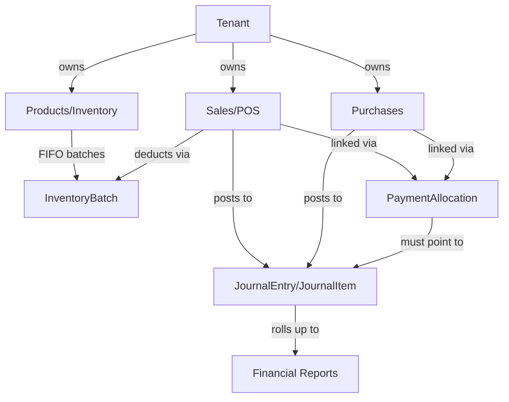

# VenQore POS — Vault Home

This vault documents **VenQore POS**, a multi-tenant SaaS Point-of-Sale and ERP system built on Laravel 12 + React 18 (Inertia.js). It is generated from a full codebase scan (128 models, 185 controllers, 40 services, 238 frontend pages, 265+ migrations) plus the project's `CLAUDE.md`.

> [!info] How to use this vault
> Start here, then follow links into whichever layer you need. Each note stands alone but cross-links heavily — use Obsidian's graph view to see how domains connect (Sales ↔ FIFO ↔ Accounting ↔ V3, for example).

## Quick Navigation

### 🏗️ Architecture
- [[Tech Stack]]
- [[Project Overview]]
- [[Two Generations - Legacy vs V3]]
- [[Directory Structure]]

### 🏢 Multi-Tenancy & SaaS Platform
- [[Multi-Tenancy Architecture]]
- [[Tenant Model Deep Dive]]
- [[Plans, Limits & Billing]]
- [[Three Admin Surfaces]]
- [[Coupons, AppSumo & Access Grants]]

### 📦 Domain Models (by area)
- [[Models - Inventory & Products]]
- [[Models - Transactions & Sales]]
- [[Models - Accounting & Ledger]]
- [[Models - Parties]]
- [[Models - Multi-Tenancy & Platform]]
- [[Models - POS & Terminal]]
- [[Models - WooCommerce Integration]]
- [[Models - Manufacturing & Recipes]]
- [[Models - AI, Chat & Support]]
- [[Models - Marketing & Growth]]

### ⚙️ Business Logic (Services)
- [[V3 Accounting Engine]]
- [[FIFO Inventory System]]
- [[Sale Lifecycle - V3 SaleService]]
- [[Purchase Lifecycle - V3 PurchaseService]]
- [[Legacy vs V3 Services]]
- [[WooCommerce Sync Engine]]
- [[Billing & Subscription Services]]
- [[Manufacturing & Composite Products]]
- [[Platform Infrastructure Services]]
- [[Jobs & Queue Workers]]

### 🌐 Routes & Controllers
- [[Route Map Overview]]
- [[Store Context Routes]]
- [[Platform & SuperAdmin Routes]]
- [[V3 ERP Routes]]
- [[API Routes]]
- [[Controllers Directory]]

### 🔧 Free Tools (SEO / Lead-Gen)
- [[Free Tools - Complete Registry]] — all 19 live tools, routes, services, tests
- [[Test Suite Dashboard]] — run any/all tests with one command

### 💻 Frontend
- [[Frontend Architecture]]
- [[POS Terminal Deep Dive]]
- [[Offline Sync - Dexie & IndexedDB]]
- [[Pages Directory Structure]]
- [[Components & Layouts]]
- [[State Management]]

### 🗄️ Database
- [[Database Schema Overview]]
- [[Core Tables - Products & Inventory]]
- [[Core Tables - Sales & Purchases]]
- [[Core Tables - Accounting]]
- [[Core Tables - Multi-Tenancy]]
- [[PaymentAllocation Trigger]]
- [[Schema Evolution & Hardening]]

### 🛠️ Dev Workflows
- [[Key Commands]]
- [[Test Suite Dashboard]]
- [[Code Conventions]]
- [[Database Policy]]
- [[Default Credentials]]

---

## Domain Concept Map

## Key Facts at a Glance

| Fact | Value |
|---|---|
| App name | VenQore POS |
| Stack | Laravel 12 + React 18 + Inertia v2 + Tailwind v3 |
| Database | MySQL only (`venqore_pos`), no SQLite anywhere |
| Models | 128 |
| Controllers | 185+ |
| Services | ~55 (legacy + V3 + tools) |
| Frontend pages | 263+ `.jsx` files |
| Migrations | 265+ |
| Free Tools (live) | 19 tools at `/tools/*` |
| Test files | 209 files (~935+ assertions) |
| Offline POS | Dexie.js / IndexedDB |
| Accounting | Double-entry, V3 engine is source of truth |
| Domain | `venqore.com` |

## Related
This vault's structure mirrors the codebase's own `CLAUDE.md` at the project root — see [[Project Overview]] for the canonical source document.
