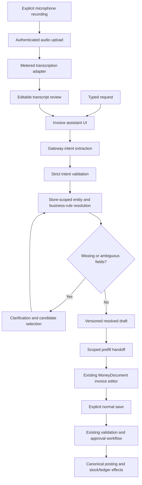

# Conversational invoices and microphone input — implementation specification

Version: 1.0 · Prepared: 2026-10-02 · Status: planning only, no feature implemented.

## 1. Purpose and implementation instructions

Build an authenticated assistant that turns a typed or spoken request into a reviewed sales invoice using VenQore's existing customer, product, pricing, approval, inventory, and accounting workflows.

Example: “Create an invoice for Ahmed Traders: three units of ABC-101 and two units of XYZ-205, on credit.”

The result must be an editable draft in the working sales invoice editor. Only the normal, explicit invoice save action may submit or post it. An AI response, transcript, tool call, or spoken “yes” cannot post an invoice.

This specification is intended to be handed to an IDE coding agent. Implement in the dependency order below. Inspect the current source before editing; source symbols are more durable than line numbers. Treat proposed files and contracts as new work, not existing functionality. Read applicable repository instructions. Preserve unrelated changes. Do not deploy or change production data as part of implementing this plan.

Repository root: `E:/AMD POS/AMD POS`. Application root: `app-code/main-app`. All paths below are relative to the application root unless explicitly prefixed with the repository root.

### Estimate and assumptions

- Production text workflow: **7–10 working days** for one developer familiar with this application.
- Microphone capture, transcription, and browser/device validation: **2–4 additional working days**.
- Full sequential delivery: **9–14 working days**, approximately 63–98 focused hours at seven hours/day. Calendar time depends on review, credentials, staging, and access to devices.
- The lower estimate assumes healthy existing invoice posting, one supported transcription provider, short recordings, and one primary invoice surface. Provider integration repairs, unsupported hosting constraints, and broader language/device requirements can extend it.
- No model training is required. Model selection and actual usage costs must be verified during implementation; no provider price or performance guarantee is assumed here.

## 2. Verified repository findings and important corrections

These are findings from source inspection, not runtime verification.

| Existing path / symbol | Observed role | Implementation consequence |
|---|---|---|
| `app/Http/Controllers/AiController.php::query()` | Existing assistant uses `AiRequest`, tool definitions/executor, and `AiGateway`; query also has local report routing. | Reuse AI infrastructure. Do not add invoice mutations to its GET query endpoint. |
| `app/Services/Ai/AiGateway.php::resolve()` | Common AI admission and resolution. | Use for intent extraction and preserve entitlement, scope, rate, and spend controls. |
| `app/Services/Ai/AiGateway.php::meter()` | Admission/reconciliation wrapper for transports outside the resolver chain; its comments explicitly say it does not record usage itself. | A speech adapter may use this seam if verified suitable, with exactly one usage recorder. |
| `app/Services/Ai/AiRequest.php` | Supports tenant, user, input, context, schema, tools, and `userText`. | Set `userText` for every free-text interpretation call. |
| `app/Services/Ai/AiSchema.php` | Existing schema validator checks basic shape/required fields. | Add full recursive, bounded intent validation; do not rely on this alone. |
| `app/Services/Ai/AiResult.php` | Common result and usage metadata. | Normalize failures and speech usage into existing conventions. |
| `config/ai_limits.php`, `config/ai_models.php`, `config/ai_pricing.php` | Existing feature limits and model/cost configuration. | Add explicit invoice/speech configuration after tracing how admission resolves these features. |
| `resources/js/Pages/Sales/CreateInvoice.jsx` | Current screen imports `@/Documents/MoneyDocument`, uses workspace invoice tabs, accepts `aiPrefill`, and saves through `store.sales.store`. | **Primary frontend integration point.** |
| `resources/js/Documents/MoneyDocument.jsx` | Shared document editing/save surface. | Preserve common document behavior; add narrow extension seams only when needed. |
| `resources/js/Documents/documentMoney.js`, `DocumentTotals.jsx`, `DocumentLines.jsx`, `documentTypes.js` | Current document calculations, lines, totals, and type configuration. | Reuse these; do not introduce another frontend totals engine. |
| `resources/js/Contexts/WorkspaceContext.jsx` | Imported by the current invoice screen for active invoice tabs. | Trace actual tab state and persistence before applying a draft. |
| `app/Services/SmartCapture/PrefillService.php::put()/pull()` | Server-side prefill cache, tenant/user scoping, configured TTL; consumption currently uses get then forget. | Reuse the prefill concept. For concurrency-safe consumption use a verified lock/atomic design; get/forget is not inherently atomic. |
| `app/Http/Controllers/SaleController.php::store()` | Current classic invoice posting controller; includes validation, approval and idempotency behavior. | Trace full store behavior and request shape before building the adapter. The create-screen prefill consumer is a route closure in `routes/web.php`, not this controller. |
| `app/Http/Controllers/V3/SaleController.php::store()` | Calls `App\Engines\SaleService`; includes maker/checker policy, returns 202 on pending approval, normal success currently redirects. | Do not assume V3 returns a JSON invoice on every successful request. Do not bypass approval by calling the engine directly. |
| `app/Http/Requests/V3/StoreSaleRequest.php` | Tenant-scoped references, positive quantity, role discount checks, manager approval checks, idempotency fields. | Preserve and extend validation consistently; AI IDs are never trusted. |
| `app/Engines/SaleService.php::post()` | Canonical posting orchestration and existing idempotency handling. | Preserve accounting/inventory semantics and verify concurrent retry behavior. |
| `app/Services/V3/SaleService.php` | Compatibility wrapper extending the engine. | Do not mistake it for the main posting implementation. |
| `app/Http/Controllers/InventoryController.php::search()` | Searches names, product/variant SKUs, and barcodes. | Existing search is useful for suggestions; exact SKU resolution must remain deterministic. |
| `app/Http/Controllers/PartyController.php::search()` | Existing party lookup. | Reuse customer eligibility and scope rules. |
| `routes/web.php` | `store.inventory.search`, `store.parties.search`, `store.sales.store`, `store.pos.sales.store`; separate V3 sales group; invoice create closure consumes `ai_prefill` through `PrefillService::pull()` and passes `aiPrefill`. | Confirm route prefixes/middleware with route listing before adding endpoints. |
| `resources/js/Domain/invoice/useInvoiceForm.js`, `invoiceSchema.js` | Older shared invoice helpers exist. | Their comments do not establish them as the current editor; do not make these the primary seam without checking actual consumers. |
| `resources/js/NewInvoice/README.md`, `app/Http/Controllers/NewInvoiceController.php` | README describes `/new-invoice` as a mock structure exercise. | Do not implement against this prototype unless its live state is independently confirmed. |
| Repository root `app-code/windows-app/package.json`, `main.js`, `preload.js` | Electron hardware bridge application. | Confirm whether users actually render invoices here before extending microphone permissions. |

Existing SmartCapture helpers worth reviewing: `app/Services/SmartCapture/{IntentResolverService,FuzzyMatchService,ProductSearchIndexService,TransactionBuilderService}.php` and `app/Http/Controllers/SmartCapture/SmartCaptureController.php`. Reuse safe lookup/prefill helpers where appropriate, but never reuse a scan-to-transaction path that posts without normal invoice review.

Concrete current prefill gaps observed in `CreateInvoice.jsx`: the scan handoff maps product, quantity, price, cost and available stock; it does not explicitly map variant, sale UOM, line tax, or discount. It uses `num(quantity) || 1`, forces non-credit payment methods to cash, and shows a scan-specific notice. Add a versioned conversational prefill path that preserves these fields, rejects unresolved quantities before handoff, respects reviewed payment preferences, and gives an appropriate source notice while preserving the existing scan behavior.

The classic `SaleController` already handles header/body idempotency keys and catches a race on the `sales_tenant_idempotency_unique` constraint. Preserve this existing mechanism; investigate outcome recovery and approval-submission concurrency rather than implementing a competing sale deduplication system.

### Day-one discovery gates

1. Run route listing and trace the exact working create/save route, including middleware, validation, approval, side effects, redirects, and frontend payload composition.
2. Determine real party/product/variant ID types, SKU uniqueness/collation, barcode relationships, sale units, warehouse selection, stock policy, customer pricing, and tax semantics. Do not infer these from names alone.
3. Trace `aiPrefill` consumption and active-tab updates in `CreateInvoice.jsx`. Current prefill mapping must be checked for variant, UOM, per-line tax, and payment preservation.
4. Confirm AI feature admission, provider capabilities, secrets handling, scope guard behavior, and whether nested schema validation is supported.
5. Inspect actual PHPUnit/Vitest discovery configuration. `tests/README.md` references older folder names; verify current paths rather than copying old launch instructions.
6. Verify staging HTTPS, hosting upload/runtime limits, queue availability, shared cache lock support, and supported browser/Electron targets.
7. Record decisions and any estimate changes in a small implementation decision log appended to this file.

## 3. Scope

### Required release behavior

- Typed invoice requests and editable, multi-turn clarification.
- Customer lookup by known identifier/name; duplicate names require selection.
- Exact product and variant SKU matching; bounded name/barcode suggestions.
- Positive quantities, supported units, server-derived pricing/tax and warehouse defaults.
- Explicit credit/cash preference, notes, invoice/due dates, and requested discounts where existing policy supports them.
- Editable review using the current sales invoice screen; explicit final save through its existing route.
- Existing maker/checker and manager approval behavior.
- Retry protection, draft revision control, feature flags, audit, metrics, and failure recovery.
- Microphone record/stop/cancel, backend transcription, editable transcript, then the identical text workflow.
- English baseline; Urdu/Roman Urdu/mixed speech must have a named fixture set and pass acceptance before claiming support. Roman Urdu is text/transliteration, not a separate audio locale.

### Deferred scope

Always-listening microphones, wake words, live bidirectional voice agents, spoken payment approvals, autonomous posting, customer/product auto-creation, invoice editing/returns, purchases, payment collection, WhatsApp sending, local speech models, and fully offline AI are outside this release. Preserve existing manual/offline invoice behavior.

## 4. Architecture and trust boundaries



The model proposes intent only. Backend lookup assigns IDs and authoritative business values. No AI tool may call posting, inventory mutations, customer creation, payment recording, or arbitrary SQL. Treat transcripts, model output, catalog text, and user notes as untrusted data. Tenant/user identity always comes from authenticated middleware, never request/model fields.

Use a dedicated invoice assistant controller/service boundary. The existing general chat can expose a button or deep link into it; add that after the main flow works. Avoid expanding report routing into a general transaction executor.

## 5. Proposed file inventory

Names below are proposed. Adjust to established repository conventions and document deviations; avoid duplicate abstractions.

| New file | Responsibility |
|---|---|
| `app/Http/Controllers/InvoiceAssistantController.php` | Thin authenticated draft/message/read/handoff/cancel endpoints. |
| `app/Http/Requests/InvoiceAssistant/{CreateDraftRequest,ClarifyDraftRequest,HandoffDraftRequest}.php` | Input bounds and expected revision validation. |
| `app/Services/InvoiceAssistant/InvoiceAssistantService.php` | Orchestration, transitions, contextual edits; never posts. |
| `app/Services/InvoiceAssistant/IntentExtractor.php` | Prompt/schema adapter through gateway. |
| `app/Services/InvoiceAssistant/InvoiceIntentValidator.php` | Recursive allowlist validation of model output. |
| `app/Services/InvoiceAssistant/CustomerResolver.php` | Eligible store-scoped customers and ambiguity handling. |
| `app/Services/InvoiceAssistant/ProductResolver.php` | Exact SKU/variant/barcode resolution and suggestions. |
| `app/Services/InvoiceAssistant/DraftPricingResolver.php` | Existing pricing/UOM/tax policy adapter, not a replacement engine. |
| `app/Services/InvoiceAssistant/InvoicePrefillAdapter.php` | Resolved draft to the current editor's contract. |
| `app/Services/InvoiceAssistant/DraftRepository.php` | Owner/tenant scope, revision locks, TTL, transition enforcement. |
| `app/Models/InvoiceAssistantDraft.php` | Persistent short-lived draft record. |
| `database/migrations/<timestamp>_create_invoice_assistant_drafts_table.php` | Draft schema and indexes. |
| `app/Http/Controllers/InvoiceVoiceController.php` | Validated audio upload/transcription response. |
| `app/Http/Requests/InvoiceAssistant/TranscribeRequest.php` | File size/type/locale constraints. |
| `app/Services/InvoiceAssistant/Speech/{SpeechProviderContract,SpeechTranscriptionService}.php` | Provider boundary, metering, cleanup, normalized result. |
| `app/Services/InvoiceAssistant/Speech/Providers/<SelectedProvider>SpeechProvider.php` | One selected transcription provider implementation. |
| `config/invoice_assistant.php` | Flags, TTL, line/input limits, speech settings/timeouts. |
| `resources/js/Components/InvoiceAssistant/{InvoiceAssistantPanel,ClarificationList,ResolvedDraftReview,VoiceInput,TranscriptReview}.jsx` | Accessible input and review surfaces. |
| `resources/js/Domain/invoiceAssistant/{useInvoiceAssistant,useVoiceRecorder,invoiceAssistantApi,draftToDocument}.js` | State, transport, recording cleanup, pure mapping. |
| `tests/tests/Feature/InvoiceAssistant/*Test.php` | Business, access, posting parity, retry, and speech endpoint tests. |
| `resources/js/tests/invoiceAssistant/*.test.jsx` | User-flow, transcript, tab, and failure interaction tests. |

Expected existing edits: `routes/web.php`; AI feature/scope/model/cost configuration and admission mappings where needed; `CreateInvoice.jsx`; prefill producer/consumer seams; `WorkspaceContext.jsx` only if tab handling requires it; existing sale validation/controller only for narrow draft-link validation and outcome association. Electron edits are conditional on actual target use. Do not make blanket changes to all document types.

## 6. Intent and resolved draft contracts

### Model output: invoice intent v1

The model cannot output authoritative database IDs or totals. Preserve lexical SKU spelling; trim whitespace but do not silently strip punctuation or leading zeros. Numeric quantities arrive as decimal strings, validated and converted with established backend decimal conventions.

```json
{
  "schema_version": 1,
  "intent": "create_sales_invoice",
  "customer_reference": {"name": "Ahmed Traders", "code": null},
  "lines": [
    {"line_key": "l1", "sku": "ABC-101", "name": null, "quantity": "3", "unit": null, "requested_unit_price": null, "discount_percent": null},
    {"line_key": "l2", "sku": "XYZ-205", "name": null, "quantity": "2", "unit": null, "requested_unit_price": null, "discount_percent": null}
  ],
  "payment": {"method": "credit", "amount_paid": null},
  "invoice_date": null,
  "due_date": null,
  "notes": null
}
```

Validation: allowlisted intent/fields; bounded strings; no extra executable fields; max 50 lines; positive finite quantity within existing sale limits; no negatives/NaN/infinity; supported dates and percentages; no payment confirmation inferred from payment method. Missing quantity remains null and unresolved, never defaults to one. Non-invoice requests return a supported-purpose explanation.

For conversational edits, pass the bounded current intent and the latest message. Require a full revised intent with stable line keys, then compute a backend diff. “Make it five” with multiple plausible lines requires clarification. Never merge an arbitrary model-produced patch directly into a database record.

### Resolved response v1 (illustrative IDs)

```json
{
  "draft_id": "uuid",
  "schema_version": 1,
  "revision": 2,
  "status": "ready_for_review",
  "expires_at": "2026-10-02T12:00:00Z",
  "customer": {"id": "actual-id", "name": "Ahmed Traders", "match_basis": "selected"},
  "lines": [
    {"line_key": "l1", "product_id": "actual-id", "variant_id": null, "sku": "ABC-101", "quantity": "3", "sale_uom": "actual-unit", "unit_price": "450.00", "tax_rate": "0", "price_source": "store_policy", "availability": "sufficient"}
  ],
  "unresolved": [],
  "warnings": [],
  "defaults_applied": ["invoice_date", "warehouse"],
  "can_handoff": true
}
```

Clarification object: `{field, line_key?, reason, question, candidates: [{id,label,secondary_label}], candidate_set_id}`. IDs are server-generated, eligible scoped records. Selection must belong to the current revision's candidate set. Revalidate it on submission; do not accept a substituted ID merely because it exists.

## 7. Resolution and monetary rules

1. Customer code/exact identifier first, then exact eligible name; multiple eligible names ask for selection. Do not silently choose the first or create a party.
2. Product variant SKU and product SKU lookup both participate. Duplicate exact matches or parent/variant collisions are ambiguous. Inactive/deleted/non-saleable entities cannot resolve.
3. Barcode matching respects product/variant relationships and store scope. Explicit SKU misses return a blocker plus optional suggestions; fuzzy similarity cannot silently replace a supplied SKU.
4. Spoken “A B C one zero one” may generate a suggested normalized candidate alongside original text. Confirmation or correction is required unless the user-supplied normalized SKU is exact and unambiguous.
5. Resolve units against actual product configuration; “two boxes” needs a real conversion or a question. Quantity decimals and weighted goods must follow the current engine. No invented conversions.
6. Resolve warehouse from a verified active selection/store default; ask if no usable default exists. Stock preview is informational and posting revalidates under existing stock policy.
7. Pricing comes from existing customer/store/variant rules. User-requested prices or discounts are explicit overrides requiring normal permissions/approval. Never use model-suggested prices as catalog values.
8. Preserve per-line tax versus invoice tax semantics; do not duplicate tax. Confirm actual backend arithmetic and compare against manual posting. Use decimal backend arithmetic; frontend totals are a preview.
9. Same SKU with different variant, UOM, pricing, tax, or discount remains separate. Do not silently merge repeated lines; preserve requested lines in v1.
10. Payment method does not mean payment received. Default assistant-originated `amountPaid` to zero; prevent existing cash auto-settlement defaults from silently filling it. Explicit payment amounts still require the normal payment/account workflow and confirmation.
11. Use existing store-local date helper/timezone. Resolve relative dates explicitly and show the resulting date. Reject impossible or contradictory due dates according to existing policy.
12. Defaults and standing charges must be visible. Do not silently add a new delivery/extra charge that was not authorized by existing configured defaults or the request.
13. Block handoff until all required references/quantities/units are resolved. In-stock warnings may be blocking or nonblocking only according to existing settings; this feature cannot enable overselling.

## 8. Persistence and state machine

Proposed table fields: UUID `id`; actual-typed `tenant_id`, `user_id`; integer `schema_version`, `revision`; status; bounded intent/resolved payload JSON; unresolved JSON; nullable sanitized transcript; `input_mode`; provider/model metadata; `expires_at`; `handed_off_at`; nullable sale/approval document linkage; timestamps. Use foreign key types matching the live schema. Index `(tenant_id,user_id,status)` and expiry. Do not store credentials, approval PINs, raw audio, or whole chat context here.

Suggested draft TTL: 30 minutes, configurable. Keep ordinary creation drafts outside financial tables; cancelling/expiring them must not change stock, balances, or ledger. Delete content on expiry using existing cleanup conventions; retain only approved minimal audit metadata under a documented retention policy.

States:

`interpreting → needs_clarification ↔ resolving → ready_for_review → handed_off`

`interpreting/resolving → failed`; active states can become `cancelled/expired`.

Posting outcomes belong to the existing invoice flow: `posted`, `pending_approval`, `validation_failed`. A handed-off draft is not a posted invoice. Link outcomes only after the backend has validated the draft association and actual invoice result. The editor may modify the invoice after handoff, so the resolved draft is provenance, not an immutable claim of what was posted.

Every write verifies tenant/user ownership, expiry, allowed state, and `expected_revision`. Lock the row or use compare-and-swap; reject stale writes with 409 and return the fresh version. Never hold DB transactions/row locks over model/network calls: capture revision, call upstream, reacquire and conditionally apply only if still current. Abort/stale responses must not overwrite newer user edits.

## 9. HTTP API contracts

Proposed store-authenticated POST endpoints below; prefixes and route names must follow verified `routes/web.php` grouping. Apply CSRF/session auth, current active store membership, sale-create authorization, feature entitlement and throttles. Public visitor chat routes cannot access these endpoints.

| Method/path under `/s/{store_slug}` | Input | Result |
|---|---|---|
| POST `/invoice-assistant/drafts` | `{text,input_mode,request_id}`; max 4000 text chars | 201 draft or clarification state. Deduplicate same owner/request ID. |
| GET `/invoice-assistant/drafts/{draft}` | None | 200 scoped current state; cache-control no-store. |
| POST `/invoice-assistant/drafts/{draft}/messages` | `{expected_revision,text?,selections?,request_id}` | 200 revised draft; one text or structured selection interaction. |
| POST `/invoice-assistant/drafts/{draft}/handoff` | `{expected_revision,request_id}` | 200 `{redirect_url,prefill_key,draft_id}`; no invoice created. |
| DELETE `/invoice-assistant/drafts/{draft}` | Expected revision | 204 cancellation; later operations forbidden. |
| POST `/invoice-assistant/transcriptions` | Multipart audio, locale hint, request ID | 200 `{text,detected_language?,warnings,request_id}`; no draft created automatically. |

For repeat create/message/handoff/transcription request IDs, return prior outcome where safely persisted; concurrent identical calls need server locking. A repeated request ID with a different payload returns 409. Never use one idempotency key for different logical operations.

Errors: 401 unauthenticated; 403 permission/feature denied; 404 unknown or inaccessible draft; 409 stale revision/conflicting replay; 410 expired owned draft; 413 oversized audio; 415 unsupported recording type; 422 semantic invalidity/silence; 429 rate limited; 502 invalid/provider failure; 503 unavailable; 504 timeout. Map existing gateway entitlement failures consistently with the established app, including its 402 convention if applicable. Include `{code,message,field_errors?,retryable,request_id}`; exclude provider secrets/internal stack traces.

Clarifications are a valid 200/201 result, not generic validation failures. Parse/model failure cannot return a fabricated ready draft.

## 10. Invoice handoff and final-save integrity

Implement `InvoicePrefillAdapter` against the actual current `CreateInvoice.jsx` mapping and `MoneyDocument` line contract. Map party, product, variant, quantity, sale UOM, price, per-line tax, explicit discount, dates, notes, payment defaults, warehouse, and source metadata. Never serialize unauthorized product costs into assistant responses; retain internal cost lookup only where the normal editor already allows it.

Existing `aiPrefill` imports currently must be checked field by field. Missing variant/UOM/tax coverage must be extended deliberately. Do not depend on older `invoiceSchema.js` shapes such as `customer` where the current document uses `party`.

Prefer a new workspace tab for the assistant draft. Never overwrite another invoice, edit-mode sale, or approval-correction document. Snapshot the intended target tab, prevent duplicate application, and avoid applying a late request to the newly active tab. Handoff consume must be atomically single-use and scoped. Handle refresh/failure with recoverable state: acknowledge application only after successful tab hydration, or use an atomic claim plus replay-safe application marker. A token alone is not authority to read another user's draft.

Ensure assistant-originated payment defaults bypass automatic “settle full cash amount” unless the operator explicitly chooses it. Preserve manual behavior for ordinary invoices.

Final Save continues through `store.sales.store` as used by the live editor. Verify its controller delegates through the canonical approval/posting flow. Do not replace it with a direct engine call. If a JSON finalization adapter is later required, extract/reuse the same orchestration, side effects and validation rather than invoking one controller from another.

Attach a server-validated draft ID/revision or signed provenance reference through a narrow allowlisted field. Never trust client `source`, `approved_by`, POS trust, or approval state. Preserve invoice idempotency key across timeout/retry. Verify that storage constraints and locking enforce concurrent duplicate prevention, including approval submissions. Existing engine idempotency handling is a starting point, not proof of concurrency safety.

On 202/pending approval show “Submitted for approval” with document reference; never “Invoice created.” When requests time out after posting, recover by scoped outcome lookup using the same idempotency identity. Do not generate a new sale key on every retry. Audit source provenance separately from business semantics where an existing source enum cannot safely accept a new value.

## 11. Microphone and transcription specification

### Approach

Use explicit short recording, upload to an authenticated backend, transcribe using one selected provider, display editable text, then call the text draft endpoint only after “Use transcript.” Typed input always remains available. Avoid relying on browser speech recognition as the sole production path; support must be measured on the actual target fleet.

### Client state and lifecycle

`idle → requesting_permission → recording → stopping → recorded → uploading → transcribing → transcript_review → idle`

All states can expose cancel/failure recovery. Buttons: Record, Stop, Cancel, Retry transcription, Use transcript. Show elapsed time and a clear microphone-active indicator; do not require holding a button or perceiving a waveform. Keyboard-accessible controls and an appropriate status live region are required.

- Request `getUserMedia({audio:true,video:false})` only after user action.
- Recording requires a secure context and user permission. Handle denied, ignored/pending, missing-device, and busy-device scenarios with useful text and typed fallback. [MDN getUserMedia](https://developer.mozilla.org/en-US/docs/Web/API/MediaDevices/getUserMedia)
- Negotiate a recording MIME using `MediaRecorder.isTypeSupported`; proposed candidates are WebM/Opus, Ogg/Opus, and MP4 where supported. Align the final choice with the selected provider and backend allowlist; no assumption that a container works everywhere. [MDN isTypeSupported](https://developer.mozilla.org/en-US/docs/Web/API/MediaRecorder/isTypeSupported_static)
- Proposed limits: 60 seconds and 10 MiB; enforce both client and server, configurable. Byte size is authoritative; client-reported duration is not trusted.
- Wait for recorder final data/stop events before upload. Stop all media tracks on stop, cancel, error, unmount and route change; revoke object URLs and clear blobs when discarded.
- If permission resolves after cancellation/unmount, immediately stop the returned stream. Use generation IDs to suppress late uploads and stale transcripts.
- Cancel HTTP requests with existing Axios/AbortController conventions. Cancellation cannot guarantee upstream billing cancellation; do not retry indefinitely.
- Do not put recordings/transcripts in localStorage, IndexedDB, analytics, or service-worker caches. No auto-restart recording after navigation.

### Backend speech transport

`SpeechProviderContract::transcribe(AudioInput, localeHint): TranscriptionResult` with normalized `{text,language?,duration_seconds?,provider,model,cost_usd,latency_ms,request_id,warnings}`. Do not manufacture confidence scores if the provider does not expose them.

Use existing server-side key resolution, gateway admission/spend reservation, and usage accounting. Speech requires explicit feature registration; do not assume existing text models support audio. If using `AiGateway::meter()`, the speech adapter must record usage once because that method's current contract does not do so. Do not set a successful billed call's model to null. Reconcile known cost; when provider cost is unavailable, use a documented conservative duration/rate estimate.

Validate authenticated access before forwarding any audio. Inspect file bytes/container, bound upload size, allow supported types, reject corrupt/empty data, and use generated private temporary paths. Bound HTTP connection/read timeouts; proposed total upstream timeout 30 seconds, subject to hosting limits. Delete temporary files in `finally`; add a cleanup sweep for crash leftovers. Never expose private storage URLs or keys to the browser.

Prefer a provider accepting the browsers' actual formats so shared hosting needs no ffmpeg installation. If server duration verification/transcoding requires unavailable binaries, revise the architecture explicitly and estimate it; do not silently install infrastructure. Hard byte/time/provider limits still apply. Use a queue with authenticated status polling only if required by verified runtime constraints; this adds persistence/cancellation/test work and must be reflected in the schedule.

Silence or empty transcription returns an editable failure, not an invoice. Urdu/English SKU misrecognition remains visible for correction. A spoken instruction to ignore validation or approve a payment remains untrusted text. No transcript can supply a manager PIN automatically.

### Browser and Electron validation

Test current supported desktop Chrome/Edge, Android Chrome, iOS Safari, and Electron only when those platforms are included in the actual release promise. Record tested versions. Safari formats and mobile interruptions need real-device validation; mocks alone cannot prove compatibility.

For the repository's Windows app, inspect actual origin/session/view configuration before changes. If microphone is requested by its hosted invoice surface, constrain permission-check/request handling to approved application origins and required audio permission; deny unexpected origins/types. Preserve Electron isolation and existing bridge security. [Electron session permission APIs](https://www.electronjs.org/docs/latest/api/session)

## 12. Security, privacy, limits, and offline behavior

- Enforce active tenant membership plus create-sale authority on every draft, lookup, handoff and transcription operation. Scope draft IDs, candidate IDs, products, variants, warehouses, accounts, and customer records.
- Revalidate permissions/entities at handoff and final save; a cached draft cannot preserve a revoked permission.
- Model receives minimal input/context; never the full catalog/ledger, credentials, staff PINs, or other tenants' data. Limit candidate results, e.g. five per field; keep hidden costs and customer balances out unless normal permissions permit them.
- Restrict model output/tool arguments with schemas and server policy. Never render AI HTML or evaluate generated code. Use escaped text and bounded notes.
- Add explicit feature admission mapping for `invoice_intent` and `invoice_transcription` (proposed names), including plan entitlement and scope rules. Do not disable scope guarding globally to allow voice.
- Proposed initial defaults: 4000 input chars, 50 lines, ten conversational turns, 30-minute draft TTL, bounded candidate lists, 60-second/10-MiB audio, and configurable per-user/store limits. Confirm business fit and provider costs on staging.
- Speech budget and text budget need explicit combined accounting; throttling uploads must happen before provider forwarding. Failed/retried upstream calls may still cost money.
- No raw prompts/audio in ordinary application logs. Redact transcript/customer/product contents from telemetry; existing general assistant logging is not a template to copy.
- Document selected provider data retention and region terms during configuration. Application retention cannot promise deletion of provider-side data beyond supported settings.
- AI/transcription requires network. If offline, show the manual invoice option, preserve existing invoice work, and do not queue financial posting from the assistant. Reconnect does not auto-record, auto-transcribe, or auto-submit.

## 13. Failure recovery and observability

Events: `draft_created`, `intent_failed`, `clarification_required`, `draft_resolved`, `draft_handed_off`, `transcription_started/completed/failed`, `invoice_posted`, `invoice_pending_approval`, `duplicate_recovered`. Fields: request ID, scoped draft ID, revision, actor/tenant IDs subject to access policy, stage, durations, normalized reason, provider/model, billed estimate/actual cost. Avoid full text/audio/keys/PINs.

Track success and clarification rates, unknown SKUs, transcription failures, latency percentiles, requests and cost per completed invoice, posting validation failures and duplicate prevention. Distinguish handoff from actual posting.

Proposed staging targets, not claims: p95 typed resolution under ten seconds for <=10 lines; p95 short-recording transcription under fifteen seconds on the tested network; no cross-store access or duplicate financial effects. Measure and revise targets transparently if provider/runtime constraints require it.

Recovery examples: provider unavailable -> retain editable text; audio failure -> retain only in-memory recording for explicit retry until leaving/cancelling; stale draft -> show current revision; changed product price -> show updated amount and require review; stock shortage -> existing policy error; expired prefill -> return to assistant/manual entry without overwriting tabs; unknown posting result -> lookup with original sale idempotency key.

## 14. Day-by-day text implementation plan

The ten-day schedule is the conservative production plan. Seven-day compression may combine discovery with extraction, UI with handoff, and test work throughout. It must retain the same acceptance gates.

| Day | Work and deliverables | Completion gate |
|---|---|---|
| 1 | Trace live routes/editor/posting, prefill/AI admission, units/pricing, tests; inventory exact file seams; record decisions and fixtures. | Proven manual invoice baseline and signed-off technical assumptions; no unresolved posting-route guess. |
| 2 | Define DTO/schema/errors/config; add draft migration/repository, owner scope, TTL/revision control; route/request scaffolding. | Cross-user/store reads/writes fail; concurrent revisions cannot overwrite. |
| 3 | Implement bounded intent extraction through gateway, full validation, contextual edit handling, model failure behavior. | Deterministic mocked fixtures cover valid/invalid requests; model cannot create financial records. |
| 4 | Customer/product/variant/barcode exact resolvers; candidate selection; SKU preservation; units/warehouse rules. | Missing and duplicate references clarify; foreign-store IDs and inactive items fail. |
| 5 | Pricing/tax/default adapter; editable resolved review; disclosure of overrides/defaults; stock policy preview. | Draft amounts/units match comparable manual invoices; no invented payments. |
| 6 | Assistant panel and state hook; text input, revision-safe edits, clarifications, cancellation and network recovery. | User can reach a valid reviewed draft without losing existing tabs. |
| 7 | Atomic scoped prefill handoff into current MoneyDocument; preserve variants/UOM/tax; explicit save; outcome/provenance association. | Reviewed invoice posts or submits for approval through existing behavior; no bypass. |
| 8 | Retry/concurrency/expiry/permission-revocation tests; approval and canonical stock/ledger parity integration cases. | Same request cannot duplicate a sale or approval document; no side effects from drafts. |
| 9 | Failure UX/accessibility, rate/spend/retention/metrics, offline/manual fallback; representative user acceptance. | Usable errors and disabled-feature/manual path; measurable latency/cost. |
| 10 | Targeted regression suites, route/build checks, staging dry run, operational notes and rollout gates. | All required tests pass with documented environment and known limitations. |

Day 3 onward: add meaningful tests as each behavior lands rather than waiting until day 8. Use real business-rule integration tests for money/permissions; mocked model responses for deterministic extraction tests; a small metered live-provider smoke set only after credentials and budgets are configured.

## 15. Additional 2–4 day voice plan

| Voice day | Work | Gate |
|---|---|---|
| V1 | Confirm one transcription provider/formats/limits/keys; add backend interface, metering, validated upload, private temp cleanup and error mapping. | Corrupt/oversized/unauthorized uploads cannot reach provider; mock success/failure usage accounted once. |
| V2 | MediaRecorder hook and controls; transcript review; same typed draft flow; full lifecycle/cancellation cleanup. | Browser recording ends cleanly and “Use transcript” works; no automatic posting or recording. |
| V3 | Real device/browser and optional Electron validation; English/Urdu/mixed fixture testing, SKU correction, network/permission/interruption recovery. | Tested platform/language matrix recorded; fallback works everywhere promised. |
| V4 | Voice rate/spend/timeout checks, live-provider smoke, metrics/privacy/retention verification and release regression. | Speech safely feature-flagged; cost/latency measured; manual/text path intact. |

Two-day voice delivery is possible for a single verified browser/provider with existing metering seams; broad mobile/Electron and multilingual production support should budget the full four days. Voice can be enabled later independently of text.

## 16. Acceptance test matrix

| Area | Required scenarios and assertions |
|---|---|
| Intent | Exact example; multiple lines; decimals; leading-zero SKU; irrelevant question; malformed/nested output; missing quantity; ambiguous edit; explicit discount/payment versus omitted values. |
| Resolution | Duplicate customer names; unknown SKU; parent/variant SKU collision; variant/barcode matches; inactive/deleted items; UOM conversion exists/missing; no warehouse default. |
| Monetary parity | Customer-specific price; variant price; mixed tax rates; fixed/percent discounts if supported; rounding; explicit standing charges; credit; partial payment; cash omitted amount stays zero for AI drafts. Compare persisted invoice and canonical ledger/stock effects to manual entry. |
| Authorization | Other store/user draft/candidate/product/account/warehouse; revoked membership; read-only user; invalid manager approval; plan locked; unauthorized visitor routes. |
| Lifecycle | TTL expiry; stale revisions; model returning after cancellation; concurrent message responses; consumed handoff replay; refresh failure; new tab versus existing unsaved/edit/correction tab. |
| Posting | Allowed post; approval-required 202; rejection/correction flows preserved; double-click; concurrent duplicate save; timeout after successful commit; approval submission retry; stock/price changes between review and save. |
| Voice backend | Valid negotiated formats; MIME spoof; empty/silent/corrupt audio; oversized upload; rate/spend cap; provider timeout; cleanup after exception; exactly-once telemetry; duplicate upload request identity. |
| Voice UI | Denied/pending permission; no microphone; route/unmount cleanup; permission resolves after cancel; final audio chunk captured; multiple recordings; stale transcript; editable SKU; keyboard controls; upload cancellation; phone interruption. |
| Offline/flags | No network; text/voice individually disabled; expired session; preserve existing manual invoice/offline behavior and existing working tabs. |

Suggested test files: `InvoiceAssistantAccessTest.php`, `InvoiceIntentValidationTest.php`, `InvoiceEntityResolutionTest.php`, `InvoiceDraftConcurrencyTest.php`, `InvoicePrefillHandoffTest.php`, `InvoicePostingParityTest.php`, `InvoiceTranscriptionTest.php`, `InvoiceAssistantUsageTest.php`; frontend tests under `resources/js/tests/invoiceAssistant` for assistant flows, recording lifecycle and draft mapping.

Regression references already in the tree: `tests/tests/Feature/Ai/{AiControllerAccessTest,AiScopeGuardTest,AiRateLimiterTest,SmartCaptureSpendCapTest}.php`; `tests/tests/Feature/Chat/{SmartCaptureSafetyTest,SmartCaptureHardeningTest}.php`; `tests/tests/Feature/Approval/R01AdminInvoiceBypassTest.php`; `tests/tests/Feature/Reckoner/SaleServiceParityTest.php`; relevant Money/Guardrails tests. Confirm current existence/discovery before invocation.

Do not use production databases. Inspect `tests/phpunit.xml`, root PHPUnit configuration, bootstrap guards and testing environment first. Likely targeted command shape, after verification: `vendor/bin/pest --configuration tests/phpunit.xml --filter InvoiceAssistant`. On Windows use the available PHP/vendor launcher. Do not supply a positional stale test directory that overrides suite configuration.

Frontend: `npm test` currently runs `vitest run resources/js/tests`; keep new tests within discovery. Run targeted tests while developing, then relevant regression suites, `npm run lint`, route audit via the current build script, and `npm run build`. Build includes design/font/theme checks and both client/SSR compilation; document pre-existing failures without silently disabling checks. Components that touch `navigator`, `window`, or recording APIs must remain safe during SSR.

## 17. Configuration, rollout and operational handoff

Proposed independent flags: `invoice_assistant.enabled` and `invoice_assistant.voice_enabled`, disabled by default until staging acceptance. Mirror actual tenant plan/feature conventions rather than inventing a competing entitlement system. Keep provider keys server-side and out of source control.

Initial rollout: internal staging fixtures -> controlled pilot stores -> measured expansion. Feature flags disable new draft/transcription creation while existing manual invoice posting remains available. Decide explicitly whether active drafts can still be handed off after disable; recommended emergency disable blocks assistant handoff as well and offers manual recovery of user-visible content.

Migration is additive. Disabling the feature does not reverse already-posted invoices. Roll back application UI/endpoints/flags without dropping draft records until retention/recovery is resolved. Never undo sales/ledger entries as a feature rollback.

Follow repository root `RELEASE_AND_DEPLOYMENT_POLICY.md` for any eventual release. Root README currently describes blocked deployment/updater issues, so successful feature tests do not establish production deployment readiness. Implementation work ends with a reviewable staged result, not an automatic production upload.

Handoff deliverables: implemented file map, route/API reference, configuration and secret setup without secret values, migrations/cleanup instructions, tested browser/language matrix, fixture results, test/build outputs, measured provider latency/cost, rollback steps, and known limitations.

Cost model: `text calls × (input/output token usage at configured model rates) + audio duration × configured transcription rate + hosting/storage overhead`. Count clarifications, failed billable calls, and retries. Record rates and verification date when selecting provider; no cost estimate should be treated as fixed without measurement.

## 18. Definition of done and IDE execution checklist

- [ ] Day-one decision gates resolved against current source and staging runtime.
- [ ] Dedicated authenticated draft workflow with strict intent validation, scope, revisions, TTL and bounded context.
- [ ] Customer/SKU/variant/UOM resolution deterministic; ambiguous/missing fields stop for clarification.
- [ ] Current shared invoice editor receives all required fields in a fresh safe tab.
- [ ] Actual pricing/tax/payment/stock/approval/accounting parity proven with manual invoice fixtures.
- [ ] No financial side effect before the existing explicit Save; pending approval shown accurately.
- [ ] Retry/concurrency tests prevent duplicate invoices and approval documents.
- [ ] Text and voice use existing AI entitlement/rate/spend/key infrastructure without bypass or double billing records.
- [ ] Microphone lifecycle, transcript editing, private upload cleanup and typed fallback verified.
- [ ] Promised browser/language/Electron support verified with recorded results.
- [ ] No secrets/raw audio/prompts in logs or persistent browser caches.
- [ ] Relevant tests, SSR/client build, route checks and staging acceptance pass; remaining limitations documented.
- [ ] Feature flags, rollout/rollback, retention and operational handoff complete.

### Suggested initial prompt for the implementing IDE

> Implement the conversational sales invoice and microphone feature described in `docs/CONVERSATIONAL_INVOICE_IMPLEMENTATION_PLAN.md`. Begin with the Day-one discovery gates and inspect current route, prefill, MoneyDocument, AI gateway, approval, and canonical posting code. Preserve unrelated edits. Work in the day-by-day dependency order, recording decisions where current source differs from this plan. Implement text first, then voice. Reuse existing business rules and the current invoice editor, with no automatic posting or approval bypass. Add meaningful tests for tenant isolation, monetary parity, retry/concurrency, handoff safety and recording cleanup. Report files changed, tests/build results, tested devices/languages, setup requirements, and remaining limitations. Do not deploy or modify production data.

## 19. Implementation decision log

Pending: exact selected speech provider/model; current create/save route contract; SKU uniqueness and UOM policy; draft storage/cleanup convention; prefill atomicity mechanism; assistant payment-default override seam; metering entitlement mapping; supported browsers/languages; optional Electron origin policy; final test invocation; staging rollout readiness.
