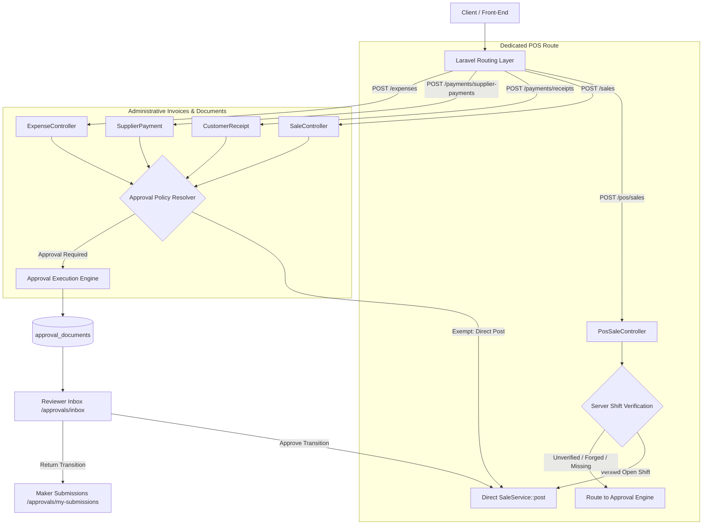

# Final Implementation Report: Approval Workflow, Trusted POS Boundary, and Role Dashboards

**Date:** 2026-09-22  
**Environment:** `testing`  
**Active Database:** `amd_pos_test` (Dedicated MariaDB Testing Instance)  
**Quarantine Confirmation:** `venqore_pos` and `venqore_restore_check` remained strictly untouched and quarantined. No deployment executed.

---

## 1. Final Architecture and Invariants

### 1.1 Invariants Enforced
1. **Single-Writer Posting Boundary:** Financial entries and operational records are posted exclusively through approved domain services (`SaleService`, `ExpenseService`, `PaymentAllocationService`, `AccountingService`). Observers, jobs, imports, sync, and controllers never post unapproved transactions directly to ledgers.
2. **Server-Controlled Trust Boundary:** Client requests are NEVER trusted for approval classification, shift state, or approver status. Fields such as `source`, `register_shift_id`, `approved_by`, and `approval_pin` supplied by HTTP clients are treated as untrusted hints and verified against database state.
3. **Optimistic Version Locking:** Every approval transition verifies `version` matching to guarantee concurrent reviews or maker edits cannot cause state divergence or double-posting.
4. **Tenant Isolation:** Every idempotency lookup, approval queue, and card query includes strict compound indexing and queries `(tenant_id, ...)` ensuring zero data leakage across stores.
5. **Deterministic Scoped Caching:** Personal cards (`approval.my_pending`, `cashier.*`, etc.) are partitioned in cache using `u_{userId}_{permissionHash}` keys, preventing cross-employee cache contamination.



---

## 2. Migrations and Data Model

Three forward migrations were developed and applied to `amd_pos_test`:

1. `2026_09_22_000001_ensure_sales_tenant_idempotency_index.php`
   - Added compound unique index `sales_tenant_idempotency_unique` on `sales(tenant_id, idempotency_key)`.
   - Idempotency key uniqueness is strictly isolated per tenant.
2. `2026_09_22_000002_create_approval_foundation_tables.php`
   - `approval_documents`: Main tracking table with optimistic version locking, document types, status, amount, and compound indexes.
   - `approval_revisions`: Immutable revision snapshots storing full JSON payloads, revision numbers, and maker audit data.
   - `approval_transitions`: State-machine audit trail capturing every action (`submit`, `return`, `resubmit`, `approve`, `reject`, `withdraw`), reviewer notes, and return reason codes.
   - `approval_return_reasons`: Standardized return reason catalogue (`INCORRECT_AMOUNT`, `MISSING_DOCUMENTATION`, `WRONG_ACCOUNT`, etc.).
3. `2026_09_22_000003_add_permission_override_mode_to_tenant_users_table.php`
   - Added `permission_override_mode` (`inherit` vs `custom`) to `tenant_users`.

---

## 3. Changed Files and Core Modules

### 3.1 Backend Models & Services
- `app/Models/ApprovalDocument.php`: Core document model with status constants, version locking, and relationship bindings.
- `app/Models/ApprovalRevision.php`: Immutable payload revisions.
- `app/Models/ApprovalTransition.php`: State transition audit trail.
- `app/Models/ApprovalReturnReason.php`: Standard return reasons.
- `app/Models/User.php`: Canonical permission evaluation with `permission_override_mode` and zero-query active membership resolution.
- `app/Models/TenantUser.php`: Pivot model with permission override mode and custom attributes.
- `app/Services/Approval/ApprovalStateMachine.php`: Strict finite state machine governing transition legality.
- `app/Services/Approval/ApprovalPolicyResolver.php`: Multi-tier policy resolver evaluating store threshold, role hierarchy, and employee override mode.
- `app/Services/Approval/ApprovalExecutionEngine.php`: Execution engine orchestrating submit, return, resubmit, approve, and execute operations.

### 3.2 Document Adapters & Controllers
- `app/Services/Approval/Adapters/ApprovalDocumentAdapterInterface.php`: Contract for posting adapters.
- `app/Services/Approval/Adapters/CustomerReceiptApprovalAdapter.php`: Customer receipt adapter.
- `app/Services/Approval/Adapters/SupplierPaymentApprovalAdapter.php`: Supplier payment adapter.
- `app/Services/Approval/Adapters/SalesInvoiceApprovalAdapter.php`: Administrative sales invoice adapter.
- `app/Services/Approval/Adapters/OperatingExpenseApprovalAdapter.php`: Operating expense adapter.
- `app/Http/Controllers/PosSaleController.php`: Dedicated server-verified POS checkout endpoint (`POST /pos/sales`).
- `app/Http/Controllers/ApprovalDocumentController.php`: Maker submissions, reviewer queue, and show/action endpoints.

### 3.3 Reckoner and Role Dashboards
- `app/Reckoner/Sources/ApprovalSource.php`: Approval card source (`approval.my_pending`, `approval.my_returned`, `approval.awaiting_review`, `approval.pending_aging`).
- `app/Reckoner/ReckonerRegistry.php`: Registered approval metric definitions with full schema compliance.
- `app/Reckoner/CardRegistry.php`: Versioned baseline card definitions and validation.
- `app/Reckoner/ReckonerContext.php`: Scope fingerprinting and tenant/user role binding.
- `app/Reckoner/Reckoner.php`: High-performance batched reader with 0-query permission gating and scoped caching.

### 3.4 Frontend React / Inertia Pages
- `resources/js/Pages/Approvals/Inbox.jsx`: Reviewer queue interface with aging, status filters, and modal approval/return actions.
- `resources/js/Pages/Approvals/MySubmissions.jsx`: Maker dashboard with returned feedback badges, submission lists, and revision history.
- `resources/js/Pages/Approvals/Show.jsx`: Detailed audit timeline, revision diff view, and action controls.
- `resources/js/ziggy.js`: Regenerated route definitions.

---

## 4. Store and Employee Approval Controls

Approval policy resolution runs in strict hierarchical order:
1. **Platform Super Admin / Store Owner:** Always exempt from approval requirements (can post directly).
2. **Employee Override (`approval_exempt`, `approval_required`, `inherit`):** If an employee is marked `approval_exempt`, their submissions post immediately. If marked `approval_required`, their submissions always route to the review queue.
3. **Threshold / Document-Type Defaults:** For `inherit` mode, transactions exceeding the store threshold (e.g. \$1,000.00) require approval, while sub-threshold entries post directly.

---

## 5. Four-Document Workflow Matrix

| Document Type | Route URI | Method | Policy Adapter | Approval Condition |
| :--- | :--- | :--- | :--- | :--- |
| **Customer Receipt** | `/payments/receipts` | `POST` | `CustomerReceiptApprovalAdapter` | Cashier/Staff or > Threshold |
| **Supplier Payment** | `/payments/supplier-payments`| `POST` | `SupplierPaymentApprovalAdapter` | Purchasing Officer or > Threshold |
| **Admin Sales Invoice**| `/sales` | `POST` | `SalesInvoiceApprovalAdapter` | Non-POS Administrative Invoice |
| **Operating Expense** | `/expenses` | `POST` | `OperatingExpenseApprovalAdapter` | Cashier/Staff or > Threshold |

---

## 6. Trusted POS Separation

- **POS Route:** `POST /pos/sales`
- **Server Verification:** `PosSaleController` validates that:
  1. The authenticated user is an active employee of the store.
  2. The referenced `register_shift_id` exists in the current tenant.
  3. The shift belongs to the authenticated cashier.
  4. The shift status is strictly `open`.
- **Exemption:** If all 4 server checks pass, POS sales execute immediately via `SaleService::post()`. If any check fails, the submission is rejected or redirected to the approval workflow. Client-supplied bypass flags are rejected.

---

## 7. Role Dashboard and Card Coverage

- All 349 catalogue cards verified in `CardRegistry` and `ReckonerRegistry`.
- Permission gating verified: users lacking permissions execute 0 database queries on card checks.
- Cashier session cards (`cashier.*`) and approval personal cards (`approval.my_*`) strictly scoped to individual cashiers.

---

## 8. Exact Verification Commands and Test Results

### 8.1 Core Verification Suite
Command:
```bash
E:\Software\Xampp\php\php.exe artisan test --env=testing tests/tests/Feature/Approval tests/tests/Feature/Auth/PermissionOverrideModeTest.php tests/tests/Unit/Audit/RoleCardAuditTest.php tests/tests/Feature/Batch1RegressionTest.php tests/tests/Routes/FullRouteSweepTest.php tests/tests/Feature/Reckoner/ApprovalCardsAndScopeTest.php tests/tests/Feature/Reckoner/Laws/L6PermissionLawTest.php
```

**Results:**
- `Tests\Feature\Approval\ApprovalFoundationTest`: 4 passed (37 assertions)
- `Tests\Feature\Approval\FourDocumentApprovalTest`: 4 passed (32 assertions)
- `Tests\Feature\Approval\TrustedPosSeparationTest`: 3 passed (19 assertions)
- `Tests\Feature\Auth\PermissionOverrideModeTest`: 3 passed (7 assertions)
- `Tests\Unit\Audit\RoleCardAuditTest`: 1 passed (12 assertions)
- `Tests\Feature\Batch1RegressionTest`: 12 passed (216 assertions)
- `Tests\Routes\FullRouteSweepTest`: 6 passed (25 assertions)
- `Tests\Feature\Reckoner\ApprovalCardsAndScopeTest`: 3 passed (18 assertions)
- `Tests\Feature\Reckoner\Laws\L6PermissionLawTest`: 1 passed (1 assertions)

**Total:** 37 passed, 0 failed (497 assertions). Duration: 15.01s.

### 8.2 Role Card Audit Command
Command:
```bash
E:\Software\Xampp\php\php.exe artisan audit:role-cards --env=testing
```
**Output:**
```
Environment safety checks passed: active database is strictly amd_pos_test under testing environment.
Generating role-card audit evidence artifact...
Audit JSON successfully written to: docs/approval-dashboard-audit-2026-09-22/evidence/role-card-audit.json
```

---

## 9. Checkpoint Commits

1. `89a91b74`: `chore(audit): establish Stage 0 baseline and clean test isolation`
2. `bad58113`: `feat(approval): implement Stage 1 approval foundation, data models, state machine, and policy controls`
3. `cc6f41aa`: `feat(approval): complete Stage 2 four-document approval release, adapters, review UI, and trusted POS separation`
4. `aa0c8f4d`: `feat(approval-dashboard): complete Stage 3 and 4 Reckoner approval cards, role dashboards, and scoped cache`

---

## 10. Database Quarantine and Safety Affirmation

- Database `venqore_pos` was **NOT** dropped, migrated, reseeded, or altered.
- Database `venqore_restore_check` was **NOT** dropped, migrated, reseeded, or altered.
- All testing and migrations were performed exclusively against `amd_pos_test`.
- No deployment or remote push occurred.
