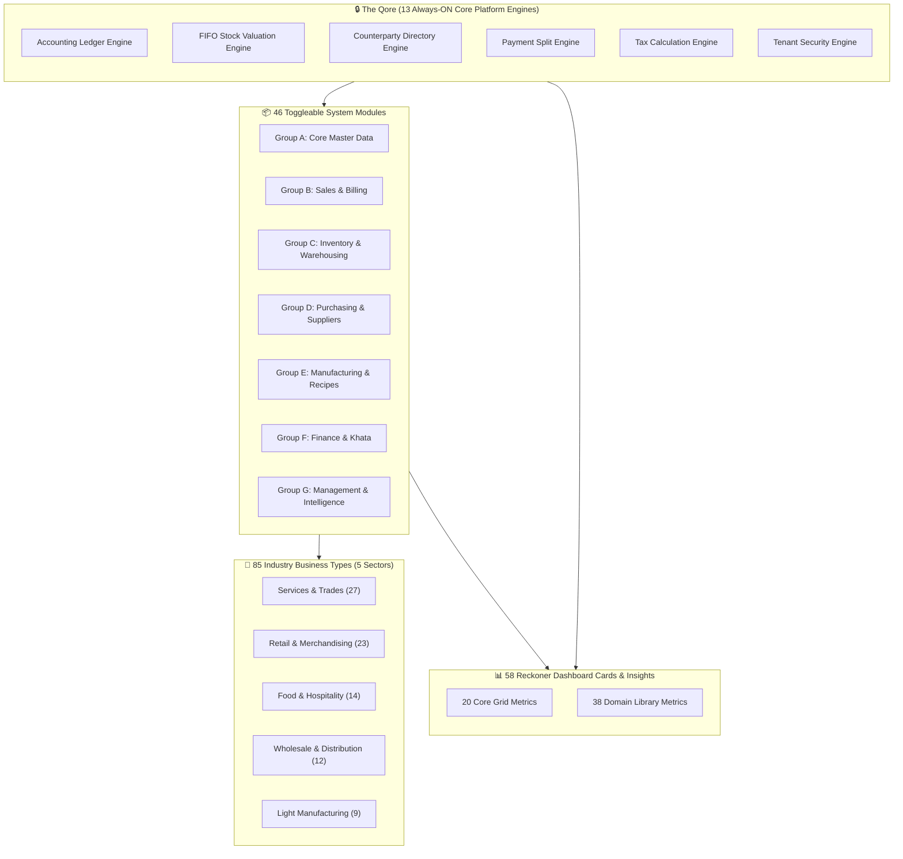

# 🗺️ VenQore — Master Architecture, Capability & Sitemap Map (2026)

> **Antigravity Architectural Audit & Operational Blueprint**  
> **Scope**: 46 Operational Modules | 85 Business Preset Types | 58 Dashboard Cards | 13 Qore Core Platform Engines

---

## 🏛️ 1. System Architecture Overview

VenQore is structured into 4 foundational layers:

1. **The Qore (13 Always-ON Core Platform Engines)**: Silent accounting, FIFO stock valuation, security isolation, and tax engines that run unconditionally for all 85 business types.
2. **Modules Suite (46 Capabilities)**: Toggleable functional modules grouped into 7 domains (Sales, Inventory, Finance, Operations, HR, CRM, Marketing).
3. **Business Types & Presets (85 Businesses)**: Pre-configured industry templates mapped across 5 sectors (Services, Retail, Food, Wholesale, Manufacturing).
4. **Reckoner Dashboard Engine (58 Catalog Cards)**: 20 default core grid metrics + 38 domain library metrics delivering live actionable business insights.

---

## 📊 2. Dashboard Cards Catalog (All 58 Reckoner Metrics)

Below is the complete catalog of all 58 dashboard cards in the VenQore Reckoner Engine:

| # | Card Metric Title | System Key | Domain | Owning Module(s) | Owner Insight & Value |
| :-: | :--- | :--- | :--- | :--- | :--- |
| 1 | **Revenue** | `sales.revenue` | Business | Standard Platform Card | Portrays live metric reading for tenant dashboard. |
| 2 | **Largest Sale (excl. tax)** | `sales.max_sale` | Business | Standard Platform Card | Portrays live metric reading for tenant dashboard. |
| 3 | **Gross Margin** | `sales.gross_margin_pct` | Business | Standard Platform Card | Portrays live metric reading for tenant dashboard. |
| 4 | **Net Profit** | `finance.net_profit` | Business | Standard Platform Card | Portrays live metric reading for tenant dashboard. |
| 5 | **Gross Profit** | `finance.gross_profit` | Business | Standard Platform Card | Portrays live metric reading for tenant dashboard. |
| 6 | **Cost of Goods Sold** | `finance.cogs` | Business | Standard Platform Card | Portrays live metric reading for tenant dashboard. |
| 7 | **Net Margin** | `finance.net_margin_pct` | Business | Standard Platform Card | Portrays live metric reading for tenant dashboard. |
| 8 | **Expenses** | `finance.expenses_total` | Business | Standard Platform Card | Portrays live metric reading for tenant dashboard. |
| 9 | **Receivables** | `finance.receivables` | Business | Standard Platform Card | Portrays live metric reading for tenant dashboard. |
| 10 | **Payables** | `finance.payables` | Business | Standard Platform Card | Portrays live metric reading for tenant dashboard. |
| 11 | **Total Liquidity** | `finance.total_liquidity` | Business | Standard Platform Card | Portrays live metric reading for tenant dashboard. |
| 12 | **Books Balanced** | `finance.balance_sheet_ok` | Business | Standard Platform Card | Portrays live metric reading for tenant dashboard. |
| 13 | **Stock Value** | `inventory.stock_value` | Business | Standard Platform Card | Portrays live metric reading for tenant dashboard. |
| 14 | **Low Stock** | `inventory.low_stock_count` | Business | Standard Platform Card | Portrays live metric reading for tenant dashboard. |
| 15 | **Out of Stock** | `inventory.out_of_stock_count` | Business | Standard Platform Card | Portrays live metric reading for tenant dashboard. |
| 16 | **Products** | `inventory.product_count` | Business | Standard Platform Card | Portrays live metric reading for tenant dashboard. |
| 17 | **Overstocked** | `inventory.overstock_count` | Business | Standard Platform Card | Portrays live metric reading for tenant dashboard. |
| 18 | **Purchases** | `purchasing.spend` | Business | Standard Platform Card | Portrays live metric reading for tenant dashboard. |
| 19 | **Purchase Bills** | `purchasing.count` | Business | Standard Platform Card | Portrays live metric reading for tenant dashboard. |
| 20 | **Paid to Suppliers** | `finance.paid_to_suppliers` | Business | Standard Platform Card | Portrays live metric reading for tenant dashboard. |
| 21 | **Customers** | `party.customer_count` | Business | Standard Platform Card | Portrays live metric reading for tenant dashboard. |
| 22 | **Suppliers** | `party.supplier_count` | Business | Standard Platform Card | Portrays live metric reading for tenant dashboard. |
| 23 | **New Customers** | `party.new_customers` | Business | Standard Platform Card | Portrays live metric reading for tenant dashboard. |
| 24 | **Dormant Customers** | `party.dormant_customers` | Business | Standard Platform Card | Portrays live metric reading for tenant dashboard. |
| 25 | **Production Cost** | `production.total_cost` | Business | Standard Platform Card | Portrays live metric reading for tenant dashboard. |
| 26 | **Production Runs** | `production.run_count` | Business | Standard Platform Card | Portrays live metric reading for tenant dashboard. |
| 27 | **Staff On Shift** | `staff.on_shift_count` | Business | Standard Platform Card | Portrays live metric reading for tenant dashboard. |
| 28 | **Staff Members** | `staff.member_count` | Business | Standard Platform Card | Portrays live metric reading for tenant dashboard. |
| 29 | **Open Orders** | `operations.open_sales_orders` | Business | Standard Platform Card | Portrays live metric reading for tenant dashboard. |
| 30 | **Pending Stock Takes** | `operations.pending_stock_takes` | Business | Standard Platform Card | Portrays live metric reading for tenant dashboard. |
| 31 | **Pending Stock Transfers** | `operations.pending_stock_transfers` | Business | Standard Platform Card | Portrays live metric reading for tenant dashboard. |
| 32 | **Tax Collected** | `tax.collected` | Business | Standard Platform Card | Portrays live metric reading for tenant dashboard. |
| 33 | **Tables Occupied** | `restaurant.tables_occupied` | Business | Standard Platform Card | Portrays live metric reading for tenant dashboard. |
| 34 | **Kitchen Orders Pending** | `restaurant.kitchen_orders_pending` | Business | Standard Platform Card | Portrays live metric reading for tenant dashboard. |
| 35 | **Revenue Trend** | `sales.revenue_trend` | Business | Standard Platform Card | Portrays live metric reading for tenant dashboard. |
| 36 | **Profit Trend** | `finance.profit_trend` | Business | Standard Platform Card | Portrays live metric reading for tenant dashboard. |
| 37 | **Payment Breakdown** | `sales.payment_breakdown` | Business | Standard Platform Card | Portrays live metric reading for tenant dashboard. |
| 38 | **Expenses by Category** | `finance.expenses_by_category` | Business | Standard Platform Card | Portrays live metric reading for tenant dashboard. |
| 39 | **Top Products** | `sales.top_products` | Business | Standard Platform Card | Portrays live metric reading for tenant dashboard. |
| 40 | **Top Customers** | `sales.top_customers` | Business | Standard Platform Card | Portrays live metric reading for tenant dashboard. |
| 41 | **Low Stock Items** | `inventory.low_stock_list` | Business | Standard Platform Card | Portrays live metric reading for tenant dashboard. |
| 42 | **Receivables Aging** | `finance.receivables_aging` | Business | Standard Platform Card | Portrays live metric reading for tenant dashboard. |
| 43 | **Cash Flow Trend** | `finance.cash_flow_trend` | Business | Standard Platform Card | Portrays live metric reading for tenant dashboard. |
| 44 | **Hourly Sales Heatmap** | `sales.hourly_heatmap` | Business | Standard Platform Card | Portrays live metric reading for tenant dashboard. |
| 45 | **Plan Usage Summary** | `plan.usage_summary` | Business | Standard Platform Card | Portrays live metric reading for tenant dashboard. |
| 46 | **Live Sales Feed** | `sales.live_feed` | Business | Standard Platform Card | Portrays live metric reading for tenant dashboard. |
| 47 | **Expense Ratio** | `finance.expense_ratio` | Business | Standard Platform Card | Portrays live metric reading for tenant dashboard. |
| 48 | **Invoice Reminders** | `reminders.count` | Business | Standard Platform Card | Portrays live metric reading for tenant dashboard. |
| 49 | **Recurring Invoices** | `recurring_invoices.count` | Business | Standard Platform Card | Portrays live metric reading for tenant dashboard. |
| 50 | **Recurring Monthly Revenue** | `recurring_invoices.revenue` | Business | Standard Platform Card | Portrays live metric reading for tenant dashboard. |
| 51 | **Inventory Batches** | `batch_tracking.count` | Business | Standard Platform Card | Portrays live metric reading for tenant dashboard. |
| 52 | **Batched Stock Quantity** | `batch_tracking.qty` | Business | Standard Platform Card | Portrays live metric reading for tenant dashboard. |
| 53 | **Proposals** | `proposals.count` | Business | Standard Platform Card | Portrays live metric reading for tenant dashboard. |
| 54 | **Purchase Orders** | `purchase_orders.count` | Business | Standard Platform Card | Portrays live metric reading for tenant dashboard. |
| 55 | **Sales Orders** | `sales_orders.count` | Business | Standard Platform Card | Portrays live metric reading for tenant dashboard. |
| 56 | **Sales Returns** | `returns.count` | Business | Standard Platform Card | Portrays live metric reading for tenant dashboard. |
| 57 | **Returned Units** | `returns.qty` | Business | Standard Platform Card | Portrays live metric reading for tenant dashboard. |
| 58 | **Returned Value** | `returns.value` | Business | Standard Platform Card | Portrays live metric reading for tenant dashboard. |

---

## 📦 3. Complete Modules Suite (46 System Modules)

| ID | Module Name | Group | Description | Compatible Businesses (out of 85) | Dedicated Cards |
| :-: | :--- | :-: | :--- | :-: | :-: |
| #1 | **Products** (`products`) | Group A | The physical things you sell, with prices and categories. | **73** Businesses | 2 Cards |
| #2 | **Services** (`services`) | Group A | The work you do, billed by job, hour or contract — with no stock behind it. | **27** Businesses | 0 Cards |
| #3 | **Customers** (`customers`) | Group A | A directory of who you sell to, with their history and balance. | **76** Businesses | 4 Cards |
| #4 | **Suppliers** (`suppliers`) | Group A | A directory of who you buy from, with balances and statements. | **40** Businesses | 1 Cards |
| #5 | **POS / Counter** (`pos`) | Group B | Fast counter checkout with scanning, split payments and receipts. | **41** Businesses | 0 Cards |
| #6 | **Invoicing** (`invoicing`) | Group B | Create, send and print invoices — with or without a shop counter. | **35** Businesses | 0 Cards |
| #7 | **Quotations** (`quotations`) | Group B | Send price quotes and turn accepted ones into orders or invoices. | **0** Businesses | 0 Cards |
| #8 | **Sales Orders** (`sales_orders`) | Group B | Take an order today, fulfil and invoice it later. | **25** Businesses | 2 Cards |
| #9 | **Sales Returns & Refunds** (`sales_returns`) | Group B | Take goods back, refund money or issue credit — correctly, in the books. | **6** Businesses | 3 Cards |
| #10 | **Recurring Invoices** (`recurring_invoices`) | Group B | Bill the same customer on a schedule without touching it each month. | **9** Businesses | 3 Cards |
| #11 | **B2B Proposals** (`b2b_proposals`) | Group B | Build detailed multi-item business proposals and convert the winners. | **0** Businesses | 1 Cards |
| #12 | **Pricing Tiers & Discounts** (`pricing_tiers`) | Group B | Different prices for different customers — wholesale, retail, staff. | **12** Businesses | 0 Cards |
| #13 | **Hold / Park & Recall** (`park_recall`) | Group B | Hold an unfinished bill and come back to it — a table, a job, a waiting customer. | **6** Businesses | 0 Cards |
| #14 | **Table & Floor Service** (`table_service`) | Group B | Floor plan, table status and kitchen tickets for dine-in service. | **2** Businesses | 2 Cards |
| #15 | **Pre-Sales Reservation** (`pre_sales`) | Group B | Reserve stock against a future sale so it cannot be sold twice. | **2** Businesses | 0 Cards |
| #16 | **Inventory** (`inventory`) | Group C | See and manage stock levels, movements and value. | **73** Businesses | 5 Cards |
| #17 | **Multi-Location / Warehouses** (`multi_location`) | Group C | Run more than one shop, branch, godown or storage location. | **12** Businesses | 0 Cards |
| #18 | **Stock Transfers** (`stock_transfers`) | Group C | Move stock between locations with a paper trail on both sides. | **12** Businesses | 1 Cards |
| #19 | **Stock Takes & Audit** (`stock_takes`) | Group C | Count what is physically there and reconcile it against the books. | **0** Businesses | 1 Cards |
| #20 | **Batches & Expiry** (`batches_expiry`) | Group C | Track batch numbers and expiry dates, and get warned before stock dies. | **4** Businesses | 2 Cards |
| #21 | **Serials / IMEI** (`serials`) | Group C | Track individual units by serial or IMEI, from intake to warranty. | **3** Businesses | 0 Cards |
| #22 | **Product Variants** (`variants`) | Group C | Size, colour and other variations of the same product. | **3** Businesses | 0 Cards |
| #23 | **Barcodes & Labels** (`barcodes_labels`) | Group C | Generate and print barcode labels, price tags and shelf edges. | **17** Businesses | 0 Cards |
| #24 | **Units of Measure** (`units_of_measure`) | Group C | Buy in cartons, sell in pieces — conversions handled for you. | **7** Businesses | 0 Cards |
| #25 | **Purchases** (`purchases`) | Group D | Record what you buy, what it cost, and what you still owe. | **40** Businesses | 4 Cards |
| #26 | **Purchase Orders** (`purchase_orders`) | Group D | Raise an order to a supplier and receive against it, partially or in full. | **20** Businesses | 1 Cards |
| #27 | **Purchase Returns / Debit Notes** (`purchase_returns`) | Group D | Send goods back to a supplier and adjust what you owe them. | **0** Businesses | 0 Cards |
| #28 | **Landed Cost Allocation** (`landed_cost`) | Group D | Spread freight, duty and clearing costs across the items you imported. | **0** Businesses | 0 Cards |
| #29 | **Cookbook / Recipes (BOM)** (`cookbook`) | Group E | Define what your made items are composed of, and what they cost. | **21** Businesses | 0 Cards |
| #30 | **Production Runs** (`production_runs`) | Group E | Run a batch: consume the ingredients, produce the finished goods. | **11** Businesses | 2 Cards |
| #31 | **Composite / Auto-Deducting Items** (`composite_items`) | Group E | Sell a made item and have its ingredients come out of stock automatically. | **0** Businesses | 0 Cards |
| #32 | **Khata / Credit** (`khata_credit`) | Group F | Let people buy now and pay later, and always know who owes what. | **35** Businesses | 2 Cards |
| #33 | **Payments In & Out** (`payments`) | Group F | Receive and send money, split across accounts, allocated to the right bills. | **63** Businesses | 1 Cards |
| #34 | **Expenses** (`expenses`) | Group F | Record what you spend, with receipts, by category. | **73** Businesses | 2 Cards |
| #35 | **Cash Register & Daily Audit** (`cash_register`) | Group F | Open and close the drawer, count the cash, find the difference. | **7** Businesses | 1 Cards |
| #36 | **Bank Accounts** (`bank_accounts`) | Group F | Track bank balances and money moving between accounts. | **0** Businesses | 1 Cards |
| #37 | **Bank Reconciliation** (`bank_reconciliation`) | Group F | Match your bank statement against your books, line by line. | **0** Businesses | 0 Cards |
| #38 | **Accounting Workspace** (`accounting_workspace`) | Group F | Chart of accounts, journals, trial balance — the accountant\ | **12** Businesses | 0 Cards |
| #39 | **Tax & Compliance / E-Invoicing** (`tax_compliance`) | Group F | Tax summaries, rate configuration and government e-invoicing. | **0** Businesses | 1 Cards |
| #40 | **Fixed Assets & Depreciation** (`fixed_assets`) | Group F | Track what you own long-term and write it down over time. | **0** Businesses | 0 Cards |
| #41 | **Loans** (`loans`) | Group F | Track money you borrowed and every repayment against it. | **0** Businesses | 0 Cards |
| #42 | **Reports** (`reports`) | Group G | Every report your system can produce, and none it cannot. | **83** Businesses | 0 Cards |
| #43 | **AI Business Insights** (`ai_insights`) | Group G | Plain-language insights about your own numbers, with the evidence attached. | **0** Businesses | 0 Cards |
| #44 | **Loyalty & Gift Cards** (`loyalty_gift`) | Group G | Points, store credit and gift cards that bring people back. | **3** Businesses | 0 Cards |
| #45 | **WooCommerce / Marketplace Sync** (`marketplace_sync`) | Group G | Keep products, stock and orders in step with your online channels. | **0** Businesses | 0 Cards |
| #46 | **Staff & Attendance** (`staff_attendance`) | Group G | Who works here, who is on shift, and who did what. | **16** Businesses | 2 Cards |

---

## 🏢 4. Business Types & Preset Mapping (85 Business Types)

| # | Business Type Name | Key | Sector | Base Preset | Enabled Modules Count |
| :-: | :--- | :--- | :--- | :--- | :-: |
| 1 | **Accountants, tax consultants & auditors** | `accounting_firm` | Services, repairs & field trades | Professional Services | **7** Modules |
| 2 | **Aluminium & glass fabrication** | `aluminium_glass` | Light manufacturing & assembly | Light Manufacturing | **13** Modules |
| 3 | **Appliance repair (AC, fridges, washers)** | `appliance_repair` | Services, repairs & field trades | Field Service & Trades | **11** Modules |
| 4 | **Architects & interior designers** | `architect_interior` | Services, repairs & field trades | Professional Services | **7** Modules |
| 5 | **Artisan bakeries & cake shops** | `bakery` | Food, beverage & hospitality | Bakery | **10** Modules |
| 6 | **Auto parts distributors** | `auto_parts_distributor` | Wholesale, trade & B2B distribution | Wholesale / Distribution | **14** Modules |
| 7 | **Auto repair & mechanic garages** | `auto_repair` | Services, repairs & field trades | Repair Workshop | **9** Modules |
| 8 | **Auto spare parts & accessories** | `auto_parts` | Retail & merchandising | Hardware / General Store | **11** Modules |
| 9 | **Bicycle & motorcycle service centres** | `bike_service` | Services, repairs & field trades | Repair Workshop | **9** Modules |
| 10 | **Bookstores & stationery shops** | `books_stationery` | Retail & merchandising | Retail Shop | **9** Modules |
| 11 | **Building materials, cement & steel** | `building_materials` | Retail & merchandising | Hardware / General Store | **11** Modules |
| 12 | **Cafés & coffee houses** | `cafe` | Food, beverage & hospitality | Cafe | **5** Modules |
| 13 | **Carpentry & woodwork services** | `carpenter` | Services, repairs & field trades | Field Service & Trades | **11** Modules |
| 14 | **Catering businesses** | `catering` | Food, beverage & hospitality | Catering | **11** Modules |
| 15 | **Chai & tea shops** | `tea_shop` | Food, beverage & hospitality | Cafe | **5** Modules |
| 16 | **Chemical & industrial cleaning** | `chemicals` | Wholesale, trade & B2B distribution | Wholesale / Distribution | **14** Modules |
| 17 | **Cleaning & janitorial companies** | `cleaning` | Services, repairs & field trades | Field Service & Trades | **11** Modules |
| 18 | **Cloud & dark kitchens** | `cloud_kitchen` | Food, beverage & hospitality | Quick-Service Food | **7** Modules |
| 19 | **Coffee roasters, spice blenders & craft drinks** | `coffee_spice` | Light manufacturing & assembly | Light Manufacturing | **13** Modules |
| 20 | **Commercial bakeries & confectioneries** | `commercial_bakery` | Light manufacturing & assembly | Bakery | **10** Modules |
| 21 | **Computer & laptop repair centres** | `computer_repair` | Services, repairs & field trades | Repair Workshop | **9** Modules |
| 22 | **Consultants & business coaches** | `consultant` | Services, repairs & field trades | Professional Services | **7** Modules |
| 23 | **Consumer electronics & home appliances** | `electronics` | Retail & merchandising | Mobile & Electronics | **12** Modules |
| 24 | **Cosmetics & perfume stores** | `cosmetics` | Retail & merchandising | Retail Shop | **9** Modules |
| 25 | **Custom gift & merchandise assembly** | `custom_merch` | Light manufacturing & assembly | Light Manufacturing | **13** Modules |
| 26 | **Digital marketing & SEO agencies** | `marketing_agency` | Services, repairs & field trades | Professional Services | **7** Modules |
| 27 | **Dine-in restaurants** | `restaurant` | Food, beverage & hospitality | Restaurant | **9** Modules |
| 28 | **Electrical & lighting stores** | `electrical_lighting` | Retail & merchandising | Hardware / General Store | **11** Modules |
| 29 | **Electrical supplies wholesalers** | `electrical_wholesale` | Wholesale, trade & B2B distribution | Wholesale / Distribution | **14** Modules |
| 30 | **Electricians & electrical contractors** | `electrician` | Services, repairs & field trades | Field Service & Trades | **11** Modules |
| 31 | **Equipment & tool rental** | `equipment_rental` | Services, repairs & field trades | Rental & Hire | **9** Modules |
| 32 | **Event decorators & sound hire** | `event_hire` | Services, repairs & field trades | Rental & Hire | **9** Modules |
| 33 | **Eyewear & optical boutiques** | `optical` | Retail & merchandising | Retail Shop | **9** Modules |
| 34 | **FMCG & packaged-goods wholesalers** | `fmcg_wholesale` | Wholesale, trade & B2B distribution | Wholesale / Distribution | **14** Modules |
| 35 | **Fashion & garment boutiques** | `fashion` | Retail & merchandising | Clothing & Footwear | **9** Modules |
| 36 | **Fast food, burger & pizza outlets** | `fast_food` | Food, beverage & hospitality | Quick-Service Food | **7** Modules |
| 37 | **Food trucks & kiosks** | `food_truck` | Food, beverage & hospitality | Quick-Service Food | **7** Modules |
| 38 | **Freelance designers & developers** | `freelance_creative` | Services, repairs & field trades | Professional Services | **7** Modules |
| 39 | **Furniture & home décor stores** | `furniture_store` | Retail & merchandising | Retail Shop | **9** Modules |
| 40 | **Furniture makers & woodworking** | `furniture_maker` | Light manufacturing & assembly | Light Manufacturing | **13** Modules |
| 41 | **Gadget & phone repair shops** | `phone_repair` | Services, repairs & field trades | Repair Workshop | **9** Modules |
| 42 | **Garment & fabric stockists** | `fabric_stockist` | Wholesale, trade & B2B distribution | Wholesale / Distribution | **14** Modules |
| 43 | **Gift, flower & craft shops** | `gift_flower` | Retail & merchandising | Retail Shop | **9** Modules |
| 44 | **Grain, flour & bulk commodities** | `grain_commodities` | Wholesale, trade & B2B distribution | Wholesale / Distribution | **14** Modules |
| 45 | **Grocery & kiryana stores** | `grocery` | Retail & merchandising | Grocery / Kiryana | **13** Modules |
| 46 | **Gyms, fitness studios & trainers** | `gym_fitness` | Services, repairs & field trades | Memberships & Classes | **8** Modules |
| 47 | **HVAC installation & maintenance** | `hvac` | Services, repairs & field trades | Field Service & Trades | **11** Modules |
| 48 | **Hair salons & barber shops** | `salon_barber` | Services, repairs & field trades | Salon / Spa | **7** Modules |
| 49 | **Hardware & paint stores** | `hardware` | Retail & merchandising | Hardware / General Store | **11** Modules |
| 50 | **Hardware & tools wholesalers** | `hardware_wholesale` | Wholesale, trade & B2B distribution | Wholesale / Distribution | **14** Modules |
| 51 | **Hardware assembly & kit packing** | `kit_assembly` | Light manufacturing & assembly | Light Manufacturing | **13** Modules |
| 52 | **Ice cream & dessert parlours** | `dessert` | Food, beverage & hospitality | Quick-Service Food | **7** Modules |
| 53 | **Import / export trading firms** | `import_export` | Wholesale, trade & B2B distribution | Wholesale / Distribution | **14** Modules |
| 54 | **Jewellery & watch shops** | `jewellery` | Retail & merchandising | Retail Shop | **9** Modules |
| 55 | **Juice, shake & smoothie bars** | `juice_bar` | Food, beverage & hospitality | Quick-Service Food | **7** Modules |
| 56 | **Kitchenware & crockery stores** | `kitchenware` | Retail & merchandising | Retail Shop | **9** Modules |
| 57 | **Lawyers & legal practices** | `law_firm` | Services, repairs & field trades | Professional Services | **7** Modules |
| 58 | **Leather goods & bag makers** | `leather_goods` | Light manufacturing & assembly | Light Manufacturing | **13** Modules |
| 59 | **Mobile & tech distributors** | `tech_distributor` | Wholesale, trade & B2B distribution | Wholesale / Distribution | **14** Modules |
| 60 | **Mobile phone & gadget retailers** | `mobile_retail` | Retail & merchandising | Mobile & Electronics | **12** Modules |
| 61 | **Nail salons & spas** | `nail_spa` | Services, repairs & field trades | Salon / Spa | **7** Modules |
| 62 | **Packaging & box suppliers** | `packaging` | Wholesale, trade & B2B distribution | Wholesale / Distribution | **14** Modules |
| 63 | **Painters & renovation contractors** | `painter_renovation` | Services, repairs & field trades | Field Service & Trades | **11** Modules |
| 64 | **Pest control services** | `pest_control` | Services, repairs & field trades | Field Service & Trades | **11** Modules |
| 65 | **Pet grooming & veterinary clinics** | `pet_care` | Services, repairs & field trades | Salon / Spa | **7** Modules |
| 66 | **Pet supply stores** | `pet_supply` | Retail & merchandising | Retail Shop | **9** Modules |
| 67 | **Pharmaceutical wholesalers & stockists** | `pharma_wholesale` | Wholesale, trade & B2B distribution | Wholesale / Distribution | **14** Modules |
| 68 | **Pharmacies & medical stores** | `pharmacy` | Retail & merchandising | Pharmacy | **12** Modules |
| 69 | **Photographers & videographers** | `photo_video` | Services, repairs & field trades | Professional Services | **7** Modules |
| 70 | **Plumbing & sanitary contractors** | `plumber` | Services, repairs & field trades | Field Service & Trades | **11** Modules |
| 71 | **Pubs, bistros & lounges** | `pub_lounge` | Food, beverage & hospitality | Restaurant | **9** Modules |
| 72 | **Sanitary & plumbing supply stores** | `sanitary_supply` | Retail & merchandising | Hardware / General Store | **11** Modules |
| 73 | **Shoe & footwear stores** | `footwear` | Retail & merchandising | Clothing & Footwear | **9** Modules |
| 74 | **Signage & custom print shops** | `signage_print` | Light manufacturing & assembly | Light Manufacturing | **13** Modules |
| 75 | **Soap & candle makers** | `soap_candle` | Light manufacturing & assembly | Light Manufacturing | **13** Modules |
| 76 | **Sports & outdoor equipment** | `sports` | Retail & merchandising | Clothing & Footwear | **9** Modules |
| 77 | **Stationery & office supplies** | `office_supplies` | Wholesale, trade & B2B distribution | Wholesale / Distribution | **14** Modules |
| 78 | **Supermarkets & minimarts** | `supermarket` | Retail & merchandising | Grocery / Kiryana | **13** Modules |
| 79 | **Surgical & medical equipment suppliers** | `surgical_supplies` | Retail & merchandising | Retail Shop | **9** Modules |
| 80 | **Sweet & mithai shops** | `sweets` | Food, beverage & hospitality | Bakery | **10** Modules |
| 81 | **Tailoring & custom stitching workshops** | `tailoring` | Light manufacturing & assembly | Tailoring & Stitching | **10** Modules |
| 82 | **Toy & hobby stores** | `toys` | Retail & merchandising | Retail Shop | **9** Modules |
| 83 | **Tuition centres & music/art academies** | `tuition_academy` | Services, repairs & field trades | Memberships & Classes | **8** Modules |
| 84 | **Tyre & battery dealers** | `tyre_battery` | Retail & merchandising | Mobile & Electronics | **12** Modules |
| 85 | **Vape & tobacco stores** | `vape_tobacco` | Retail & merchandising | Retail Shop | **9** Modules |

---

## 🔒 5. The Qore Platform Engines (13 Always-ON Services)

1. **Double-Entry Accounting Ledger Engine** (`App\Engines\AccountingService`)
2. **FIFO Stock Ledger & Valuation Engine** (`App\Engines\FifoService`)
3. **Inventory Maintenance & Guard Engine** (`App\Engines\InventoryService`)
4. **Counterparty Directory Engine** (`App\Engines\PartyService`)
5. **Payment Allocation & Split Engine** (`App\Engines\PaymentService`)
6. **Automatic Sales Tax Engine** (`App\Engines\TaxService`)
7. **Units of Measure Conversion Engine** (`App\Engines\UomService`)
8. **Sequential Document Numbering Engine** (`App\Services\SequenceService`)
9. **Sales Transaction Processing Engine** (`App\Engines\SaleService`)
10. **Multi-Tenant Security & Isolation Engine** (`App\Http\Middleware\TenantMiddleware`)
11. **Account & Party Settlement Engine** (`App\Engines\SettlementService`)
12. **Ledger Reversal & Refund Engine** (`App\Engines\SaleReversalService`)
13. **Immutable Security Audit Engine** (`App\Engines\AuditService`)

---

*Documentation auto-generated & synchronized with VenQore Interactive System Explorer.*
